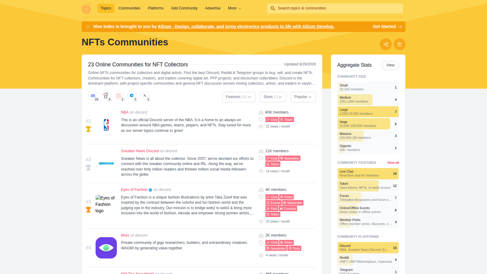

# Best NFT Communities in 2026: 10 Projects Still Worth Following

The best NFT communities in 2026 are not the ones with the loudest price action. They are the ones that still produce identity, culture, participation, and useful network effects after the hype wave has passed.

That matters because community is one of the few durable reasons NFT ownership can still mean more than holding a tradable asset. A weak NFT community is just a bagholder funnel. A strong one becomes a distribution engine, social layer, brand amplifier, or creative network. This page should also work as a bridge into broader NFT market shifts, digital-identity use cases, and gaming culture around [NFT games](/gaming-nft/games/best-nft-games-2026).

> Reviewed by NFTEnex Editorial Team
> Last reviewed: 2026-07-13
> Review type: No-budget editorial comparison
> Editorial policy: [NFTEnex Editorial Policy](/info/editorial-policy)

> Why you can trust this guide
>
> This guide is based on live public product surfaces and official references reviewed on 2026-07-13. We directly checked the public positioning, visible workflow framing, and documentation shown in this article. We do not present unverified logged-in behavior, live checkout results, or completed onchain actions as first-hand use unless they were actually completed and documented.
>
> Methodology
>
> We compared each option using live public product surfaces, official documentation, and visible workflow cues captured at review time. In this version, the ranking prioritizes clarity, workflow posture, and fit for different user types over private dashboard claims we could not verify directly.
>
> Limitations
>
> This is a no-budget editorial review, not a fully funded end-to-end product test. Where a conclusion would require a live transaction, paid plan, logged-in dashboard, or wallet-funded workflow, we treat that as a limitation and avoid overstating direct experience.

## The best NFT communities in 2026 are the ones that still create culture, utility, and identity beyond price

The communities still worth following in 2026 are usually the ones that do at least one of four things well:

- turn holders into active participants
- extend beyond a single marketplace cycle
- create culture that outsiders can recognize
- connect ownership to identity, events, products, or media

That is why communities such as Pudgy Penguins, Azuki, Bored Ape Yacht Club, Doodles, Nouns, Milady, DeGods, Parallel-linked communities, The Sandbox ecosystem, and OnChainMonkey-style identity communities stay in the conversation more than many once-hyped collections.

This is not a ranking of "best investments." It is a ranking of communities that still matter as social and cultural systems.

## What we checked ourselves before ranking these communities

For this article, we reviewed live public community surfaces rather than relying only on legacy reputation. We started with [Hive Index's NFT community directory](https://thehiveindex.com/topics/nft/) and then checked current ecosystem-facing surfaces such as [The Sandbox](https://www.sandbox.game/) to anchor the article in visible public activity rather than nostalgia.

That does not replace a deep ethnographic review of each community, nor does it prove the internal health of every holder group. What it does do is help separate communities with visible public presence, ecosystem participation, and repeatable identity from collections that only survive as market memory.

**Featured Image**
File: `../media/hiveindex-nft.png`
Alt text: `Hive Index page listing active NFT communities and social ecosystem groups`
Caption: `Hive Index NFT communities page captured during our July 2026 review of active Web3 communities.`

*Hive Index NFT communities page captured during our July 2026 review of active Web3 communities.*

**Screenshot 1**
File: `../media/sandbox-home.png`
Alt text: `The Sandbox homepage showing a live virtual ownership and creator ecosystem`
Caption: `The Sandbox ecosystem homepage captured during our July 2026 review of NFT-led digital communities.`

*The Sandbox ecosystem homepage captured during our July 2026 review of NFT-led digital communities.*

What stood out immediately was that community quality becomes much easier to discuss once you stop asking which collection is most famous and start asking which communities still produce visible culture, products, events, or identity signals in public.

The screenshots above show why public artifacts matter. One surface maps the category, and the other shows what a live ecosystem actually looks like when community extends into products and virtual spaces.

## How to tell whether an NFT community is actually alive

A living NFT community usually shows some mix of:

- repeated activity that is not purely giveaway farming
- creator or founder visibility
- real community artifacts such as events, content, memes, or collaborations
- a recognizable identity layer
- ecosystem spillover into games, media, commerce, or social products

A dead or weak community usually depends too heavily on floor watching, vague roadmap promises, or closed-circle status signaling that no longer creates real participation.

## Our direct editorial read after reviewing current community surfaces

After checking current public surfaces, the clearest difference was not simply brand size. It was whether the community still creates visible artifacts beyond price talk.

The stronger communities in this article tend to do at least one thing in public that outsiders can recognize: brand expansion, governance, creator output, ecosystem participation, world-building, or identity signaling. The weaker ones, by contrast, are much harder to describe without falling back on floor history or old prestige.

That is why I would not rank NFT communities by market memory alone. A community that still produces visible output is more valuable editorially than one that was once huge but now only exists as a reference point.

## The 10 best NFT communities to watch in 2026

### Pudgy Penguins

Pudgy Penguins remains one of the strongest examples of an NFT community becoming a broader brand story. It matters because the community narrative moved beyond collection status and into consumer-facing identity and IP.

This is one of the clearest cases where community strength cannot be reduced to holder chat alone. The reason Pudgy still matters is that the identity escaped the original collection context and became legible to a broader audience.

Why it matters:

- strong brand recognition
- community identity that travels outside crypto-native circles
- clearer bridge between holders and broader audience awareness

### Azuki

Azuki stays relevant when the conversation is culture, design language, and community-driven worldbuilding. Its importance is not just market history, but whether it still signals aesthetic coherence and committed audience energy.

Why it matters:

- strong visual identity
- community attachment to cultural style
- ongoing relevance in NFT-native creator conversations

### Bored Ape Yacht Club

BAYC still matters because it remains one of the benchmark case studies for NFT status, brand extension, and community-led prestige, even if the surrounding market narrative is no longer what it was at its peak.

Why it matters:

- still a reference point for NFT identity culture
- large installed mindshare
- useful for analyzing whether premium NFT communities can evolve

### Doodles

Doodles matters because it sits closer to media and brand-world expansion than many traditional collection communities. That makes it relevant to people tracking how NFT communities become entertainment or IP systems.

Why it matters:

- brandable visual identity
- broader creative and media ambitions
- more accessible cultural tone than some status-driven collections

### Nouns

Nouns is important because it frames NFT community as governance, experimentation, and public-good-flavored identity rather than only collectible membership.

That difference matters because it shows one of the healthiest alternatives to pure speculation-led community design.

Why it matters:

- stronger governance and onchain participation story
- useful for readers interested in social infrastructure, not just collectibility
- different model from standard profile-picture communities

### Milady

Milady matters because it represents how aesthetic intensity and internet-native identity can sustain a community long after mainstream readers stop understanding why it matters.

Why it matters:

- highly recognizable online identity layer
- meme-native participation
- strong subcultural energy

### DeGods

DeGods remains relevant as a case study in how NFT communities manage migration, positioning, and audience expectation across cycles.

Why it matters:

- historically strong community visibility
- useful lens on brand resilience and chain/community movement
- still frequently referenced in serious NFT conversation

### Parallel-linked communities

Parallel matters because it shows how a strong NFT community can overlap with a game, lore system, and competitive ecosystem rather than live only as a collection identity.

Why it matters:

- stronger utility narrative than purely social collections
- ties culture to product participation
- useful bridge between NFTs and gaming communities

### The Sandbox ecosystem

The Sandbox ecosystem remains relevant because it centers virtual ownership, land, creator experiences, and branded digital space in one persistent narrative.

From the current public ecosystem surface we reviewed, The Sandbox still looks like one of the clearest examples of community tied to a participatory digital world rather than only a collection page.

Why it matters:

- clear digital-ownership use case
- creator and ecosystem participation
- strong fit for broader metaverse and virtual asset coverage

### OnChainMonkey and identity-led communities

Identity-led communities such as OnChainMonkey matter because they tie NFTs to belonging, values, and social signaling beyond a single collection event.

Why it matters:

- clearer identity and intellectual framing
- useful for coverage around digital ownership and online identity
- often more durable than short-cycle hype groups

## Why some communities outlast hype cycles

The best NFT communities survive because they answer a better question than "why should this floor go up?"

They give holders a reason to stay even when:

- trading is quiet
- the broader market slows
- attention rotates elsewhere

That reason might be identity, creativity, governance, shared IP, social belonging, or access. But there has to be a reason.

## Red flags that signal a weak or extractive NFT community

Watch out for communities that:

- only speak in pricing language
- cannot point to real participation beyond giveaways
- depend on constant roadmap bait
- claim culture without producing anything recognizable

A weak community can still look busy on social media. That is why surface-level activity is not enough.

## Which kind of NFT community fits your goal

Follow Pudgy Penguins or Doodles if you care about brand and culture moving beyond crypto-native circles.

Follow Azuki or Milady if you care more about aesthetics, identity, and internet-native signal.

Follow Nouns if you care about governance and onchain social experimentation.

Follow Parallel-linked or Sandbox-linked communities if you care about utility and digital worlds.

The best NFT community in 2026 is the one whose members still have a reason to show up after speculation stops doing the work for them.
