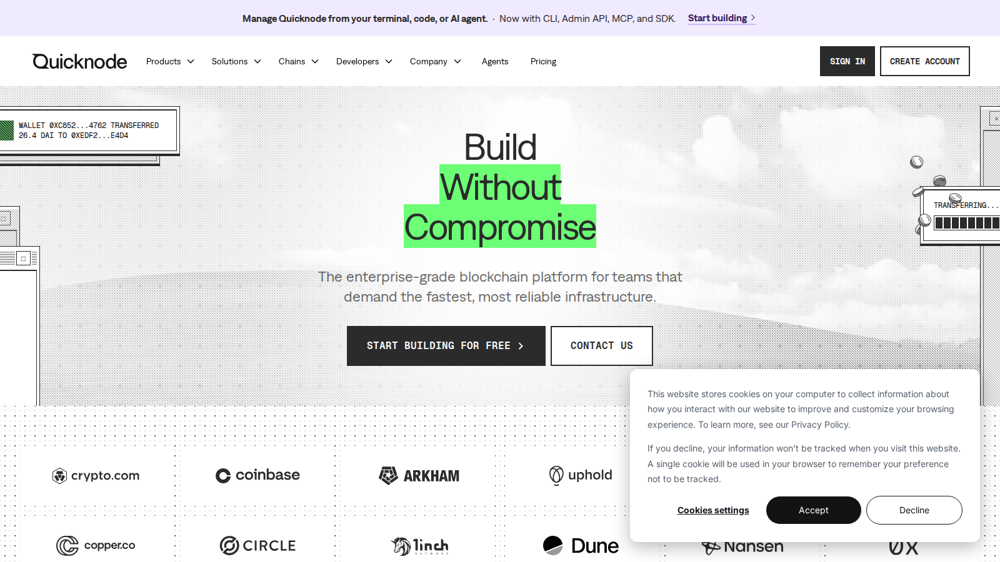

# Best NFT APIs in 2026: 7 Developer Picks for Metadata, Ownership, and Market Data

The best NFT APIs in 2026 are the ones that save developers from rebuilding the same indexing, metadata, wallet, and sales-query logic over and over again.

That matters because NFT products now need more than token reads. Teams want ownership lookups, metadata normalization, transfer history, floor and sales context, webhook logic, and multichain support that does not break every time the product expands. This article should also point readers naturally toward [NFT minting tools](/nft-infrastructure/minting/best-nft-minting-tools-2026), [NFT storage tools](/nft-infrastructure/storage/best-nft-storage-tools-2026), and [NFT analytics tools](/nft-markets/trading-data/best-nft-analytics-tools-2026).

> Why you can trust this guide
>
> This guide is based on live documentation and current ecosystem references reviewed on 2026-07-10. Because API products evolve quickly, readers should verify endpoint scope, multichain support, rate limits, and pricing-tier assumptions on the official documentation before building around them.

## The best NFT APIs in 2026 are Alchemy, Reservoir, SimpleHash, Moralis, QuickNode, Zerion, and Blockdaemon

Alchemy is one of the strongest all-around choices because it combines broad developer adoption with an NFT tooling ecosystem. Reservoir is attractive when marketplace and trading data matter. SimpleHash is useful when normalized NFT asset and metadata handling is the real problem. Moralis and QuickNode make sense for teams that want broader Web3 development context instead of NFT-only tooling. Zerion belongs in the list because portfolio and ownership visibility matters for product experiences. Blockdaemon is relevant where enterprise-grade infrastructure posture matters.

Quick picks:

- Best overall developer starting point: `Alchemy`
- Best for marketplace-oriented product logic: `Reservoir`
- Best for normalized asset data: `SimpleHash`
- Best broader Web3 dev environment: `Moralis` or `QuickNode`
- Best portfolio-linked NFT data context: `Zerion`

## What we checked ourselves before ranking these APIs

For this article, we reviewed the current public product surfaces for [Alchemy](https://www.alchemy.com/), [Zerion](https://zerion.io/), and [QuickNode](https://www.quicknode.com/) on 2026-07-10. We also attempted to inspect [Reservoir](https://reservoir.tools/) directly, but the public surface available to us was not clean enough to use as strong screenshot evidence in the article, so Reservoir remains in the ranking because of its product role, not because of a presentable public capture.

That distinction matters. A serious API article should not pretend that every inclusion was verified the same way. What we could verify directly from live public surfaces was enough to confirm three things: some products are builder ecosystems, some are infrastructure platforms with NFT support inside a wider stack, and some are portfolio or ownership environments rather than pure NFT API brands.

*Alchemy ecosystem page captured during our July 2026 review of NFT developer tooling.*

*Zerion homepage captured during our July 2026 review of NFT API and ownership-data platforms.*

*QuickNode homepage captured during our July 2026 review of NFT and blockchain infrastructure providers.*

What stood out immediately was that API products frame the NFT problem very differently. Alchemy looks like an ecosystem layer. QuickNode looks like broader infrastructure with NFT capability inside it. Zerion looks closer to an ownership-and-portfolio product environment than a classic standalone NFT developer console.

## What a good NFT API must do in 2026

A serious NFT API now needs to do more than answer "who owns token #123?"

It should help with:

- metadata retrieval and normalization
- wallet ownership lookups
- transfer and activity history
- collection and asset indexing
- pricing or market context where relevant
- multichain coverage
- stable developer documentation

If the API cannot handle metadata, ownership, and chain expansion cleanly, it will create product debt fast.

## Our direct editorial read after reviewing the live API surfaces

After reviewing these public surfaces, the clearest difference was not simply whether an API supports NFT metadata. It was whether the product is trying to be your whole developer environment, one layer inside your stack, or a specialized ownership-data source.

Alchemy feels like the safest overall recommendation because it sits at the center of a broader tooling ecosystem. QuickNode feels stronger for teams already thinking in infrastructure terms. Zerion feels more useful where the account view and ownership context matter as much as raw developer plumbing.

That is why "best NFT API" is too broad unless the article splits by use case. A wallet product, a marketplace product, and a creator tool do not need the same kind of API.

## Best API by use case

If you are building a wallet, portfolio product, or discovery surface, ownership lookups and asset normalization matter most.

If you are building a marketplace-adjacent product, sales and listing context become more important.

If you are building creator tools, metadata handling, contract visibility, and mint-linked workflows matter more than pure trader data.

If you are building enterprise or production-heavy infrastructure, reliability, documentation, and scale matter more than a flashy demo response.

## Side-by-side review of the leading NFT APIs

### Alchemy

Alchemy is one of the easiest recommendations because it sits near the middle of the developer market: strong enough for serious teams, accessible enough for growing ones, and close to a broader ecosystem of NFT tools and references.

From the public product surfaces we reviewed, Alchemy feels like the most complete starting point for teams that do not yet know how broad their NFT infrastructure stack will need to become.

Best for:

- general NFT product development
- teams that want a large developer ecosystem
- stacks that may expand into minting, notifications, or analytics

### Reservoir

Reservoir becomes more attractive when product logic is closer to marketplaces, liquidity, or trading behavior. It is not simply about reading NFT ownership. It is about understanding NFT assets inside a market system.

We could not get a clean presentable public surface for Reservoir that we would want to use as first-hand visual proof here, so this section should be read as a directional product judgment rather than a screenshot-backed surface review.

Best for:

- marketplace and aggregation products
- teams that need more market-aware NFT data
- builders focused on transaction and liquidity surfaces

### SimpleHash

SimpleHash is a good fit when normalized asset data is the real bottleneck. Many teams do not need fancy market intelligence first. They need clean, consistent NFT asset handling that supports product building.

Best for:

- asset normalization
- metadata-heavy product layers
- teams cleaning up multi-collection or multichain NFT views

### Moralis

Moralis remains attractive when NFT data is part of a broader Web3 build rather than a dedicated NFT product. It suits teams that want developer convenience and a wider onchain tooling environment.

Best for:

- broader Web3 app builds
- teams that do not want NFT logic in total isolation

### QuickNode

QuickNode makes sense for teams that care about node access, broader onchain infrastructure, and NFT support inside a more general blockchain backend strategy.

From the public surface we reviewed, QuickNode clearly presents itself as infrastructure-first. That is a strength for technical teams that do not want NFT support isolated from the rest of their blockchain stack. It is a weaker fit for readers who are specifically searching for a more NFT-native workflow layer.

Best for:

- infrastructure-led teams
- products that combine token, contract, and NFT logic

### Zerion

Zerion is relevant because NFT data is often used in portfolio and ownership products, not just minting or marketplaces. If your product centers the user account view, Zerion-style visibility matters.

From the public surface we reviewed, Zerion looked less like a pure developer utility and more like a product environment built around ownership visibility. That is exactly why it belongs in the list for some use cases and not for others.

Best for:

- account and portfolio products
- ownership-centric user experiences

### Blockdaemon

Blockdaemon belongs in the shortlist when the buyer is thinking in terms of infrastructure posture, reliability, and production-grade deployment expectations instead of only startup speed.

Best for:

- larger teams
- infrastructure-heavy or enterprise-facing products

## Where NFT APIs usually break in production

The most common failure points are:

- inconsistent metadata across chains or collections
- weak handling of asset refresh and indexing lag
- marketplace context that is thinner than product teams expect
- documentation that looks clear until edge cases show up

A good NFT API is not the one with the biggest homepage promise. It is the one that fails least often in the exact workflow your product depends on.

## Which API should developers and data teams choose

Choose Alchemy if you want the safest overall recommendation.

Choose Reservoir if marketplace and trading context are central.

Choose SimpleHash if normalized asset handling is the main problem.

Choose Moralis or QuickNode if NFT support lives inside a bigger Web3 architecture.

Choose Zerion if you care about the account view and portfolio logic.

Choose Blockdaemon if reliability and production posture matter more than startup simplicity.
