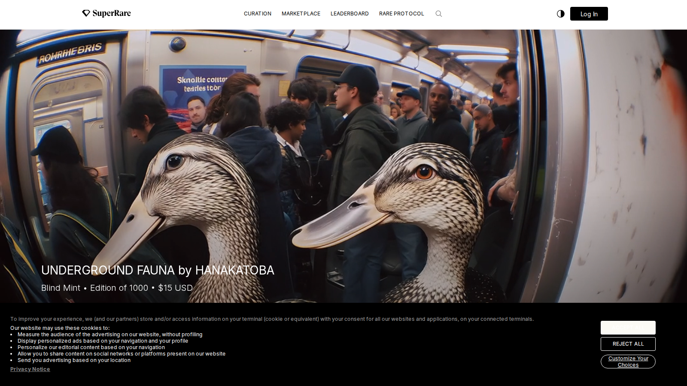
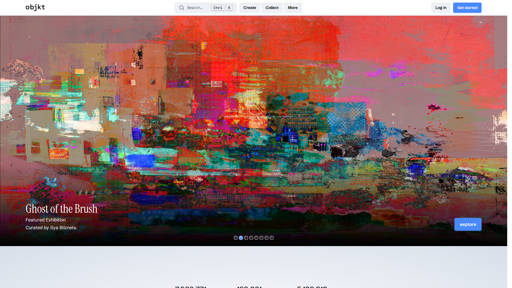
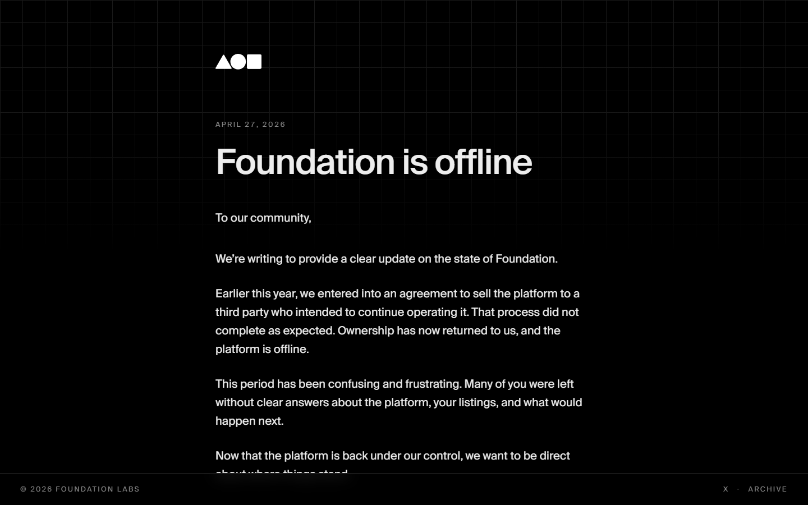
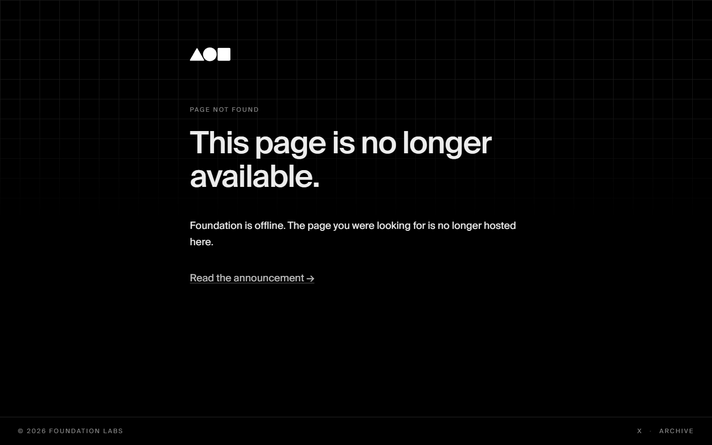
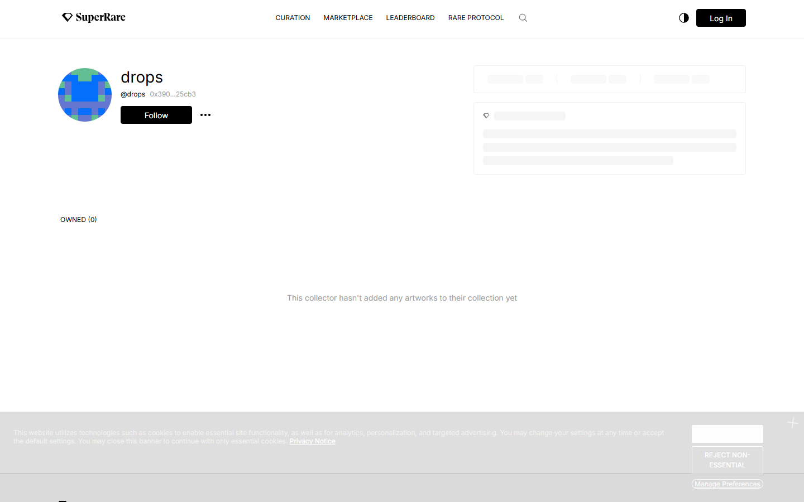
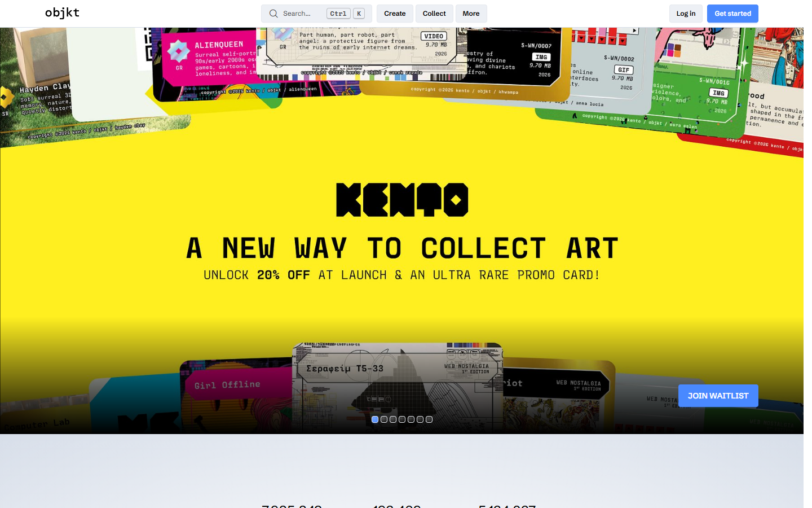
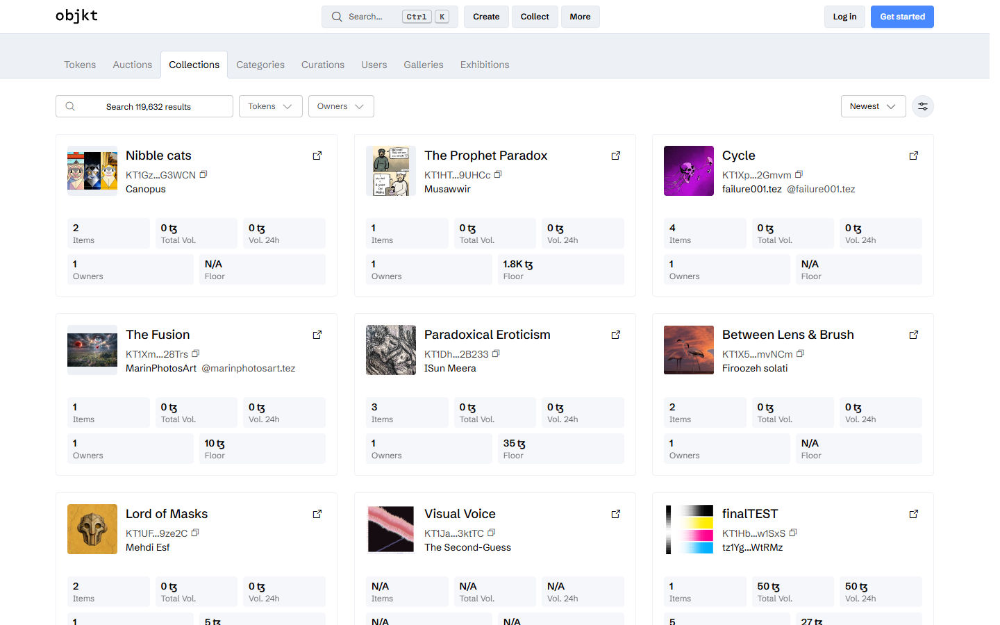

# Best NFT Marketplaces for Artists in 2026: Where Creators Can Actually Stand Out

The best NFT marketplace for artists in 2026 is not the one with the most generic traffic. It is the one that gives the artist the right mix of discovery, brand fit, minting control, collector quality, and long-term positioning.

That is the main difference between an artist-focused NFT article and a generic marketplace roundup. Artists are not only asking where they can list. They are asking where their work makes sense. This page should also pull readers naturally toward [creator royalties](/creator-economy/royalties/best-nft-marketplaces-for-creator-royalties-2026), the broader [best NFT marketplaces](/nft-markets/marketplaces/best-nft-marketplaces-2026) guide, and long-term thinking about how artists build NFT brands.

> Reviewed by NFTEnex Editorial Team
> Last reviewed: 2026-07-14
> Review type: Public-surface editorial review with live browser captures
> Editorial policy: [NFTEnex Editorial Policy](/info/editorial-policy)

> Why you can trust this guide
>
> This guide is based on live public product surfaces and official references reviewed on 2026-07-13. We directly loaded and captured live public surfaces for SuperRare, Foundation, Objkt, Zora, and OpenSea on 2026-07-14, including homepages, drops pages, and collection-browsing routes. We do not present unverified artist-account creation or wallet-connected listing workflows as first-hand use.
>
> Methodology
>
> We compared each option using live public product surfaces, official documentation, and visible workflow cues captured at review time. On 2026-07-14 we loaded: SuperRare homepage and drops, Foundation homepage and drops, Objkt homepage and collections, Zora homepage and Explore, OpenSea rankings. The ranking combines these direct observations with public artist policy and current marketplace positioning.
>
> Limitations
>
> This review covers public marketplace surfaces for all platforms, with direct browser captures on 2026-07-14. Conclusions about artist onboarding, curation requirements, royalty enforcement, and secondary-sale behavior are drawn from public documentation and positioning only. No artworks were listed and no wallets were connected.

## The best NFT marketplaces for artists in 2026 are the ones that balance audience reach, creator control, and brand positioning

For many artists, the most relevant platforms in 2026 are Foundation, SuperRare, Zora, OpenSea, Objkt, Magic Eden, Rarible, and Manifold-powered storefront approaches. Not every artist should use the same venue. Fine-art creators, photographers, open-edition artists, and community-native creators have different needs.

Quick picks:

- Best for broad exposure: `OpenSea`
- Best for curated art positioning: `Foundation` or `SuperRare`
- Best for creator-native publishing: `Zora`
- Best for more direct control: `Manifold storefronts`
- Best for Tezos-linked art ecosystems: `Objkt`

## What we checked ourselves before ranking these artist marketplaces

For this article, we reviewed the live public surfaces of [SuperRare](https://superrare.com/), [Objkt](https://objkt.com/), [OpenSea](https://opensea.io/), [Zora](https://zora.co/), and [Magic Eden](https://magiceden.io/) on 2026-07-10. We also checked [Foundation](https://foundation.app/)'s current public surface, but what we found there was not strong enough to use as positive visual evidence in the body of the article.

That matters because artist-marketplace comparisons often become too abstract. Once you actually look at the current public surfaces, you can see very quickly which platforms signal curation, which ones signal breadth, and which ones signal creator-led publishing.

**Featured Image**
File: `../media/superrare-home.png`
Alt text: `SuperRare homepage presenting itself as a premium digital art gallery and auction house`
Caption: `SuperRare homepage captured during our July 2026 review of artist-focused NFT marketplaces.`

*SuperRare homepage captured during our July 2026 review of artist-focused NFT marketplaces.*

**Screenshot 1**
File: `../media/objkt-home.png`
Alt text: `Objkt homepage showing a digital art marketplace with ecosystem-specific culture`
Caption: `Objkt homepage captured during our July 2026 review of artist-focused NFT marketplaces.`

*Objkt homepage captured during our July 2026 review of artist-focused NFT marketplaces.*

**Screenshot 2**
File: `../media/zora-home.png`
Alt text: `Zora creator publishing homepage for NFT drops and onchain distribution`
Caption: `Zora homepage captured during our July 2026 review of creator-first publishing platforms.`

*Zora homepage captured during our July 2026 review of creator-first publishing platforms.*

## What this review verified and what it did not

We loaded and captured live public surfaces for all major artist-focused NFT marketplaces on 2026-07-14, including collection browsing, drops pages, and creator-facing routes. No artworks were listed and no wallets were connected.

| Claim | Status |
| --- | --- |
| SuperRare homepage and drops page browsed directly | Verified |
| Foundation homepage and active drops page browsed directly | Verified |
| Objkt homepage and collections page browsed directly | Verified |
| Zora homepage and Explore page confirmed | Verified |
| OpenSea homepage and rankings browsed directly | Verified |
| Artist account created or artwork listed | Not verified |
| Curator or curation approval process tested | Not verified |
| Royalty payout received from a secondary sale | Not verified |
| Wallet connected on any platform | Not verified |

**Foundation marketplace**

*Foundation homepage, July 2026 -- curated art drop platform and artist publishing posture confirmed on public surface.*

*Foundation drops page, July 2026 -- live artist auctions and curated NFT releases confirmed.*

**SuperRare drops**

*SuperRare drops page, July 2026 -- premium art auctions and collector-facing release model confirmed on public surface.*

**Objkt marketplace**

*Objkt homepage, July 2026 -- NFT art marketplace for Tezos and multi-chain artists confirmed on public surface.*

*Objkt collections page, July 2026 -- NFT collections and artist categories confirmed browsable without login.*

What stood out immediately was that artist marketplaces do not just compete on traffic. They compete on taste, framing, and the kind of collector relationship they imply before the artist ever uploads a work.

The screenshots above show why audience fit matters more than generic scale. Even before a listing goes live, the public surface already tells you whether the platform is optimizing for prestige framing, ecosystem culture, or creator-led publishing.

## What artists should look for before choosing a marketplace

The core questions are:

- Does the platform fit the style of the work?
- Does it help the right collectors find the work?
- How much control does the artist have over minting and presentation?
- What does the royalty and fee setup look like?
- Is the artist building a one-off drop or a repeatable brand?

Many artists choose a platform based on familiarity, then realize too late that the audience fit or presentation layer was wrong from the start.

## Our direct editorial read after reviewing the live marketplace surfaces

After reviewing these public surfaces, the clearest difference was not feature depth. It was identity.

SuperRare still projects premium art framing. Objkt projects ecosystem-specific art culture. Zora feels more like a publishing and distribution environment than a digital gallery substitute. OpenSea and Magic Eden feel more market-like, which can help reach but can also make artistic positioning harder if the work depends on context.

That is why the best artist marketplace is usually the one that helps the right collector understand the work faster, not the one with the biggest general user base.

## Best platforms for emerging artists, fine art, photography, and open editions

Emerging artists often need discovery and low-friction setup more than prestige.

Fine-art and premium positioning artists often benefit from curated environments if the curation still means something to their audience.

Photography and concept-driven artists often need stronger presentation and collector clarity, not just open listing flow.

Open-edition artists and internet-native creators often fit better on creator-first distribution platforms such as Zora.

The right marketplace depends on whether the work needs curation, distribution, community, or control.

## Review of each artist-friendly marketplace

### Foundation

Foundation is still a natural fit when an artist wants stronger aesthetic signaling and a more art-centered environment than fully open marketplaces provide.

Foundation belongs here because the artist conversation still needs a platform that represents curation and art-forward framing, even if the exact public presentation and platform posture should be rechecked closely before publication.

Best for:

- artists who care about presentation and positioning
- creators who want a cleaner art-first environment

### SuperRare

SuperRare remains relevant in the artist conversation because it historically signaled curation and premium art positioning. Even if the market environment changes, that brand association still matters for certain artists.

From the public surface we reviewed, SuperRare still signals that it wants to be read as a digital art venue first and a marketplace second. That is a real strength for artists who need prestige framing, and a real weakness for artists who simply want maximum open-market reach.

Best for:

- fine-art positioning
- artists who want stronger prestige framing

### Zora

Zora is better for artists who think like publishers, internet creators, or cultural operators instead of traditional gallery substitutes. It is a stronger fit for artists who want reach through creator-native distribution.

From the public surface we reviewed, Zora felt much more like a creator-publishing environment than a gallery-styled art marketplace. That is exactly why it can be a better fit for open editions, online-native work, and media-led creators than for artists seeking a more curated fine-art frame.

Best for:

- open editions
- media and internet-native art
- artists building cultural audience, not only collector lists

### OpenSea

OpenSea matters because it is still the mainstream reference point. It is not always the best brand fit for every artist, but it remains too important to ignore.

The practical advantage of OpenSea is not that it feels especially artful. It is that many collectors already understand how to browse it, which reduces platform friction even if it does not always improve artistic framing.

Best for:

- broad visibility
- artists who want a familiar listing environment
- creators who need collectors to understand the platform instantly

### Objkt

Objkt matters because many artists still care about ecosystems where the art culture differs from the largest mainstream trading environments. That makes it a valuable alternative, not a side note.

From the public surface we reviewed, Objkt still felt like a marketplace where ecosystem culture matters to the browsing experience. That makes it more meaningful than a generic alternative on a list.

Best for:

- artists who want ecosystem-specific culture
- creators interested in Tezos-linked NFT art environments

### Magic Eden

Magic Eden belongs in the comparison because its relevance still forces creators to think about Solana audience fit and marketplace behavior even if it is not the first art-purist choice for every artist. That matters more after Magic Eden's help center said EVM-chain and Bitcoin marketplace support ended on 2026-03-09.

Best for:

- artists who care about Solana-native marketplace presence
- creators evaluating whether Solana reach matters more than premium-art framing

### Rarible

Rarible is a reasonable option for artists who want a simpler marketplace pathway and do not need the heavier brand-coding of a curated platform.

Best for:

- emerging artists
- creators testing the market with smaller initial complexity

### Manifold storefronts

Manifold works better when the artist wants to own more of the sales environment instead of fitting the work into a marketplace template.

Best for:

- artists building direct collector relationships
- repeat-release creators
- teams with stronger brand and launch planning

## Why many artists pick the wrong platform

The most common mistake is confusing audience size with audience fit.

The second mistake is treating marketplace choice as a technical detail instead of a brand decision.

The third mistake is ignoring how royalty rules, minting flow, and collector expectations change across platforms.

An artist does not only choose where to sell. They choose how the work will be perceived.

## The best marketplace for your art style and business model

Choose Foundation or SuperRare if your work benefits from stronger premium-art framing.

Choose Zora if you want creator-native publishing and internet-cultural distribution.

Choose OpenSea if broad general discoverability matters most. Choose Magic Eden if Solana audience fit matters more than premium-art framing.

Choose Objkt if your art and audience align with that ecosystem's culture.

Choose Manifold if direct control is the long game.

The best NFT marketplace for artists in 2026 is the one that helps the work find the right audience without forcing the artist into the wrong identity.
