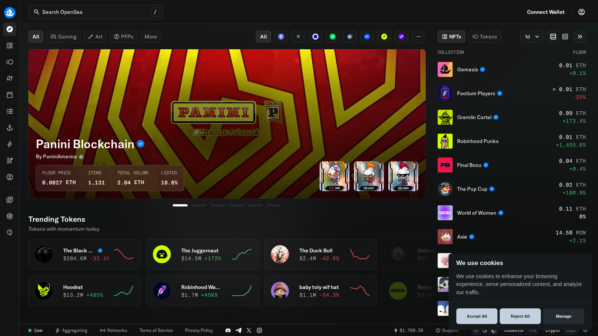
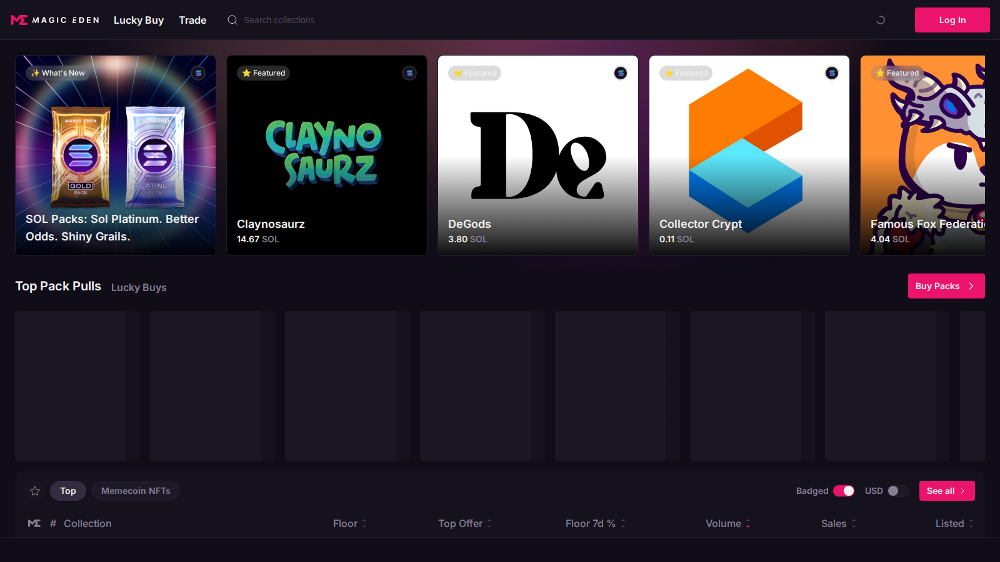
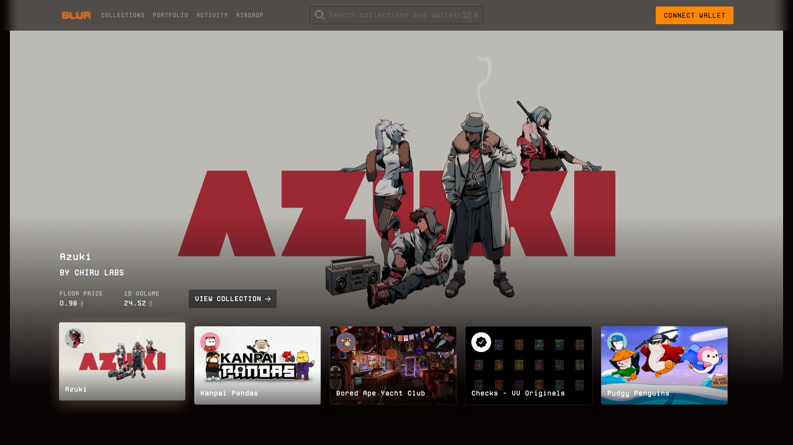

# Best NFT Marketplaces in 2026: Top Platforms to Buy, Sell, and Discover Digital Ownership

The best NFT marketplaces in 2026 are not all trying to win the same market. Some optimize for broad discovery, some for trader liquidity, some for creator-native publishing, and some for niche artistic or ecosystem-specific use cases.

That is why the right marketplace depends on what you want to own, sell, or build around. A collector, an artist, a flipper, and a brand team should not default to the same venue. This article should also guide readers into [NFT marketplaces for artists](/creator-economy/artists/best-nft-marketplaces-for-artists-2026), [creator royalties](/creator-economy/royalties/best-nft-marketplaces-for-creator-royalties-2026), and [marketplace trends](/nft-markets/trends/nft-marketplace-trends-2026).

> Reviewed by NFTEnex Editorial Team
> Last reviewed: 2026-07-13
> Review type: No-budget editorial comparison
> Editorial policy: [NFTEnex Editorial Policy](/editorial-policy)

> Why you can trust this guide
>
> This guide is based on live public product surfaces and official references reviewed on 2026-07-13. We directly checked the public positioning, visible workflow framing, and documentation shown in this article. We do not present unverified logged-in behavior, live checkout results, or completed onchain actions as first-hand use unless they were actually completed and documented.
>
> Methodology
>
> We compared each option using live public product surfaces, official documentation, and visible workflow cues captured at review time. In this version, the ranking prioritizes clarity, workflow posture, and fit for different user types over private dashboard claims we could not verify directly.
>
> Limitations
>
> This is a no-budget editorial review, not a fully funded end-to-end product test. Where a conclusion would require a live transaction, paid plan, logged-in dashboard, or wallet-funded workflow, we treat that as a limitation and avoid overstating direct experience.

## The best NFT marketplaces in 2026 are OpenSea, Magic Eden, Blur, Zora, Foundation, Objkt, and Rarible

OpenSea remains the broadest mainstream reference point. Magic Eden is too relevant to ignore, especially when marketplace competition and multichain behavior are part of the conversation. Blur still matters for users focused on more active trading behavior. Zora belongs here because publishing and creator distribution increasingly shape digital ownership flows. Foundation and Objkt remain useful because not all marketplace value comes from scale; some of it comes from cultural fit. Rarible stays relevant for simpler creator and marketplace workflows.

Quick picks:

- Best general marketplace: `OpenSea`
- Best big alternative: `Magic Eden`
- Best for active trading behavior: `Blur`
- Best for creator-native publishing: `Zora`
- Best for art-focused positioning: `Foundation`
- Best ecosystem-specific art venue: `Objkt`

## What we checked ourselves before ranking these marketplaces

For this article, we reviewed the live public surfaces of [OpenSea](https://opensea.io/), [Magic Eden](https://magiceden.io/), [Blur](https://blur.io/), and [Zora](https://zora.co/) on 2026-07-10, along with current fee documentation where available.

That direct review does not replace a logged-in trading or listing test across all platforms. But it does reveal something that weak top-list pages often hide: these marketplaces are not really competing to be the same product. Some are discovery-led, some are trader-led, and some are closer to publishing environments than generic NFT stores.

**Featured Image**
File: `../media/opensea-home.png`
Alt text: `OpenSea homepage showing mainstream NFT discovery and marketplace browsing`
Caption: `OpenSea homepage captured during our July 2026 review of leading NFT marketplaces.`

*OpenSea homepage captured during our July 2026 review of leading NFT marketplaces.*

**Screenshot 1**
File: `../media/magiceden-home.png`
Alt text: `Magic Eden homepage showing a live NFT marketplace and collection environment`
Caption: `Magic Eden homepage captured during our July 2026 review of leading NFT marketplaces.`

*Magic Eden homepage captured during our July 2026 review of leading NFT marketplaces.*

**Screenshot 2**
File: `../media/blur-home.png`
Alt text: `Blur homepage showing a pro-trader NFT marketplace interface`
Caption: `Blur homepage captured during our July 2026 review of trader-focused NFT marketplaces.`

*Blur homepage captured during our July 2026 review of trader-focused NFT marketplaces.*

What stood out immediately was not just aesthetic difference. It was user intent. OpenSea feels like the most legible mainstream marketplace. Magic Eden feels like a serious alternative that still wants broad relevance. Blur feels built for people who already think in terms of active market behavior rather than casual discovery.

The screenshots above show why one marketplace does not fit every reader. The visual posture already tells you whether the platform is trying to help you discover, trade, or publish.

## How we judged the top NFT marketplaces

The marketplace criteria that matter in 2026 are:

- audience and liquidity
- chain coverage
- user experience
- creator tooling
- royalty and fee clarity
- cultural fit for the type of NFT being sold

A marketplace is not "best" in the abstract. It is best at something. That is the right frame for readers and the right frame for search intent.

## Our direct editorial read after reviewing the live marketplace surfaces

After opening the leading public marketplace surfaces side by side, the clearest difference was not chain count or headline brand strength. It was how each venue frames the user's first job.

OpenSea frames that job as broad discovery. Magic Eden frames it as a large-scale alternative marketplace with strong relevance across active NFT ecosystems. Blur frames it as speed and trader orientation. Zora, meanwhile, belongs in the same conversation precisely because it bends the idea of a marketplace toward publishing and distribution.

That is why this list should not pretend there is one universal winner. The better answer is that different marketplaces win different jobs.

## Which marketplace is best for collectors, traders, artists, and brands

Collectors usually need range, trust, and visibility. OpenSea and Magic Eden are hard to ignore there.

Traders care more about liquidity, speed, and execution environment. Blur stays relevant for that audience.

Artists care more about presentation, discovery quality, and creator fit. Foundation, Objkt, Zora, and artist-focused comparisons matter more.

Brands care about onboarding, control, and where audience behavior is predictable. That often changes the answer completely.

## Detailed review of the top NFT marketplaces

### OpenSea

OpenSea still matters because it remains the default marketplace benchmark. Even readers who end up elsewhere usually understand the market through OpenSea first.

From the public surface we reviewed, OpenSea still looks like the easiest marketplace to explain to a general reader. That is a real advantage in a category where too many products assume prior market fluency.

Best for:

- broad discovery
- general collectors
- mainstream NFT orientation

### Magic Eden

Magic Eden matters because marketplace competition no longer belongs to one dominant narrative. It is a serious comparison point for creators, traders, and multichain participants.

From the public surface we reviewed, Magic Eden felt like a marketplace that wants to be read as a major platform rather than as a niche alternative. That matters because creators and collectors increasingly need to compare more than one high-liquidity venue seriously.

Best for:

- users comparing large marketplace ecosystems
- collectors or creators watching multichain activity

### Blur

Blur remains more important for active market behavior than for casual browsing. It is not the easiest entry point for everyone, but it remains relevant for serious marketplace comparison.

From the public surface we reviewed, Blur clearly signals that it is designed around an active user who already understands the market. That is useful for traders and less helpful for newcomers who need broad orientation first.

Best for:

- active traders
- liquidity-aware users

### Zora

Zora belongs in this article because the NFT marketplace category now overlaps with publishing, creator distribution, and onchain media culture.

Best for:

- creator-native releases
- open editions and media drops
- culture-led digital ownership

### Foundation

Foundation remains one of the clearest references for art-first marketplace positioning. It may not serve every NFT category, but that is exactly why it matters.

Best for:

- curated or premium-feeling art releases
- artists who care about aesthetic framing

### Objkt

Objkt matters because ecosystem-specific marketplaces can outperform larger venues for the right creators and collectors. Scale is not the only kind of marketplace value.

Best for:

- creators and collectors aligned with its ecosystem culture
- readers exploring alternatives to the largest NFT venues

### Rarible

Rarible stays relevant as a simpler marketplace option for creators and users who want an established environment without building more specialized workflows.

Best for:

- lighter creator launches
- smaller teams
- users who want simpler marketplace onboarding

## The biggest changes in NFT marketplace competition in 2026

The biggest shift is that marketplace competition is no longer only about who has the biggest homepage. It is about:

- who controls discovery
- who serves creators best
- who captures active trading
- who becomes the default layer for digital ownership beyond art

That means the marketplace category is fragmenting in a productive way. Readers do not need one winner. They need the right venue for the asset and goal.

## Which NFT marketplace should you actually use

Use OpenSea if you want the broadest mainstream starting point.

Use Magic Eden if you want a major alternative that still matters in serious comparisons.

Use Blur if active trading is central to your behavior.

Use Zora if creator distribution and onchain publishing matter more than generic browsing.

Use Foundation or Objkt if artistic fit matters more than raw scale.

Use Rarible if you want simpler creator workflow and established marketplace familiarity.

The best NFT marketplace in 2026 is the one that matches your ownership behavior, not the one with the loudest reputation.
