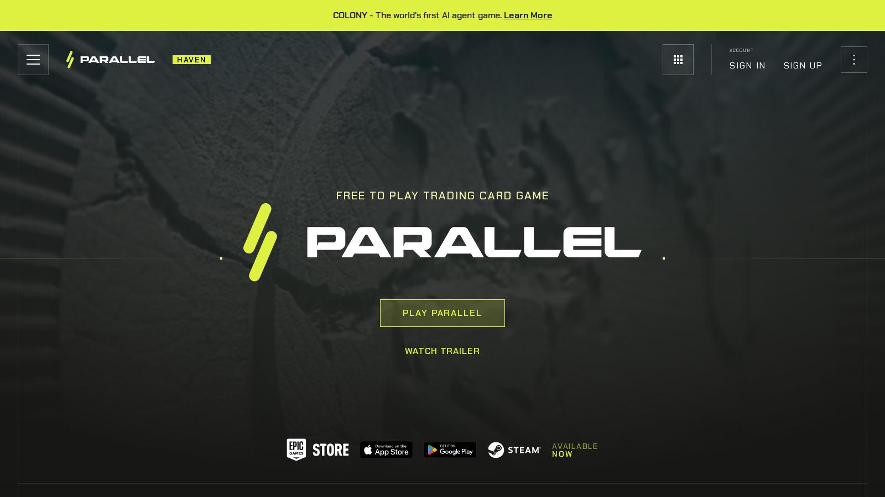
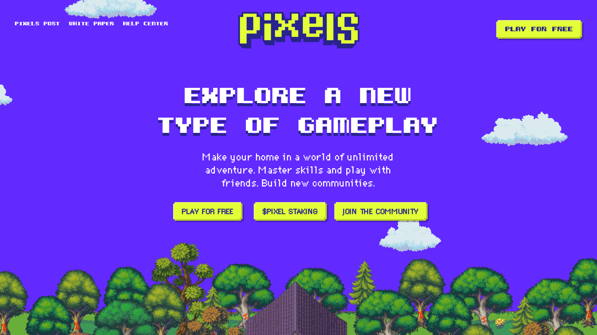
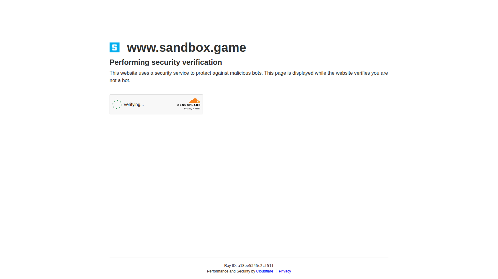

# Best NFT Games in 2026: 10 Web3 Games Still Worth Your Time

The best NFT games in 2026 are the ones where ownership actually improves the product instead of compensating for weak gameplay. That sounds obvious, but it is still the simplest way to separate durable Web3 games from extraction-first token loops.

A good NFT game now has to survive two tests at once: would people play it if the token price disappeared for a week, and does ownership make the player experience better rather than more complicated? This article should also help readers move into [NFT analytics tools](/nft-markets/trading-data/best-nft-analytics-tools-2026), [gaming NFT communities](/gaming-nft/virtual-assets/best-gaming-nft-communities-2026), and a deeper explainer on [in-game NFT assets](/gaming-nft/in-game-assets/how-nft-game-assets-work-2026).

> Reviewed by NFTEnex Editorial Team
> Last reviewed: 2026-07-13
> Review type: No-budget editorial comparison

> Why you can trust this guide
>
> This guide is based on live public product surfaces and official references reviewed on 2026-07-13. We directly checked the public positioning, visible workflow framing, and documentation shown in this article. We do not present unverified logged-in behavior, live checkout results, or completed onchain actions as first-hand use unless they were actually completed and documented.
>
> Methodology
>
> We compared each option using live public product surfaces, official documentation, and visible workflow cues captured at review time. In this version, the ranking prioritizes clarity, workflow posture, and fit for different user types over private dashboard claims we could not verify directly.
>
> Limitations
>
> This is a no-budget editorial review, not a fully funded end-to-end product test. Where a conclusion would require a live transaction, paid plan, logged-in dashboard, or wallet-funded workflow, we treat that as a limitation and avoid overstating direct experience.

## The best NFT games in 2026 are the ones where gameplay matters more than token hype

The strongest games to watch in 2026 are usually the ones most often mentioned in serious Web3 gaming conversations: Parallel, Pirate Nation, Pixels, Axie Infinity, Illuvium, Gods Unchained, Guild of Guardians, The Sandbox, Off The Grid, and MapleStory Universe-style blockchain game initiatives where available.

That list is not built around "highest upside." It is built around a stricter standard:

- the game has recognizable gameplay
- NFT ownership has an actual function
- the ecosystem still has enough activity to matter
- the project helps explain where gaming NFTs are going

## What we checked ourselves before ranking these games

For this article, we reviewed the live public surfaces of [Parallel](https://parallel.life/), [Pixels](https://www.pixels.xyz/), and [The Sandbox](https://www.sandbox.game/) on 2026-07-10. We did that because a games article should not rely only on token narratives or category memory. The public product surface tells you very quickly whether a project is presenting itself like a game, a social world, a token wrapper, or a generic Web3 brand.

That direct review does not replace real gameplay sessions, retention analysis, or economy stress testing. But it does give a much stronger starting point for editorial judgment than simply recycling the same old "top NFT games" list.

**Featured Image**
File: `../media/parallel-home.png`
Alt text: `Parallel homepage showing a gameplay-first Web3 game environment`
Caption: `Parallel homepage captured during our July 2026 review of NFT games.`

*Parallel homepage captured during our July 2026 review of NFT games.*

**Screenshot 1**
File: `../media/pixels-home.png`
Alt text: `Pixels homepage showing a social and progression-led Web3 game environment`
Caption: `Pixels homepage captured during our July 2026 review of NFT games.`

*Pixels homepage captured during our July 2026 review of NFT games.*

**Screenshot 2**
File: `../media/sandbox-home.png`
Alt text: `The Sandbox homepage showing a creator and virtual-world ecosystem`
Caption: `The Sandbox homepage captured during our July 2026 review of NFT gaming ecosystems.`

*The Sandbox homepage captured during our July 2026 review of NFT gaming ecosystems.*

What stood out immediately was that the strongest candidates in this category no longer want to be read as simple play-to-earn products. They want to be read as games, worlds, or ecosystems where ownership is one layer of the experience rather than the entire product.

The screenshots above show why that distinction matters. Even before a live play session, the public surface already tells you whether the project is trying to lead with gameplay identity, social progression, or virtual-world ownership.

## What separates a good NFT game from a speculative one

A strong NFT game usually does four things:

- gameplay comes first
- owned assets have clear use
- the economy does not depend only on constant new-user inflow
- community and content keep people engaged beyond rewards

A weak NFT game usually depends on emissions, shallow loops, and the assumption that "ownership" itself is enough to keep people interested.

## Our direct editorial read after reviewing the live game surfaces

After reviewing these current public surfaces, the clearest difference was not just polish. It was where the project puts ownership in the user story.

Parallel looks like a game first. Pixels looks like a social and progression environment first. The Sandbox looks like a creator world and virtual ownership ecosystem first. Those differences matter because they reveal whether NFTs are supporting the product or trying to replace the need for a product.

That is why I would rather rank a game with a clear play identity and a modest ownership layer above a louder project whose token logic is more obvious than its gameplay loop.

## The best NFT games by genre and player goal

If you want competitive strategy, Parallel and Gods Unchained-style games make more sense than generic play-to-earn titles.

If you want lighter progression and social loops, Pixels and some world-building ecosystems are more approachable.

If you want a higher-fidelity world or larger product ambition, Illuvium, Off The Grid, and similar titles are better reference points.

If you care about historical relevance and lessons from earlier cycles, Axie Infinity still matters as a case study even when it is no longer the only center of the conversation.

## Review of each game

### Parallel

Parallel matters because it shows what happens when a Web3 game takes gameplay identity and worldbuilding seriously. It is one of the better examples of an NFT-linked title that wants to be judged as a game first.

From the current public surface we reviewed, Parallel clearly signals a gameplay-first posture. That is one of the strongest signs a Web3 game can give at the top of the funnel.

Best for:

- players who like competitive strategy
- readers who want a stronger case study for gameplay-first Web3 design

### Pirate Nation

Pirate Nation stays relevant because it often appears in discussions about gameplay loops and onchain game design that feel more substantial than pure asset speculation.

Best for:

- players who want a clearer game layer
- readers tracking product-led Web3 gaming

### Pixels

Pixels matters because it helps explain the social and progression side of NFT gaming rather than only the prestige-asset side.

From the current public surface we reviewed, Pixels looked more approachable and socially structured than many older NFT game examples. That matters because accessibility is one of the category's biggest long-term tests.

Best for:

- more casual players
- users who want a lower-friction Web3 game environment

### Axie Infinity

Axie still matters because the history of NFT gaming is impossible to discuss seriously without it. Even if it is no longer the singular center of the market, it remains essential as a model, warning, and reference point.

Best for:

- readers who want historical context
- users studying what sustainable and unsustainable game economies look like

### Illuvium

Illuvium remains relevant because it represents the higher-production-value ambition side of blockchain gaming.

Best for:

- players who care about presentation and larger game-world ambition
- readers evaluating whether NFT gaming can support higher-end game expectations

### Gods Unchained

Gods Unchained belongs in the shortlist because it ties NFT ownership to a card-game format that players can understand quickly.

Best for:

- strategy card-game fans
- readers who want a more legible ownership utility model

### Guild of Guardians

Guild of Guardians matters when discussing team-based progression and mobile-friendly or broader audience-facing Web3 game design.

Best for:

- players interested in squad-building loops
- readers tracking mainstream-friendly Web3 game formats

### The Sandbox

The Sandbox still matters because it links NFTs to land, virtual experiences, and creator ecosystems rather than just closed combat loops.

From the current public surface we reviewed, The Sandbox still reads more like a participatory digital world than a conventional reward-first blockchain game. That makes it useful for readers who care about digital ownership beyond match-based play.

Best for:

- users interested in virtual ownership and world-building
- readers who care about creator ecosystems as much as gameplay

### Off The Grid

Off The Grid matters because it represents the push to make blockchain-linked games feel more like contemporary gaming products and less like token wrappers.

Best for:

- players who want more traditional action-game expectations
- readers testing whether NFT infrastructure can stay in the background

### MapleStory Universe-style initiatives

Projects in this category matter because they show how established gaming IP can experiment with blockchain ownership systems without starting from zero community awareness.

Best for:

- readers watching the mainstreaming path for gaming NFTs
- players interested in existing game-franchise leverage

## Why most play-to-earn models still fail

The simplest answer is that reward loops cannot replace game design.

If the economy needs constant fresh demand to feel good, the game is fragile.

If ownership only exists to justify extraction, players eventually feel it.

The strongest NFT games are shifting away from "play to earn" rhetoric and toward:

- asset utility
- deeper progression
- social identity
- modifiable or persistent game worlds

## Which NFT game is worth trying in 2026

Try Parallel if you want one of the clearest gameplay-first examples.

Try Pixels if you want a lighter social and progression entry point.

Study Axie Infinity if you want to understand the category's history.

Watch Illuvium and Off The Grid if you care about production ambition.

Follow Sandbox-like ecosystems if your interest is broader digital ownership, not just match-based games.

The best NFT game in 2026 is the one that would still feel like a real game even if the market stopped talking about tokens for a month.
