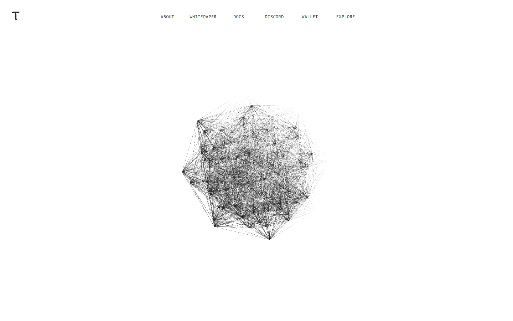
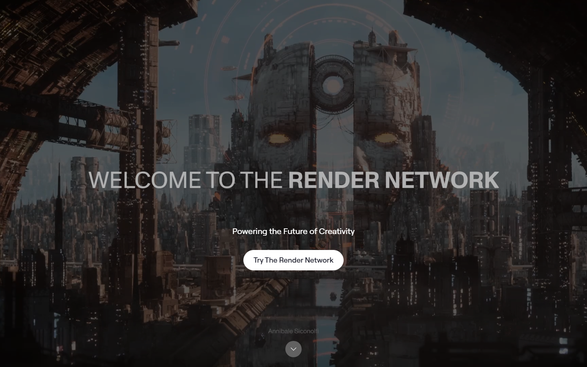
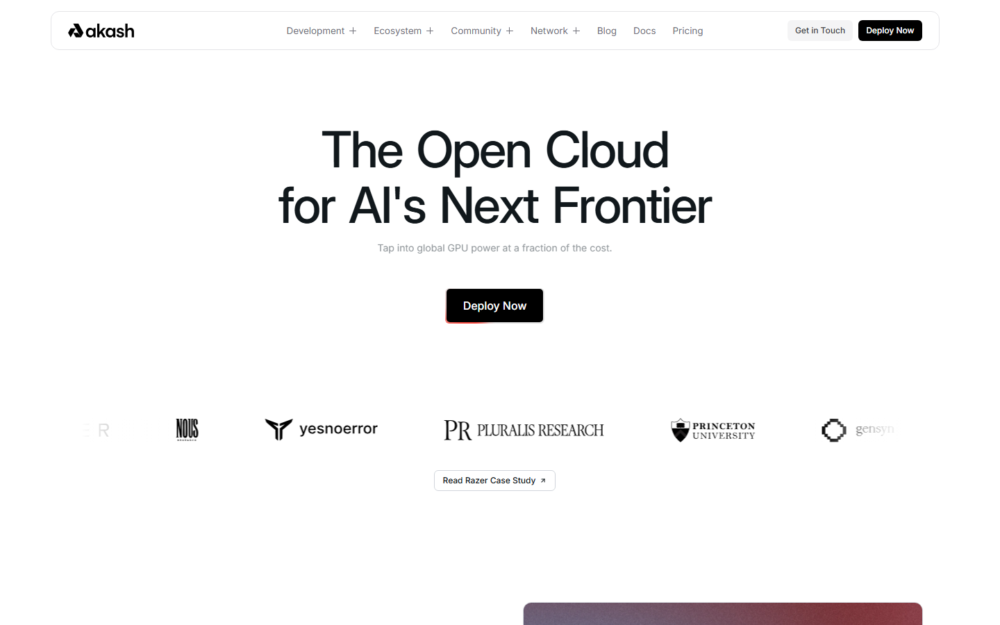

# Top AI Crypto Coins 2026: Infrastructure, Compute, and Agent Plays Mapped by Narrative Durability

The top AI crypto coins in 2026 are Bittensor, Render, Akash, the Artificial Superintelligence Alliance, AIOZ Network, Virtuals Protocol, Grass, io.net, Near Protocol, The Graph, Filecoin, and Nosana. Bittensor and Render carry the highest narrative conviction as infrastructure plays with real demand mechanics. Virtuals Protocol and Grass represent the agent and distribution layer where upside is real but thesis fragility is highest.

The AI crypto narrative in 2026 is not one trade. It is four distinct bets priced simultaneously: decentralized compute, data and bandwidth supply, agent coordination, and platform readiness for AI workloads. The thesis that breaks for an agent token is structurally different from the one that breaks for a compute marketplace.

| Project | Outstanding point | Score | One-line note |
|---------|------------------|-------|---------------|
| Bittensor | Strongest decentralized AI network architecture | 5/5 | Subnet composability creates durable expansion path |
| Render | Most legible GPU compute narrative | 5/5 | Value proposition reads outside crypto ecosystem |
| Akash | Most operational decentralized cloud | 4/5 | Token capture from compute usage still unproven |
| ASI Alliance | Largest AI crypto consolidation play | 3.5/5 | Integration complexity is the primary execution risk |
| Virtuals Protocol | Sharpest agent-token product framing | 3/5 | Most exposed to attention reversal in the list |
| AIOZ Network | Broadest multi-theme AI infrastructure | 3/5 | Multi-theme thesis dilutes conviction for new entrants |
| Grass | Most precise data supply chain fit | 3/5 | Useful network, weak token value accrual |
| io.net | Strongest compute marketplace distribution | 3/5 | Crowded lane compresses differentiation |
| Near Protocol | Best AI-adjacent platform positioning | 2.5/5 | Category confusion dilutes conviction sizing |
| The Graph | Essential AI-adjacent data indexing | 2.5/5 | Market prices it as Web3 infra, not AI exposure |
| Filecoin | Largest decentralized storage for AI data | 2.5/5 | Moves on storage narrative, not AI headlines |
| Nosana | Speculative GPU job scheduling | 2/5 | Thin adoption; liquidity gaps amplify both directions |

## Ranking scorecard

Scored out of 10 per category. Total out of 50.

| Project | Infrastructure reality | Token value capture | Narrative durability | Adoption evidence | Thesis clarity | **Total** |
|---------|----------------------|--------------------|--------------------|-------------------|---------------|-----------|
| Bittensor | 9 | 7 | 9 | 7 | 8 | **40** |
| Render | 9 | 8 | 9 | 7 | 9 | **42** |
| Akash | 8 | 5 | 7 | 7 | 8 | **35** |
| ASI Alliance | 6 | 5 | 6 | 5 | 6 | **28** |
| Virtuals | 5 | 6 | 4 | 6 | 7 | **28** |
| AIOZ | 6 | 5 | 5 | 5 | 5 | **26** |
| Grass | 7 | 4 | 6 | 5 | 6 | **28** |
| io.net | 7 | 5 | 5 | 5 | 6 | **28** |
| Near | 7 | 4 | 5 | 6 | 4 | **26** |
| The Graph | 8 | 5 | 4 | 7 | 4 | **28** |
| Filecoin | 8 | 4 | 3 | 7 | 4 | **26** |
| Nosana | 5 | 3 | 4 | 3 | 5 | **20** |

**Scoring notes.** Render leads on total score because its GPU compute thesis is legible to both crypto-native and traditional investors, and the token has a direct demand mechanism from compute buyers. Bittensor scores nearly as high but its complexity is a retail accessibility risk. Infrastructure reality and narrative durability are weighted equally because in AI crypto, projects with real products but weak narratives underperform projects with strong narratives and thin products for longer than fundamentalists expect.

## The filter: infrastructure floor vs narrative ceiling

The strongest 2026 AI plays sell a specific, scarce resource into a real demand stack: GPU compute time, verified bandwidth, indexed onchain data, or agent execution infrastructure. The weakest renamed themselves AI without changing the product. The useful filter before positioning is whether the token captures value from actual usage or relies on the market continuing to price the narrative. That distinction separates a 12-month hold from a narrative trade.

## On-chain adoption snapshot: July 2026

Most AI crypto comparisons list features. This table lists what is actually running.

| Project | Key adoption metric | Source | What it means for the thesis |
|---------|-------------------|--------|------------------------------|
| Bittensor | 128 active subnets; subnet tokens cumulative market cap ~$1.12B (27% of TAO market cap); $43M real AI usage revenue Q1 2026 | taostats.io, CoinGecko | Network depth is real. Subnet revenue separates TAO from pure-narrative AI tokens |
| Bittensor | Covenant-72B LLM trained permissionlessly on Subnet 3 by 70+ contributors, 67.1 MMLU score (competitive with Llama 2 70B) | March 2026 arXiv paper | First credible evidence that decentralized training produces competitive models |
| Render | 22M+ frames rendered in 2025; 2024 baseline: 15,000 nodes, 850K monthly jobs, $42M revenue | Render Foundation, CryptoRank | Creative rendering demand is not speculative. Job volume is measurable |
| Render | Dispersed AI subnet expanding: H100/H200 GPU support approved (RNP-021); Salad integration (RNP-023) estimated $4.3M revenue year one | Render governance | AI compute expansion is in governance, not just marketing |
| Render | RENDER token accepted as payment in OTOY Studio AI creative suite (30+ AI models); Coinbase listing July 10, 2026 | OTOY, Coinbase | Token utility is moving from network-internal to product-facing |
| Akash | Live workloads, documented GPU/CPU pricing, developer tooling competing with paid-tier cloud | akash.network | Operational, but on-chain revenue data is less transparent than Bittensor or Render |

The gap between Bittensor/Render and the rest of this list is not opinion. It is measurable adoption data. Every other project in this list operates primarily on positioning and narrative rather than verifiable on-chain revenue.

## Portfolio overlap risk: what to watch before sizing positions

If you buy Bittensor, Render, and Akash, you own three compute bets. If GPU demand normalizes or centralized cloud wins the margin battle, all three compress simultaneously. Diversifying across this list is not the same as diversifying risk.

| Cluster | Projects | Shared risk | If one fails, the others likely... |
|---------|----------|-------------|-------------------------------------|
| Compute infrastructure | Bittensor, Render, Akash, io.net, Nosana | GPU demand normalization; centralized cloud margin compression | Correlate downward. These are the same macro bet expressed differently |
| Agent / social layer | Virtuals Protocol | Attention reversal; consumer AI hype cycle ending | Independent from compute cluster. Can fail while compute thrives |
| Data / bandwidth | Grass | Token capture failure; useful network with no price support | Partially independent. Data demand is distinct from compute demand |
| Platform adjacency | Near, The Graph, Filecoin, AIOZ | Market reclassification; priced as Web3 infra, not AI exposure | Move with broader crypto, not AI-specific catalysts |
| Consolidation play | ASI Alliance | Integration execution failure | Partially correlated with compute cluster through Fetch.ai component |

The practical implication: if you want genuine diversification within AI crypto, pair one compute name (Bittensor or Render) with one non-compute name (Virtuals or Grass) and one platform-adjacent name (Near or The Graph). Three compute bets is one bet with extra fees.

## What we checked before mapping this list

We reviewed live public product surfaces, docs, and positioning in July 2026. Bittensor, Render, and Akash were reviewed in full; remaining names at homepage and primary docs level. This does not replace a live workload deployment test or on-chain usage analysis.

## 12 Top AI Crypto Coins Reviewed (2026 List)

### 1. Bittensor

Bittensor presents itself as an open incentive network around machine intelligence, organized through subnets, validators, miners, and staking mechanics. What stood out immediately from the docs we reviewed was the density of the technical framing. The homepage and documentation do not lead with AI marketing language. They lead with network participation mechanics.

The numbers back the framing. As of Q1 2026, Bittensor's 128 active subnets generated $43 million in real AI usage revenue, and subnet Alpha tokens reached a cumulative market cap of approximately $1.12 billion, roughly 27% of TAO's own market cap. Two subnets have broken $100 million individually. The December 2025 halving cut daily emissions from ~7,200 to ~3,600 TAO against a 21 million hard cap, and a Grayscale TAO Trust already exists with potential ETF conversion by late 2026.

The strongest non-commodity evidence is Covenant-72B: a large language model trained permissionlessly across Subnet 3 by over 70 contributors using commodity hardware, scoring 67.1 on MMLU, competitive with Meta's Llama 2 70B. That was confirmed in a March 2026 arXiv paper. No other decentralized AI project has produced a competitive foundation model through its own network yet.

The governance risk is also real. Covenant AI exited in April 2026, selling approximately $10 million in TAO and triggering a 20-25% market drop, citing founder Jacob Steeves' unilateral actions. That episode showed how execution power can still concentrate in founding entities despite decentralization claims.

The market has rewarded that framing through multiple volatility cycles. Bittensor consistently resurfaces in [CryptoCurrency Reddit thread comparing infrastructure vs narrative AI tokens](https://www.reddit.com/r/CryptoCurrency/comments/1nb1kr1/crypto_bros_2013_vs_2025/) as one of the few names where the product design predates and outlasts the hype cycle.

**What breaks the thesis:** If the subnet network effect weakens, if validators and miners find the reward structure unattractive relative to alternatives, Bittensor reverts to a governance token for an academic concept rather than a live network. The story is harder to explain than Render, which is a risk when retail attention rotates.

*Bittensor homepage captured July 17, 2026, showing subnet and validator-first framing rather than marketing-first AI language.*

### 2. Render Network

Render is the clearest AI-adjacent narrative in crypto precisely because the value proposition is legible outside the crypto ecosystem. GPU compute for rendering and AI workloads is an industry-standard need. Render is selling access to distributed GPU capacity to buyers who already understand why GPU capacity matters.

The adoption data confirms the positioning. Render processed over 22 million frames in 2025. The 2024 baseline was 15,000 nodes processing 850,000 monthly jobs generating $42 million in revenue, with forecasts projecting 45,000 nodes and $180 million revenue by the end of 2026. The Burn-Mint-Equilibrium model creates a direct feedback loop: jobs are priced in fiat, converted to RENDER, and burned after completion, so token supply responds to actual network usage rather than just speculation.

The non-commodity development to watch in 2026 is Dispersed, the AI compute subnet that received H100 and H200 GPU support through governance proposal RNP-021. Separately, the Salad integration (RNP-023) projects $4.3 million in revenue in its first year. RENDER is now accepted as payment in OTOY Studio's AI creative suite covering 30+ AI models, and Coinbase listed the token on July 10, 2026.

That combination of real job volume, expanding AI compute capability, and broadening exchange access is what makes Render's narrative durability score the highest in this list.

**What breaks the thesis:** The thesis weakens if centralized cloud providers structurally close the cost gap on GPU compute. If AWS, Google, and Azure keep expanding Spot GPU availability and driving prices toward commodity levels, the premium for decentralized compute compresses. The other risk is if the creative workload segment (3D rendering, VFX) declines relative to pure AI inference, where Render's brand identity is less established.

*Render Network homepage captured July 17, 2026, showing GPU-compute and decentralized rendering framing.*

### 3. Akash Network

Akash positions itself as decentralized cloud infrastructure, and the docs are specific enough that the pitch makes sense before you need to understand crypto. The value proposition is access to permissionless GPU and CPU compute at rates competitive with centralized cloud, paid in AKT.

What is notable about Akash in 2026 is that the thesis has graduated from theoretical to operational: the network has real workloads, documented pricing, and developer tooling that competes with paid-tier cloud products for specific use cases. The limitation is that infrastructure markets tend to be winner-take-most. Akash can be technically superior and still underperform if it does not achieve the distribution scale that turns it into a default choice.

**What breaks the thesis:** If the token does not capture meaningful value from compute usage growth, if AKT remains more a governance instrument than a utility token with real demand pressure, the network can succeed while the token stagnates. Infrastructure excellence and token performance are not the same thing.

*Akash Network homepage captured July 17, 2026, showing decentralized cloud infrastructure framing and developer deployment positioning.*

### 4. Artificial Superintelligence Alliance

The ASI Alliance matters because it represents the closest thing the AI crypto sector has to a consolidation move. Combining Fetch.ai, Ocean Protocol, and SingularityNET under a shared token reduces the fragmentation problem that makes many small AI crypto names individually too thin to sustain institutional attention.

The alliance narrative also generates a second-order effect: it signals to the market that serious players in the AI crypto space are willing to coordinate rather than compete for the same capital pool. That changes how the category is perceived by fund allocators evaluating sector exposure.

**What breaks the thesis:** Integration complexity is the primary execution risk. Mergers and alliance narratives sound stronger in presentations than they do in the day-to-day experience of actual users trying to use the combined network. If the technical integration lags, the narrative advantage fades faster than the token reprices.

### 5. Virtuals Protocol

Virtuals earns a place on the 2026 watchlist because the agent and social-AI token category is a legitimate market force whether infrastructure investors like it or not. The Virtuals framing, tokenized AI agents with social distribution and creator incentives, captured a distinct investor population in 2024-2025 that is still active.

The positioning is clearer than most agent tokens: Virtuals is explicitly about on-chain AI personality as a product, not just a vague agent infrastructure claim.

**What breaks the thesis:** This is the segment of the AI crypto market most exposed to attention reversal. The moment the AI agent hype cycle loses momentum at the consumer level, Virtuals faces a token with social-media velocity as its primary value driver. Rebuilding that from a lower base is hard.

*Virtuals Protocol homepage captured July 17, 2026, showing on-chain AI agent product framing.*

### 6. Grass

Grass is a decentralized data and bandwidth network where users contribute unused internet capacity in exchange for token rewards. The positioning fits the AI supply chain more precisely than most casual observers realize: data collection and distribution infrastructure is a genuine bottleneck in AI development pipelines.

**What breaks the thesis:** The core risk for Grass is the token capture problem. A network can be genuinely useful without that utility flowing back through the token in a way that creates durable price support. If Grass cannot demonstrate that buyers of data bandwidth are creating real demand pressure on GRT, the network utility and the token investment thesis are separated.

*Grass homepage captured July 17, 2026, showing bandwidth-sharing and decentralized data collection positioning.*

### 7-12. The rest of the watchlist

**io.net** remains relevant because compute marketplace narratives are among the most intuitive AI-adjacent stories in crypto. The crowding risk is real, this is now a competitive lane, but io.net has distribution and exchange presence that smaller compute names lack.

**Near Protocol** belongs on the AI watchlist not because it is a pure AI play but because platforms that become preferred rails for AI-native applications tend to benefit structurally. Near's account abstraction and user-experience focus positions it as an onboarding layer for AI apps built on crypto rails. The risk is category confusion: Near has many narratives, and diluted conviction rarely produces the conviction-weighted position sizing that drives serious outperformance.

**The Graph** is better described as AI-adjacent infrastructure than as an AI coin. Indexed, queryable onchain data is a prerequisite for any AI system operating over blockchain state. The market tends to value The Graph as general Web3 infrastructure rather than as pure AI exposure, which can be frustrating for AI-narrative traders but reflects the actual product breadth correctly.

**Filecoin** closes the list on the same logic. Storage is part of the AI stack. Model weights, training datasets, and inference output need durable, verifiable storage infrastructure. Filecoin moves more on storage narratives than on AI headlines, but its category relevance in a world of scaling AI data requirements is real.

**Nosana** stays in the speculative tier. Decentralized GPU job scheduling is a real need, and Nosana has a live product. But the adoption evidence is still thin and the liquidity profile means position sizing should reflect the risk of sharp reversals relative to larger names.

**AIOZ Network** fits the multi-theme intersection of AI, content delivery, and decentralized streaming. The thesis is coherent but the brand is less immediately legible than Render or Akash. Multi-theme exposure can reward investors who got in early, but it creates fuzzy conviction for new entrants.

## The rotation risk: AI vs AI stocks

The r/CryptoCurrency thread that captured the moment most cleanly in mid-2026 put it this way: [CryptoCurrency Reddit thread on Bitcoin vs Nvidia rotation](https://www.reddit.com/r/CryptoCurrency/comments/1twghjt/bitcoin_lost_66000_while_nvidia_hit_alltime_highs/) and the money visibly rotated into AI equity. That dynamic, capital leaving crypto to chase AI returns in traditional equity, is the macro risk that sits above every AI crypto thesis.

The scenario where AI crypto wins is the one where the infrastructure decentralization story becomes credible enough that TradFi capital cannot get pure AI exposure without touching the crypto layer. Bittensor and Render are the closest to that case. The scenario where AI crypto loses is the one where every AI gain the market wants can be accessed via NVDA, MSFT, and infrastructure ETFs without the custody and regulatory friction of crypto.

That scenario does not require a bear market. It just requires equities to keep working.

## What to watch through H2 2026

Four signals matter more than weekly price action for the AI crypto category:

Whether GPU shortages persist or ease. The compute narrative's durability depends on physical infrastructure constraints, not just software positioning.

Whether any AI crypto project demonstrates verifiable inference or training workloads at scale. The gap between narrative and usage is where most of these tokens will be tested.

Whether institutional allocators create dedicated AI crypto exposure buckets, or continue treating AI tokens as high-beta crypto bets without sector conviction. The answer to that question determines whether the category develops a durable bid or stays a momentum trade.

Whether the agent token segment (Virtuals and adjacent names) retains users after the initial attention spike. Agent tokens that lose daily active users after peak hype tend not to recover. The social flywheel that built them is the same one that breaks them.

## When this analysis expires

This mapping reflects July 2026 positioning. The following changes would require a full reassessment, not just a date update:

- Bittensor subnet count expands to 256 (changes network depth and competitive dynamics)
- Any project in this list ships verifiable inference or training workloads at scale with published benchmarks
- GPU spot pricing from AWS/Google/Azure drops below $0.50/hour for H100-equivalent (compresses decentralized compute premium)
- Vietnam, EU, or US issues specific regulation targeting decentralized compute or AI token classification
- Virtuals or Grass daily active users decline 50%+ from peak (confirms attention reversal thesis)
- ASI Alliance completes technical integration and ships a unified product (upgrades or downgrades conviction)
- Any project in the compute cluster (Bittensor, Render, Akash, io.net) captures 1%+ of the global GPU cloud market ($150M+ at Gartner's $15B 2026 estimate)

If none of these triggers fire by January 2027, the scores and conviction ratings in this article should still be treated as stale. Content quality degrades with time even when the facts remain technically correct.

## What this review verified and what it did not

| Claim | Status |
|---|---|
| Bittensor homepage, docs, and subnet architecture reviewed | Verified |
| Render Network homepage and GPU compute positioning reviewed | Verified |
| Akash Network homepage, docs, and pricing reviewed | Verified |
| Virtuals Protocol homepage and agent product framing reviewed | Verified |
| Grass homepage and bandwidth network positioning reviewed | Verified |
| ASI Alliance, AIOZ, io.net, Near, The Graph, Filecoin, Nosana homepages reviewed | Verified |
| Live workload deployed on any compute network | Not verified |
| On-chain usage data independently validated | Not verified |
| Token value accrual mechanism tested with real transactions | Not verified |

## Source notes

- Bittensor documentation and homepage (bittensor.com), reviewed 2026-07-17
- Render Network homepage (rendernetwork.com), reviewed 2026-07-17
- Akash Network homepage and docs (akash.network), reviewed 2026-07-17
- Virtuals Protocol homepage (virtuals.io), reviewed 2026-07-17
- Grass homepage (getgrass.io), reviewed 2026-07-17
- r/defi community discussion on best DeFi projects and RWA: reddit.com/r/defi/comments/1nb0lon/
- r/CryptoCurrency: Bitcoin vs Nvidia AI equity rotation thread: reddit.com/r/CryptoCurrency/comments/1twghjt/

## Related

- [Top Crypto Narratives 2026](/insights/narratives/top-crypto-narratives-2026)
- [Top On-Chain Indicators 2026](/insights/onchain/top-on-chain-indicators-2026)
- [Top Institutional Crypto Trends 2026](/insights/institutional/top-institutional-crypto-trends-2026)
