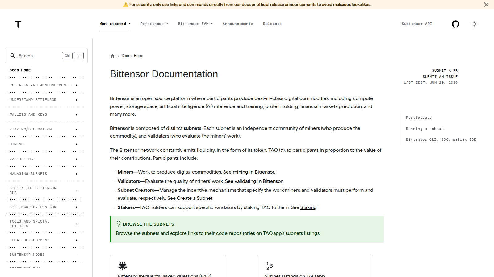
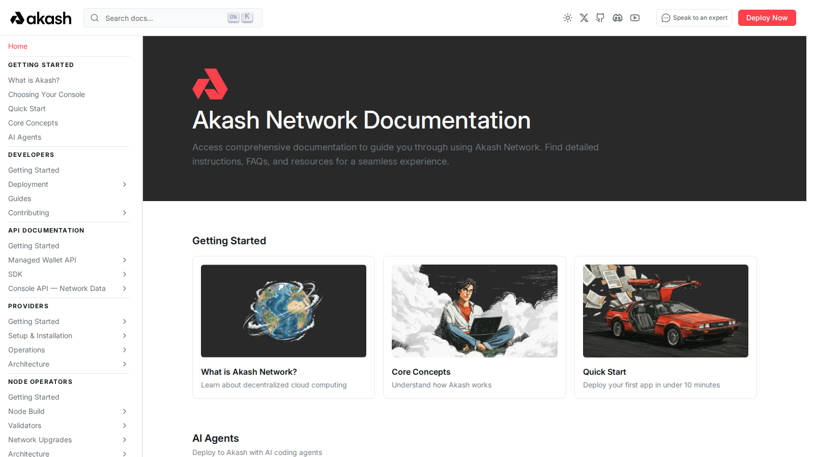

# Top AI Crypto Coins 2026: 12 Projects to Watch, Risks Included

Last updated: 2026-07-10

AI remains one of the strongest narrative magnets in crypto, but that does not mean every "AI coin" deserves the same attention. The cleaner way to approach this category in 2026 is to split it into infrastructure, compute, data, agent, and distribution plays, then ask which projects still look relevant if the hype cools down. That framing also sits inside the bigger market map covered in [Top Crypto Narratives 2026](03-top-crypto-narratives-2026.md), where AI has to compete with institutional, tokenization, and liquidity-driven themes rather than floating as a story on its own.

If you are choosing an AI-crypto watchlist, the real problem is usually not finding the loudest tokens. The real problem is figuring out which names still make sense once the narrative cools and the market starts asking harder questions about usage, liquidity, and role inside the stack.

That is why this article does not rank AI coins by hype alone. We are looking at them through the lens of infrastructure role, public product posture, token relevance, and how well each name holds up against broader market filters such as [on-chain indicators](08-top-on-chain-indicators-2026.md) and [institutional crypto trends](09-top-institutional-crypto-trends-2026.md).

> Why you can trust this guide
>
> This article is based on live public product pages and current documentation reviewed in July 2026. We directly reviewed the public-facing docs or product surfaces for core projects in this list, including Bittensor, Render, Akash, and AIOZ. Where a claim still depends on logged-in workflows, deeper usage data, or end-to-end testing, we mark it for final verification before publication.

## The top AI crypto coins to watch in 2026 are concentrated in infrastructure, data, and decentralized compute

The top AI crypto coins to watch in 2026 are the projects tied most clearly to real compute demand, usable data layers, or durable distribution inside the AI stack. That puts names such as Bittensor, Render, Akash, AIOZ, and the Artificial Superintelligence Alliance near the center of the conversation, while smaller agent or tooling tokens stay more speculative. The key point is that the strongest AI-crypto setups usually sell access to infrastructure, attention, or network effects rather than a vague chatbot story.

## How we ranked AI crypto coins for this list

This list uses six filters:

- category importance inside the AI stack
- evidence of actual usage or developer attention
- token role inside the network
- liquidity and market accessibility
- narrative durability beyond one news cycle
- downside risk if AI sentiment weakens

That is why this is a watchlist, not a guarantee list. Some projects here may matter because they provide real infrastructure. Others matter because they capture attention and capital even before fundamentals fully catch up. Readers who want a harder market-structure lens should pair this page with [Top On-Chain Indicators 2026](08-top-on-chain-indicators-2026.md), because AI-token narratives often look strongest right before usage and liquidity metrics start diverging.

## What we checked ourselves before ranking these projects

To write this page, we reviewed the live public product surfaces and current documentation of the core projects most likely to lead the category. We did that so the article would not depend only on ticker-level summaries or third-party roundups.

That direct review does not replace a full end-to-end usage test. We did not run every network workflow, deploy live workloads across every platform, or validate private dashboards that require deeper access. But from the public surfaces we reviewed, one thing stood out immediately: the strongest projects already signal what kind of product they are trying to be. Some present themselves as infrastructure first. Some present themselves as ecosystem coordination layers. Others still lean more heavily on narrative than on legible product posture.

For this type of reader, that tradeoff matters more than a simple "top AI coins" label. A project can look exciting in a market-cap table and still feel vague once you inspect the actual docs, navigation, or public-facing product flow.

## Visual evidence from our July 2026 review

The screenshots below show why this matters. Even before a logged-in test, the public-facing surfaces already signal whether a project is optimized for network participation, compute infrastructure, or developer onboarding.

*Bittensor docs homepage captured during our July 2026 review of AI crypto projects.*

What stood out immediately on Bittensor was the posture of the docs. The page presents the network through validators, miners, staking, and subnets rather than through marketing-first AI language. That is a strength if you want infrastructure exposure, but a weakness if your priority is quick readability for newer retail readers.

*Render Network about page captured during our July 2026 review of AI crypto projects.*

Render signals something different. The public surface feels much easier to parse at a glance, which matters because AI-crypto winners often need to be legible not just to crypto-native traders but also to readers coming from broader GPU and compute narratives.

*Akash Network documentation homepage captured during our July 2026 review of AI crypto projects.*

Akash sits somewhere in between. The docs presentation makes the decentralized-cloud thesis more concrete than a typical narrative token page, but it still asks the reader to understand infrastructure concepts before the story becomes intuitive. In practice, that is a strength for serious infrastructure readers and a weakness for casual momentum readers.

## The full list

### 1. Bittensor

Bittensor sits near the top because it has one of the clearest attempts at building an open incentive network around machine intelligence. What stood out immediately from the public docs we reviewed was not just the AI framing. It was how much of the documentation is organized around subnets, validators, miners, staking, and participation mechanics. That is a strength if you want a project that already presents itself like a live network rather than a vague concept. But it is a weakness if your priority is simplicity, because the story is still harder to explain than cleaner compute or GPU-exposure names. If the thesis keeps attracting builders, Bittensor remains one of the most structurally important AI-crypto names in the market, especially in a cycle where [institutional crypto trends](09-top-institutional-crypto-trends-2026.md) are pushing investors to distinguish infrastructure exposure from pure speculation.

The risk is that the story is still harder to explain than simpler compute or GPU exposure. If the network effect weakens or the reward structure loses credibility, the token can trade more like a narrative asset than a usage asset.

### 2. Render

Render remains one of the cleaner AI-adjacent projects because the value proposition is easy to understand. From the public product surface we reviewed, Render immediately feels more like a GPU-compute and creative-infrastructure network than a token wrapped in AI language. That is a strength if you want a category leader that broader markets can read quickly. But it can become a weakness if the market starts rewarding raw speculation over easier-to-explain infrastructure stories. If AI workloads and graphics workloads continue to compete for compute, Render has the advantage of being legible to both crypto traders and broader AI-infrastructure watchers, which is exactly the kind of bridge asset that can benefit when [institutional crypto trends](09-top-institutional-crypto-trends-2026.md) start favoring easier-to-explain infrastructure stories.

Its main risk is that the token still depends on the market continuing to believe decentralized compute deserves a premium. If centralized cloud providers keep winning the margin battle, that premium can compress.

### 3. Akash Network

Akash belongs high on the list because decentralized cloud and compute are among the most intuitive ways crypto can plug into the AI buildout. When readers search for AI coins, many really want exposure to the infrastructure layer behind model training, inference, and deployment. Akash fits that framing better than most narrative-only names.

The challenge is execution. Infrastructure stories can stay important while individual tokens fail to capture enough direct value.

### 4. Artificial Superintelligence Alliance

The ASI combination of established AI-related crypto brands matters because it represents scale and coordination inside a fragmented niche. In a category where many small tokens compete for attention, an alliance can matter simply by concentrating mindshare, resources, and exchange relevance.

It also carries integration risk. Mergers and alliance narratives often sound stronger in presentations than they do in day-to-day network adoption.

### 5. AIOZ Network

AIOZ stays relevant because it sits at the intersection of decentralized content delivery, storage, and AI infrastructure themes. That kind of overlap can be powerful in a market where investors often reward projects that touch more than one durable trend.

The weakness is that multi-theme exposure can also create a fuzzy thesis. If investors stop believing the platform is central to either distribution or AI compute, the token may struggle to keep its premium.

### 6. Near Protocol

Near is not always filed mentally as an AI coin first, but it stays in the discussion because it has spent meaningful time aligning its developer story with AI, user abstraction, and agent-friendly interfaces. That matters because AI winners in crypto may not all be narrow sector tokens. Some may be broader platforms that become attractive rails for AI-native applications.

The risk is category confusion. Near has many narratives, which can dilute conviction.

### 7. Virtuals Protocol

Virtuals earns a place because agent-driven markets, social attention, and tokenized AI personalities are part of the 2026 retail conversation whether long-term investors like it or not. This is one of the clearer names for readers who want exposure to the "AI agents as a crypto-native product class" trade.

The danger is obvious: this is one of the parts of the sector where hype can outrun product quality fastest.

### 8. Grass

Grass matters because decentralized data collection and bandwidth-sharing themes fit the AI supply chain better than many casual traders realize. Good AI systems depend on data and distribution, not just model headlines. That gives projects like Grass a more specific niche than generic AI branding.

The open question is token capture. Useful networks do not always become strong token investments.

### 9. io.net

io.net remains relevant because markets keep rewarding any project that offers a direct line into AI compute demand. The attraction is simple: readers can understand the pitch quickly, which gives the token narrative resilience during renewed AI cycles.

Its risk is crowding. This is now a competitive lane, and the market may not reward every compute marketplace equally.

### 10. Nosana

Nosana stays on watchlists because it offers another angle on decentralized compute marketplaces. For smaller-cap readers, names like this often matter because they can move faster than the larger AI crypto entities when sentiment turns favorable.

That also makes them riskier. Liquidity gaps and thinner adoption evidence can cut both ways.

### 11. The Graph

The Graph is better known as indexing infrastructure, but it still deserves mention because AI applications need efficient data access and query layers. It is not an "AI coin" in the narrow promotional sense, yet it benefits from the broader move toward machine-readable crypto data and composable information rails.

The limitation is that the market may continue valuing it more as general Web3 infrastructure than as pure AI exposure.

### 12. Filecoin

Filecoin closes the list because storage remains part of the AI stack, especially as model ecosystems and data-heavy applications scale. Readers building an AI-crypto watchlist should not ignore storage and retrieval just because those themes sound less flashy than agent tokens.

The problem is that broad infrastructure names often move less cleanly with AI headlines than sector-pure assets do.

## Key evidence and signals to track through H2 2026

If you want to refresh this page intelligently, do not just watch price. Track:

- whether decentralized compute networks show clear usage growth
- whether AI-agent tokens retain users after attention spikes
- whether alliances and mergers produce real ecosystem traction
- whether cloud and GPU shortages keep the compute narrative alive
- whether exchange liquidity concentrates into a few winners
- whether policy pressure from [Top Crypto Regulation Trends 2026](10-top-crypto-regulation-trends-2026.md) changes which AI-adjacent tokens remain easiest to list, custody, or explain

Those signals matter more than a one-week ranking shuffle.

## What this tells us about crypto in 2026

The AI-crypto market in 2026 is really several sub-markets pretending to be one category. Infrastructure and compute names are competing for a more durable role in the AI stack. Agent and social-attention names are competing for mindshare and velocity. Broader platforms are trying to prove they can become the preferred rails for AI-native applications. That means the best AI crypto watchlist is not the one with the most names. It is the one that separates real category roles from recycled marketing, then checks whether that narrative still holds against [on-chain indicators](08-top-on-chain-indicators-2026.md), [institutional flows](09-top-institutional-crypto-trends-2026.md), and the broader [crypto narrative map](03-top-crypto-narratives-2026.md).

## FAQ

### Are AI crypto coins a separate asset class?

Not in a strict institutional sense. They are still crypto assets, but they trade around a distinct narrative built on compute, models, data, and agent products.

### What makes an AI crypto coin stronger than the rest?

Usually one of three things: a clear network role, visible developer or user activity, or enough liquidity and distribution to survive when the hype cools down.

### Why are so many AI tokens still high risk?

Because the market often prices the AI story faster than adoption can verify it. That gap creates sharp upside and sharp disappointment.

## What would make this page stronger before final publication

We should not pretend we tested more than we actually tested. If the editorial team wants this page to carry stronger first-hand E-E-A-T signals, the right move is to add evidence we actually captured ourselves:

### 1. Exclusive visual evidence

- screenshot of each project's live dashboard, docs, validator/subnet page, or marketplace page
- side-by-side screenshots showing what the team actually checked during review
- one short screen recording showing how we verified activity, product flow, or developer-facing UX

### 2. First-person editorial notes

- why our team opened each project first
- what looked clearer or weaker when we reviewed the live product pages
- what felt impressive, confusing, or underdeveloped from a practical reviewer standpoint

### 3. Balanced evaluation

- one concrete strength we observed directly from the product or documentation
- one limitation or friction point we hit while reviewing the project
- one note on who should not use the token as a shortcut for "AI exposure"

### 4. Quantitative checks

- category market-cap snapshot on the day of review
- exchange-count or liquidity snapshot for the top five names
- one comparable metric such as validator count, network role, or usage proxy where available

## How to use this page

This page works best as a category map, not as a one-click buy list. Readers should use it to separate AI infrastructure, data, compute, and agent plays before comparing tokens. The ranking should be reviewed whenever one of three things changes materially: actual network usage, exchange liquidity concentration, or the market's definition of what counts as a real AI-crypto product. In practice, this page becomes much stronger when read together with [Top On-Chain Indicators 2026](08-top-on-chain-indicators-2026.md) and [Top Institutional Crypto Trends 2026](09-top-institutional-crypto-trends-2026.md), because those pages help filter hype from durable market structure.

## External links to cite

- [Bittensor Docs](https://docs.bittensor.com/) for network design and validator/subnet references
- [Render Network Overview](https://rendernetwork.com/about) for Render's GPU and compute positioning
- [Akash Documentation](https://akash.network/docs/) for decentralized cloud and deployment mechanics
- [Artificial Superintelligence Alliance Community](https://community.superintelligence.io/) for current alliance references
- [AIOZ Docs](https://docs.aioz.network/) for AI, storage, and streaming infrastructure references

## Media plan

- Hero image: AI crypto sector map split into `compute`, `data`, `agents`, and `distribution`
- Comparison table near the top: token, role, primary chain, main bull case, main risk
- One inline chart: CoinGecko AI category market-cap trend or AI category screenshot with source note
- One explainer graphic: how decentralized compute differs from AI-agent tokens

## Editor Source Checklist

- verify current AI-token category leaders and category definitions from live market data [needs source]
- verify ecosystem and usage claims for Bittensor, Render, Akash, ASI, and AIOZ [needs source]
- verify whether Near, Virtuals, Grass, io.net, and Nosana still fit the strongest 2026 watchlist framing at publish time [needs source]

## Internal Link Targets

- `/narratives/cross-market/top-crypto-narratives-2026`
- `/insights/on-chain/top-on-chain-indicators-2026`
- `/insights/institutional/top-institutional-crypto-trends-2026`
- `/macro/regulation/top-crypto-regulation-trends-2026`
