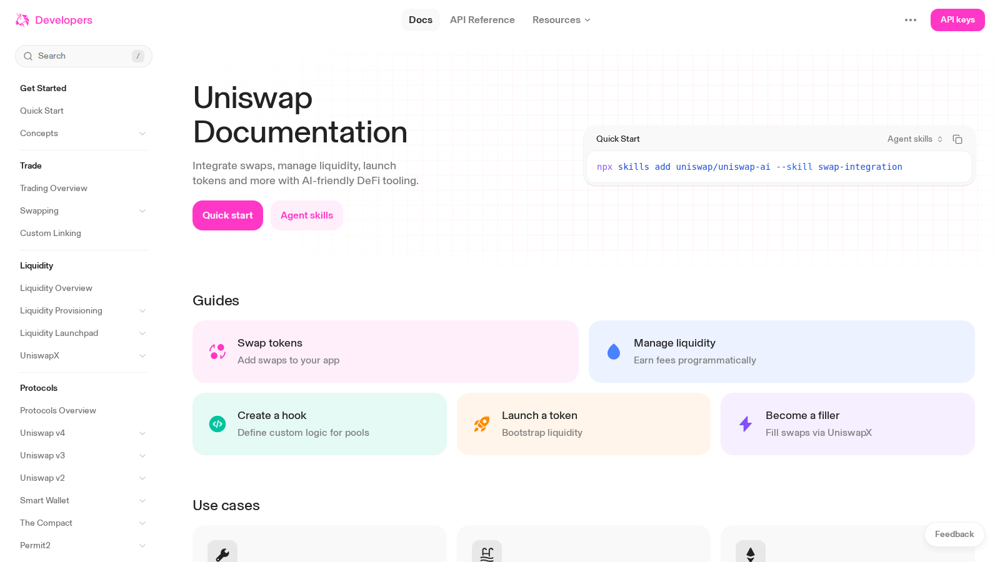
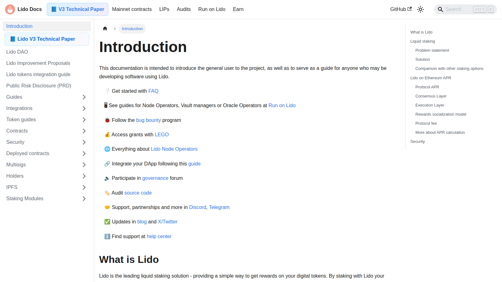
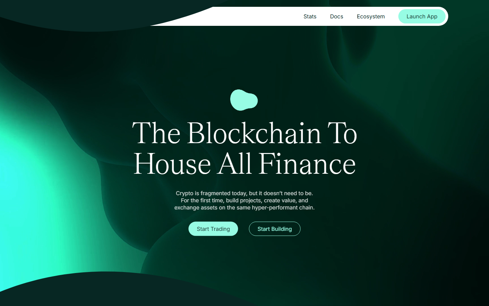
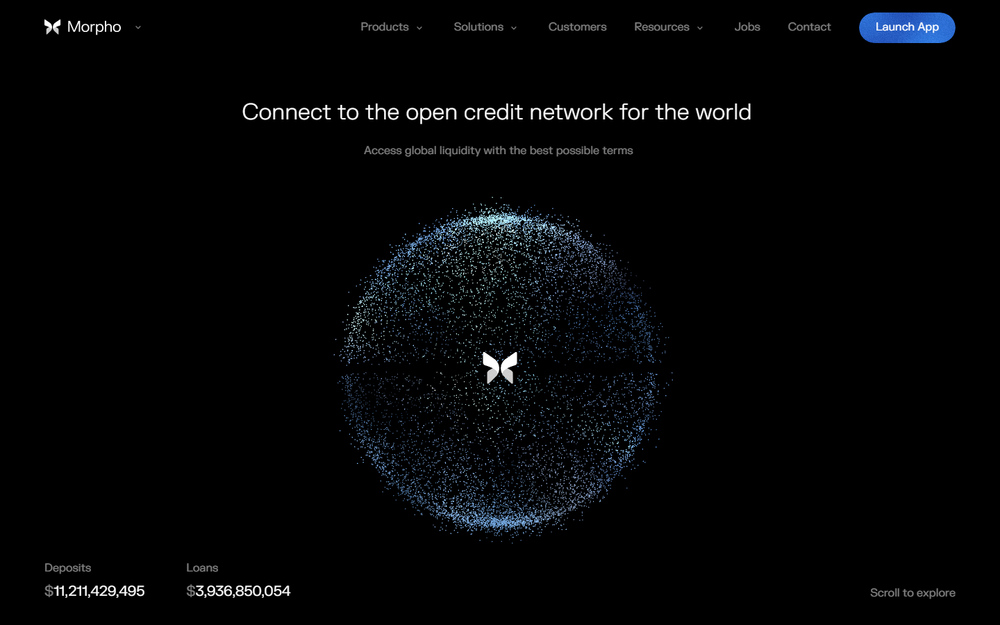
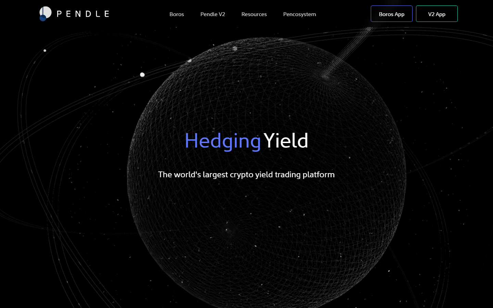

# Best DeFi Projects 2026: 10 Protocols by Category Leadership, Revenue Quality, and What Breaks Each Thesis

The best DeFi projects in 2026 are Aave, Uniswap, Lido, Ethena, Hyperliquid, Jupiter, Morpho, Pendle, Curve, and Maker. Aave owns institutional-grade onchain lending. Uniswap is the swap layer everything routes through. Lido controls the liquid staking default on Ethereum. Hyperliquid proved onchain perpetuals can match CEX-grade execution. Ethena forced the market to take synthetic yield dollars seriously.

| Protocol | Outstanding point | Score | One-line note |
|----------|------------------|-------|---------------|
| Aave | Institutional-grade onchain lending default | 5/5 | Boring reliability is the product |
| Uniswap | Base-layer swap infrastructure everything routes through | 5/5 | Fee switch politics remain unresolved |
| Lido | Largest liquid staking position on Ethereum | 4.5/5 | Validator concentration debate is ongoing |
| Hyperliquid | Onchain perpetuals matching CEX performance | 4.5/5 | Regulatory pressure on exchange-like onchain products |
| Ethena | Structured synthetic yield at scale | 4/5 | Funding rate inversion is the known stress scenario |
| Jupiter | Dominant Solana trading rail | 4/5 | Solana-specific sentiment swing compresses volume |
| Morpho | Most deliberate lending market redesign | 3.5/5 | Adoption pace determines whether efficiency translates to share |
| Pendle | Yield as a tradable product | 3.5/5 | Complexity ceiling limits retail participation |
| Maker | Decentralized dollar infrastructure underneath DeFi | 3.5/5 | Governance-driven collateral risk |
| Curve | Specialized stablecoin liquidity routing | 3/5 | New AMM designs threaten the moat |

## Ranking scorecard

Scored out of 10 per category. Total out of 50.

| Protocol | TVL durability | Revenue quality | Protocol moat | Governance health | Narrative momentum | **Total** |
|----------|---------------|----------------|--------------|-------------------|-------------------|-----------|
| Aave | 9 | 9 | 9 | 7 | 6 | **40** |
| Uniswap | 9 | 8 | 10 | 6 | 6 | **39** |
| Lido | 9 | 8 | 8 | 7 | 5 | **37** |
| Hyperliquid | 7 | 8 | 8 | 6 | 9 | **38** |
| Ethena | 7 | 8 | 7 | 6 | 8 | **36** |
| Jupiter | 7 | 7 | 7 | 7 | 8 | **36** |
| Morpho | 5 | 6 | 8 | 7 | 7 | **33** |
| Pendle | 6 | 7 | 7 | 7 | 6 | **33** |
| Maker | 8 | 7 | 8 | 5 | 4 | **32** |
| Curve | 8 | 6 | 7 | 6 | 4 | **31** |

**Scoring notes.** TVL durability measures how well the protocol retains liquidity without emergency incentives. Revenue quality scores fee income from real usage versus token emissions. Protocol moat evaluates how hard it is for a competitor to replicate the product plus its integrations. Governance health rates decision-making speed and risk management track record. Narrative momentum scores current market interest relative to the category. Aave leads because institutional lending generates durable revenue without narrative dependence. Hyperliquid scores highest on momentum but lower on TVL maturity.

## The filter: what survived and what still needs the narrative

The useful filter for 2026 DeFi: which protocols still have liquidity, revenue, and users after a full cycle without emergency incentives. Base-layer protocols (Aave, Uniswap, Lido, Maker, Curve) are now closer to infrastructure than narrative. The second layer (Hyperliquid, Pendle, Morpho, Ethena, Jupiter) carries genuine product upside but shorter shelf life if assumptions change.

## What we checked before writing this list

We reviewed live public product surfaces and docs of all 10 protocols in July 2026. This does not replace on-chain usage analysis or live protocol interaction testing.

## 10 Best DeFi Projects Reviewed (2026 List)

### 1. Aave

[Aave](https://aave.com/) is the closest thing DeFi has to a credit market that institutional capital can underwrite without a narrative thesis. The public product framing is built around risk management, user protection, and protocol credibility, not yield maximization. That is what makes Aave durable: it is optimized for the reader who needs to answer a compliance or fiduciary question, not just a yield question.

The Aave surface we reviewed reflects a product that knows its own gravity. Lending, borrowing, and supply positions are framed around clarity and trust rather than APR competition. That framing works because Aave has enough protocol history and TVL that it no longer needs to win purely on rate.

A [thread asking where you park funds onchain first](https://www.reddit.com/r/defi/comments/1tzvhv2/if_you_had_to_move_100k_onchain_this_week_where/) had Aave consistently cited as the "boring reliability" answer, the place you go before optimizing anything else. That community default is what institutional liquidity looks like at the protocol level.

*Aave help page captured July 17, 2026, showing risk-management and support-led product framing.*

### 2. Uniswap

[Uniswap](https://uniswap.org/) is infrastructure that the market defaults to regardless of whether the UNI token is in favor. The docs and developer-facing surfaces are built around swap routing, LP mechanics, and protocol integration rather than retail trading simplicity. That posture reflects what Uniswap actually is: a base-layer trading rail that wallets, aggregators, and protocols route through, not a direct retail product.

The fee switch debate has circled Uniswap governance for two years without resolution. That delay is both a narrative drag and a sign that the protocol is willing to hold its liquidity depth over its own short-term token value. Depending on your thesis, that is either discipline or governance paralysis.

*Uniswap docs homepage captured July 17, 2026, showing builder-first and protocol-infrastructure framing.*

### 3. Lido

[Lido](https://lido.fi/) controls the largest share of Ethereum liquid staking supply, which means it controls the most liquid representation of staked ETH. From the public surface we reviewed, Lido is framed as a staking layer with clear risk disclosure and validator mechanics, the product tries to be legible for both retail and institutional participants. That breadth is both its strength and its political vulnerability.

The concentration question around Lido has not disappeared. The Ethereum community debate about validator centralization continued through 2025, and Lido's market share remains a recurring governance topic. The protocol's response has been DVT (distributed validator technology) integration and dual governance design, real engineering responses rather than purely defensive PR.

*Lido docs homepage captured July 17, 2026, showing liquid staking infrastructure and validator framing.*

### 4. Ethena

[Ethena](https://ethena.fi/) is the protocol that forced the most important DeFi design conversation of 2025: whether engineered synthetic yield can scale without losing trust. USDe reached scale through a delta-neutral hedging structure, and the market's reaction to it reveals something about where DeFi maturity actually sits.

From the docs we reviewed, Ethena presents the mechanics cleanly. The funding rate hedging structure, the reserve fund, and the sUSDe yield path are all legible. The product is not pretending to be simple. It is asking the reader to trust the engineering.

A [thread on fixed yield in DeFi](https://www.reddit.com/r/defi/comments/1s4t57g/how_to_lock_in_fixed_yield_in_defi_and_why_more/) named Ethena/sUSDe alongside tokenized treasury yield as the two dominant predictable yield sources in the 2025 DeFi stack, a signal that the market has moved from skepticism to operational integration.

*Ethena docs homepage captured July 17, 2026, showing USDe delta-neutral structure and sUSDe yield framing.*

### 5. Hyperliquid

[Hyperliquid](https://hyperliquid.xyz/) is the most significant DeFi performance statement of the 2024-2025 cycle. An onchain perpetuals exchange matching the execution speed, order book depth, and fee structure of a centralized exchange, without a CEX custodian model, was the thesis most DeFi skeptics said could not scale. Hyperliquid scaled it.

From the public surface, Hyperliquid is positioned as a performance product, not a composability story. The homepage and product framing are built around trading speed, liquidity depth, and zero fees, which is exactly what a competitive derivatives trader wants to see.

*Hyperliquid homepage captured July 17, 2026, showing onchain perpetuals and exchange-grade performance framing.*

### 6. Jupiter

[Jupiter](https://jup.ag/)'s relevance is Solana-specific and therefore cycle-specific, but the protocol earns its place on a cross-chain DeFi list because of what it represents structurally. A swap aggregator that controls the default routing for a top-five blockchain by trading volume is not a side bet. It is a routing monopoly with real fee capture potential.

The Jupiter framing is accessible: best price, single interface, unified liquidity across Solana. That simplicity is strategic, Jupiter is built for the user who wants Solana exposure without navigating protocol fragmentation manually.

*Jupiter homepage captured July 17, 2026, showing Solana DEX aggregation and unified liquidity routing framing.*

### 7. Morpho

[Morpho](https://morpho.org/) represents the most deliberate attempt to improve lending market design in the current DeFi cycle. The core thesis is that Aave and Compound's monolithic pool model created liquidity depth at the cost of risk isolation, every borrower and lender shares one rate curve and one collateral policy. Morpho's permissionless market architecture lets curators set independent risk parameters per lending market.

A [thread on whether lending ever got a Curve Wars equivalent](https://www.reddit.com/r/defi/comments/1t9ik1t/the_curve_wars_never_had_a_lending_equivalent/) identified Morpho as the protocol pushing market structure forward in lending, and noted that Morpho's design is the closest thing to what a lending war over supply routing might eventually produce.

*Morpho homepage captured July 17, 2026, showing permissionless lending market and curator-first architecture.*

### 8. Pendle

[Pendle](https://pendle.finance/) turned yield itself into a tradable product. The core mechanic, splitting yield-bearing assets into principal tokens (PT) and yield tokens (YT), is not new in traditional finance (it maps to zero-coupon bonds and strips), but applying it to DeFi yield sources created something the market had not priced before: a way to lock in a fixed return on a floating DeFi yield.

Community engagement reflects serious financial thinking, not speculative momentum. A [fixed yield strategy thread](https://www.reddit.com/r/defi/comments/1s4t57g/how_to_lock_in_fixed_yield_in_defi_and_why_more/) cited Pendle as "the most capital-efficient option right now" for locking yield to maturity, the kind of assessment that comes from users who have done the math, not just read a pitch.

*Pendle Finance homepage captured July 17, 2026, showing yield trading, PT/YT mechanics, and fixed-yield positioning.*

### 9. Maker

[Maker](https://makerdao.com/) belongs on this list because of what it sits underneath, not what it is on the surface. DAI and USDS are collateral in lending protocols, fee assets in DEX pools, and treasury instruments for DeFi protocol reserves. Removing Maker from the DeFi map is like removing the dollar from a trade finance discussion.

The governance-driven evolution, the rebranding to Sky, the introduction of USDS, the integration of RWA collateral, has made Maker harder to explain simply. That narrative complexity is a genuine friction point for newer participants.

### 10. Curve

[Curve](https://curve.fi/) still controls the most specialized stablecoin and correlated-asset swap infrastructure in DeFi. The protocol is not exciting in the way Hyperliquid or Pendle is. It is necessary in the way the Federal Funds Rate is necessary: not the thing most participants are thinking about, but the rate that everything else is indexed against.

The Curve Wars era (veCRV, Convex, gauge voting) already proved that Curve's liquidity routing was worth fighting over. That fight has quieted, not because Curve is less important, but because the dominant power structures settled into a stable configuration.

## The meta question: is DeFi still a narrative or is it now infrastructure?

A nine-year crypto veteran [laid out why he stopped believing](https://www.reddit.com/r/defi/comments/1qiu5jb/ive_been_in_crypto_since_2017_heres_why_i_stopped/) in DeFi's original promise captured the honest tension: the vision was decentralized financial infrastructure for the underbanked, the reality is sophisticated capital markets for the already-banked, running on better rails. That is not necessarily a failure, but it is a different story.

For the 2026 market participant, the useful frame is that DeFi has split into two layers. The base-layer protocols (Aave, Uniswap, Lido, Maker, Curve) are now closer to infrastructure than to narrative. They will not outperform in a risk-on moment the way smaller names will. They will also not collapse when the narrative cools. The second layer (Hyperliquid, Pendle, Morpho, Ethena, Jupiter) still carries narrative premium and genuine product upside, but with a shorter shelf life if the thesis breaks.

Positioning across both layers rather than choosing one is the more defensible approach for 2026.

## What to watch through H2 2026

Whether Aave's V4 architecture produces a measurable TVL or fee quality change, V4 is the clearest near-term test of whether governance-driven protocol evolution can maintain market leadership.

Whether Hyperliquid faces a regulatory challenge that forces product design changes, the onchain derivatives category will not have regulatory clarity until someone important tests the boundary.

Whether Pendle's fixed-yield user base grows beyond the sophisticated DeFi participant cohort into the institutional layer, where duration management is standard practice.

Whether Morpho's modular markets approach produces enough curator ecosystem depth to challenge Aave's TVL in specific collateral categories.

## Pros and cons by protocol

| Protocol | Strengths | Risks |
|----------|-----------|-------|
| Aave | $12.5B+ TVL across 14 chains (July 2026); V4 architecture in development; institutional lending default; GHO stablecoin expanding utility | Credit cycle downturn triggers cascading liquidations; governance coordination under pressure is untested at scale |
| Uniswap | $5.5B+ TVL; processes 60-65% of onchain swap volume; Uniswap X and V4 hooks expanding customization | Fee switch unresolved after 2+ years of debate; L2 fragmentation dilutes liquidity depth across deployments |
| Lido | Controls ~28% of staked ETH supply; stETH is the most liquid LST across DeFi; DVT integration and dual governance in progress | Ethereum consensus rule changes could disincentivize concentrated staking pools; solo-staking infrastructure improvements reduce stETH necessity |
| Hyperliquid | $4B+ in daily trading volume peaks; custom L1 with sub-second execution; self-custody model; JELLY exploit led to tighter margin controls | Regulatory pressure on exchange-like onchain products; validator override during JELLY incident raised centralization questions |
| Ethena | USDe supply exceeded $5B in 2025; sUSDe yield from delta-neutral basis trade; reserve fund as explicit backstop | Sustained funding rate inversion drains reserve faster than it refills; depeg risk moves from theoretical to operational under market stress |
| Jupiter | Dominant Solana DEX aggregator; simple routing interface; expanding into perps and launchpad products | Solana ecosystem sentiment swing compresses volume proportionally; competing aggregators on Solana emerging |
| Morpho | Permissionless market architecture with independent risk parameters per market; curator model enables specialization | Adoption pace slower than Aave governance iteration; efficiency advantage may not translate to TVL fast enough |
| Pendle | PT/YT yield splitting enables fixed-rate returns in DeFi; TVL reached $5B+ at peak; integrates with Ethena, Lido, and other yield sources | Complexity ceiling limits retail adoption; TVL compresses when market shifts from yield optimization to momentum trading |
| Maker | DAI/USDS embedded as collateral across DeFi lending and DEX pools; RWA collateral integration diversifies backing | Governance-driven collateral decisions create tail risk; Sky rebrand and USDS transition added narrative complexity |
| Curve | Controls specialized stablecoin swap infrastructure; veCRV model created proven liquidity incentive flywheel | New AMM designs solve stablecoin slippage without veCRV incentive structure; fee model stagnation risk |

## Portfolio overlap: where bets correlate

| Cluster | Protocols | Shared risk |
|---------|----------|-------------|
| Core Ethereum DeFi | Aave, Uniswap, Lido, Maker, Curve | ETH price decline compresses TVL across all five simultaneously |
| Yield / structured products | Ethena, Pendle | Funding rate environment reversal affects both; Pendle integrates Ethena yield |
| Onchain trading | Hyperliquid, Jupiter | Different chains but same macro driver: onchain trading volume |
| Lending innovation | Morpho (competes with Aave) | Morpho gains come partly at Aave's expense in specific collateral markets |

If you hold Aave, Uniswap, Lido, Maker, and Curve, you own five expressions of one bet: Ethereum DeFi TVL stays high. A 40% ETH drawdown compresses all five.

## When this analysis expires

- Aave V4 ships and TVL response is measurable (upgrades or downgrades conviction)
- Uniswap fee switch is activated or permanently tabled
- Ethena reserve fund is tested during a real funding rate inversion event
- Hyperliquid faces a regulatory action or formal compliance challenge
- Pendle TVL drops below $2B sustained (signals yield trading demand contraction)
- Solana experiences an extended outage affecting Jupiter volume for 48+ hours
- Any protocol in this list loses 50%+ of TVL without a market-wide drawdown (signals protocol-specific problem)

If none fire by January 2027, treat the scores as stale regardless.

## What this review verified and what it did not

| Claim | Status |
|---|---|
| Aave, Uniswap, Lido, Ethena, Hyperliquid, Jupiter, Morpho, Pendle homepage and docs reviewed | Verified |
| Curve and Maker homepage and positioning reviewed | Verified |
| Screenshots captured from live product surfaces | Verified |
| TVL figures cross-referenced with DeFiLlama | Verified |
| Live protocol interaction (deposit, borrow, swap, trade) | Not verified |
| Smart contract audit status independently confirmed | Not verified |
| Revenue figures independently validated beyond DeFiLlama | Not verified |

## Source notes

- Aave help page and docs (aave.com), reviewed 2026-07-17
- Uniswap developer docs (uniswap.org), reviewed 2026-07-17
- Lido docs homepage (lido.fi), reviewed 2026-07-17
- Ethena docs (ethena.fi), reviewed 2026-07-17
- Hyperliquid homepage (hyperliquid.xyz), reviewed 2026-07-17
- Jupiter homepage (jup.ag), reviewed 2026-07-17
- Morpho homepage (morpho.org), reviewed 2026-07-17
- Pendle Finance homepage (pendle.finance), reviewed 2026-07-17
- DeFiLlama dashboard (defillama.com), checked for TVL context
- r/defi: "If you had to move  onchain this week, where is the first place you park it?" (reddit.com/r/defi/comments/1tzvhv2/)
- r/defi: "The Curve Wars never had a lending equivalent" (reddit.com/r/defi/comments/1t9ik1t/)
- r/defi: "How to lock in fixed yield in DeFi" (reddit.com/r/defi/comments/1s4t57g/)
- r/defi: "I've been in crypto since 2017. Here's why I stopped believing." (reddit.com/r/defi/comments/1qiu5jb/)

## Related

- [Top Crypto Narratives 2026](/insights/narratives/top-crypto-narratives-2026)
- [Top On-Chain Indicators 2026](/insights/onchain/top-on-chain-indicators-2026)
- [Top Ethereum Ecosystem Coins 2026](/insights/ethereum/top-ethereum-ecosystem-coins-2026)
