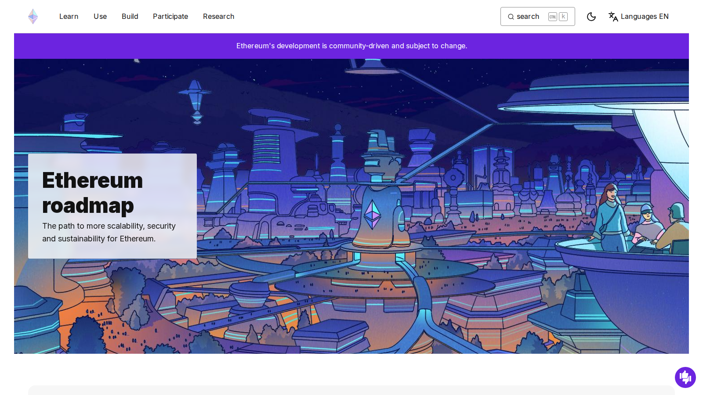
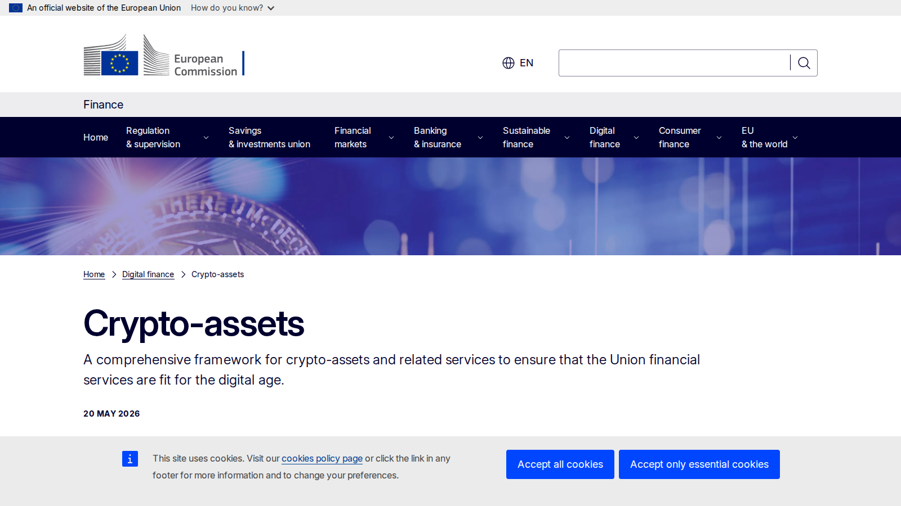

# Top Crypto Narratives 2026: 9 Themes Driving the Market

Last updated: 2026-07-13

If you are trying to understand which crypto themes matter in 2026, the real problem is usually not spotting the loudest narrative on social media. The real problem is figuring out which stories are actually being reinforced by policy, product launches, liquidity, or institutional distribution.

That is why this article does not rank narratives by volume of discussion alone. We are looking at them through the lens of repeatable catalysts, market-structure impact, and whether the theme still holds up when you compare it with [Top AI Crypto Coins 2026](01-top-ai-crypto-coins-2026.md), [Top Institutional Crypto Trends 2026](09-top-institutional-crypto-trends-2026.md), and [Top Altcoins for Altcoin Season 2026](05-top-altcoins-for-altcoin-season-2026.md).

> Why you can trust this guide
>
> This article is based on live public product, policy, and research pages reviewed in July 2026. We directly reviewed public-facing sources tied to major narratives in this list, including Ethereum's roadmap, the European Commission's crypto-assets page, and Coinbase research on tokenization. Where a claim still depends on private flow data or deeper market-share verification, we stay descriptive rather than pretending to have proved more than we did.

## The top crypto narratives in 2026 are AI, institutional adoption, tokenized assets, Ethereum scaling, and liquidity-sensitive alt rotation

The top crypto narratives in 2026 are the themes that keep reappearing across markets rather than only inside one token category. AI infrastructure, institutional adoption, tokenized real-world assets, Ethereum scaling and restaking, stablecoin competition, Bitcoin treasury expansion, Solana trading culture, regulation-driven market segmentation, and altcoin rotation all belong in that group. Some are growth stories. Some are market-structure stories. All of them matter because they shape where attention and capital go next.

## How we ranked crypto narratives for this list

This list uses five filters:

- how many sectors the narrative touches
- whether the narrative has real policy or product catalysts
- whether it changes capital allocation
- whether it is durable beyond one quarter
- whether it creates clear winners and losers

The strongest narrative is not always the loudest one. It is usually the one with repeatable catalysts and visible public evidence behind it.

## What we checked ourselves before ranking these narratives

To write this page, we reviewed live public pages tied to the themes most likely to shape crypto in 2026. We did that so the article would not rest only on abstract market commentary or recycled top-narrative roundups.

That direct review does not replace full access to private flow data or proprietary market intelligence. But from the public sources we reviewed, one thing stood out immediately: the strongest narratives already leave visible traces in official roadmaps, policy pages, and institutional research surfaces. Weak narratives mostly live in commentary. Stronger ones usually show up in actual product direction, public framework pages, or capital-market packaging.

For this type of reader, that distinction matters more than a broad label like narrative. The important thing is not whether a theme sounds exciting. The important thing is whether the market is building around it.

## Visual evidence from our July 2026 review

The screenshots below show why this page is more useful when tied to public evidence. Even before a reader opens charts or trade dashboards, the live surfaces already reveal which themes are being formalized into product, policy, or institutional language.

*Ethereum roadmap captured during our July 2026 review of leading crypto narratives.*

What stood out immediately on Ethereum's roadmap was that scaling is not being marketed as a side-story. It is presented as a central structural direction. That is a strength for the Ethereum-scaling narrative because it ties the theme to actual protocol priorities rather than to pure trader commentary.

*European Commission crypto-assets page captured during our July 2026 review of leading crypto narratives.*

The European Commission page makes something else clear: regulation is no longer just a risk headline. It already exists as a formal framework that shapes how products and issuers operate. That visual difference matters because it turns the regulation narrative from abstract fear into a market-structure variable.

*Coinbase research page on tokenization captured during our July 2026 review of leading crypto narratives.*

The Coinbase research surface shows how tokenization has moved into the language of institutional market intelligence. That is important because tokenized-assets narratives become much stronger once they stop sounding like niche crypto theory and start sounding like capital-market packaging.

## The full list

### 1. AI infrastructure and decentralized compute

AI stays near the top because it connects crypto to one of the biggest technology stories in the world, not just to a local market meme. The strength is that the narrative now has clearer sub-sectors such as compute, data, and agent coordination, which gives it more structure than a simple chatbot trade. The weakness is crowding. Once every token wants to borrow the AI label, readers need a stricter filter like [Top AI Crypto Coins 2026](01-top-ai-crypto-coins-2026.md) to separate infrastructure assets from narrative wrappers.

### 2. Institutional adoption and market plumbing

Institutional adoption matters because it changes who can enter the market and how capital moves once it arrives. The strength here is breadth: ETFs, custody, tokenized settlement rails, onchain funds, and compliance-friendly distribution all fit inside the same structural story. The weakness is that the phrase can become lazy very quickly. If a headline does not change market access or market plumbing, it should not automatically count as a major institutional shift. That is exactly why this theme works best next to [Top Institutional Crypto Trends 2026](09-top-institutional-crypto-trends-2026.md).

### 3. Tokenized real-world assets

Tokenized treasuries, funds, and equities remain important because they promise to make crypto more than a self-referential market. That is a strength if you believe better distribution and operational efficiency can pull traditional assets onchain. It is a weakness if you start treating every tokenization announcement as proof of real end-user scale. This narrative stays high because the direction is serious even when the pace of adoption is uneven.

### 4. Ethereum scaling, restaking, and settlement relevance

Ethereum remains a major narrative because it still anchors large parts of the market's DeFi, stablecoin, and tokenization logic. The strength is that scaling and settlement relevance are tied to visible protocol priorities, not just to tribal debate. The weakness is that the story can feel slower and less exciting than high-velocity alt narratives. For this type of reader, that tradeoff matters less than durability, which is why the ecosystem detail in [Top Ethereum Ecosystem Coins 2026](04-top-ethereum-ecosystem-coins-2026.md) still matters.

### 5. Stablecoin market-share competition

Stablecoins deserve a narrative slot because they now behave like infrastructure, not just trading chips. The strength is obvious: whoever wins distribution, exchange integration, and regulatory trust can shape much of the market's day-to-day liquidity. The weakness is that stablecoin stories often look simple on the surface while hiding policy, reserve, and issuer risk underneath. This is one of the clearest themes where narrative and market plumbing are now the same story.

### 6. Bitcoin treasury expansion and macro reserve logic

Corporate and institutional treasury interest in Bitcoin remains important because it gives the asset a balance-sheet role beyond retail speculation. The strength is that this narrative is easy for traditional markets to understand. The weakness is that it can become too Bitcoin-centric and miss what is happening elsewhere in crypto. It matters most when macro uncertainty rises and balance-sheet defensibility starts mattering more than token creativity.

### 7. Solana as a high-velocity trading and consumer chain

Solana keeps earning narrative weight because it sits close to speculative energy, fast-moving product culture, and consumer-facing crypto experiences. That is a strength if you want to understand where risk appetite tends to show up first. It is a weakness if you mistake velocity for durability. Solana belongs on this list because it often acts as the market's first answer to renewed retail aggression, even when longer-term capital still prefers other rails.

### 8. Regulation-driven market segmentation

Regulation belongs on a narrative list because it now sorts winners and losers by region, product scope, and distribution rights. The strength is that it explains why the same asset or service can have a different future in different jurisdictions. The weakness is that policy stories can look dramatic long before they become operational. Readers who want the deeper policy layer should keep [Top Crypto Regulation Trends 2026](10-top-crypto-regulation-trends-2026.md) open beside this page.

### 9. Altcoin rotation and liquidity spillover

Altcoin rotation remains one of the market's favorite stories because traders keep looking for the same sequence: Bitcoin strength, then broader liquidity release, then higher-beta sector expansion. The strength is that this pattern really does shape behavior in many cycles. The weakness is that it is one of the easiest narratives to overtrade. That is why it needs the more tactical filter in [Top Altcoins for Altcoin Season 2026](05-top-altcoins-for-altcoin-season-2026.md) rather than being treated like an automatic market law.

## Key evidence and catalysts to track through H2 2026

For a live update, focus on these questions:

- which narratives attract repeat capital rather than one-off attention
- which narratives gain support from policy or institutional product launches
- whether Ethereum and Bitcoin continue to anchor the market's credibility layers
- whether stablecoin competition and tokenization move from thesis to habit
- whether alt rotation broadens or stays concentrated in a few sectors

Those signals matter more than discussion volume alone.

## How to use this page

This page is a market map, not a daily signal feed. It is designed to help readers understand which themes are drawing repeated attention across products, policy, and capital flows. In practice, it works best as the hub that sends readers into more specific pages such as [Top AI Crypto Coins 2026](01-top-ai-crypto-coins-2026.md), [Top Ethereum Ecosystem Coins 2026](04-top-ethereum-ecosystem-coins-2026.md), [Top Institutional Crypto Trends 2026](09-top-institutional-crypto-trends-2026.md), and [Top Altcoins for Altcoin Season 2026](05-top-altcoins-for-altcoin-season-2026.md).

## FAQ

### What makes a crypto narrative strong?

A strong narrative links capital, timing, and believable catalysts. It is not just a catchy label.

### Can multiple narratives be true at once?

Yes. In fact, the market often performs best when several narratives reinforce each other, such as AI plus infrastructure demand or stablecoins plus regulation plus institutional adoption.

### Why does regulation count as a narrative?

Because it changes behavior, distribution, and trust. In crypto that often moves markets as much as technology does.

## Sources and further reading

- [European Commission Crypto-Assets / MiCA page](https://finance.ec.europa.eu/digital-finance/crypto-assets_en)
- [Ethereum Roadmap](https://ethereum.org/roadmap/)
- [Coinbase 2026 Institutional Investor Survey](https://www.coinbase.com/institutional/research-insights/research/insights-reports/2026-institutional-investor-survey-e-and-y)
- [Coinbase Research: Major Trends in Tokenization](https://www.coinbase.com/en-gb/institutional/research-insights/research/market-intelligence/major-trends-in-tokenization)
- [CoinGecko Categories Guide](https://www.coingecko.com/learn/coingecko-categories)

## Publishing media pack

Featured Image
File: `../assets/article-03-crypto-narratives/ethereum-roadmap.png`
Placement: below the intro or as the article hero image
Alt text: `Ethereum roadmap reviewed in July 2026 for our top crypto narratives guide`
Caption: `Ethereum roadmap captured during our July 2026 review of leading crypto narratives.`

Screenshot 1
File: `../assets/article-03-crypto-narratives/ethereum-roadmap.png`
Placement: inside `## Visual evidence from our July 2026 review`
Alt text: `Ethereum roadmap showing scaling direction during our July 2026 narrative review`
Caption: `Ethereum roadmap captured during our July 2026 review of leading crypto narratives.`

Screenshot 2
File: `../assets/article-03-crypto-narratives/eu-crypto-assets-page.png`
Placement: inside `## Visual evidence from our July 2026 review`
Alt text: `European Commission crypto-assets page reviewed for our July 2026 crypto narratives analysis`
Caption: `European Commission crypto-assets page captured during our July 2026 review of leading crypto narratives.`

Screenshot 3
File: `../assets/article-03-crypto-narratives/coinbase-tokenization-research.png`
Placement: inside `## Visual evidence from our July 2026 review`
Alt text: `Coinbase tokenization research page reviewed in July 2026 for our crypto narratives guide`
Caption: `Coinbase research page on tokenization captured during our July 2026 review of leading crypto narratives.`
