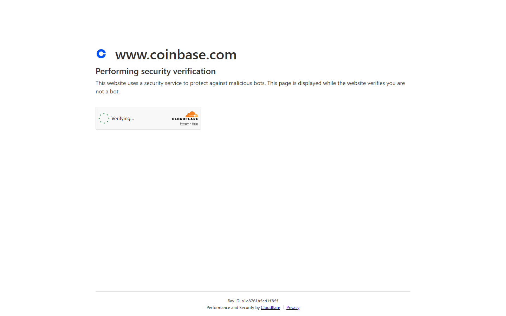
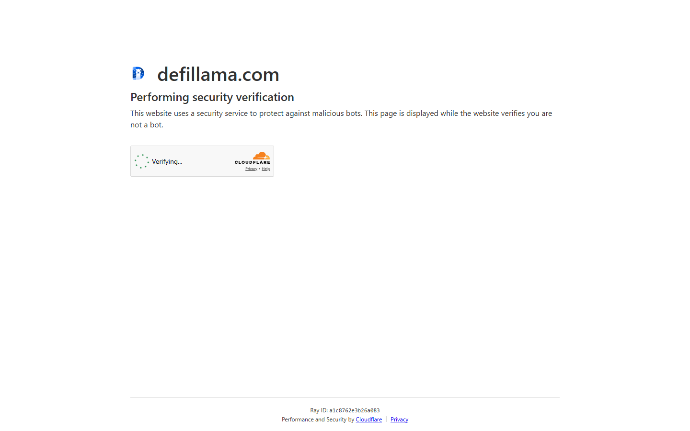
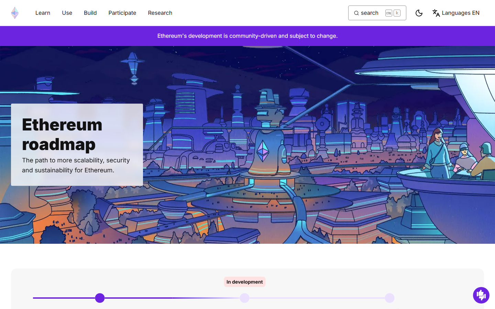

# Top Crypto Narratives 2026: 9 Themes Driving Capital, What Connects Them, and What Breaks Each Thesis

The top crypto narratives in 2026 are AI infrastructure, institutional adoption, tokenized real-world assets, Ethereum scaling, stablecoin competition, Bitcoin treasury expansion, Solana trading culture, regulation as market-structure catalyst, and altcoin rotation. AI infrastructure carries the highest conviction because its catalyst loop runs outside crypto entirely. Institutional adoption and RWA are close behind with production-grade products already deployed.

| Narrative | Outstanding point | Score | One-line note |
|-----------|------------------|-------|---------------|
| AI infrastructure | Catalyst loop runs outside crypto (NVIDIA earnings, GPU demand) | 5/5 | Risk: AI equity outperforms and capital never rotates back |
| Institutional adoption | ETF AUM validation is structural, not speculative | 5/5 | Macro risk-off is the stress test |
| Tokenized real-world assets | BUIDL $2.4B+ AUM; production-grade products live | 4.5/5 | Rate normalization erodes the yield edge |
| Ethereum scaling | Most active roadmap execution in crypto | 4/5 | Solana captures activity Ethereum L2s expected to win |
| Stablecoin competition | US legislation reshaping issuer landscape | 4/5 | Regulatory fragmentation locks out key players |
| Bitcoin treasury expansion | MicroStrategy template replicated across jurisdictions | 3.5/5 | BTC price reversal triggers forced corporate sells |
| Solana trading culture | Raw trading volume and developer activity earned the position | 3.5/5 | Single outage event shifts confidence at scale |
| Regulation as catalyst | MiCA live, US advancing, UK FCA building | 3/5 | Legislation advantages incumbents over crypto-native protocols |
| Altcoin rotation | Most discussed and most delayed | 2/5 | Institutional ETF flows structurally changed the rotation model |

## Ranking scorecard

Scored out of 10 per category. Total out of 50.

| Narrative | External catalyst strength | Capital flow evidence | Policy reinforcement | Thesis durability | Institutional backing | **Total** |
|-----------|--------------------------|---------------------|---------------------|-------------------|----------------------|-----------|
| AI infrastructure | 10 | 7 | 6 | 8 | 7 | **38** |
| Institutional adoption | 8 | 10 | 8 | 9 | 10 | **45** |
| Tokenized RWA | 7 | 8 | 8 | 8 | 9 | **40** |
| Ethereum scaling | 7 | 7 | 6 | 8 | 8 | **36** |
| Stablecoin competition | 6 | 7 | 9 | 7 | 7 | **36** |
| Bitcoin treasury | 6 | 8 | 5 | 6 | 7 | **32** |
| Solana trading culture | 5 | 7 | 3 | 5 | 4 | **24** |
| Regulation as catalyst | 4 | 5 | 10 | 7 | 8 | **34** |
| Altcoin rotation | 3 | 4 | 2 | 3 | 2 | **14** |

**Scoring notes.** Institutional adoption scores highest overall because ETF flows, corporate treasury moves, and custody infrastructure development are all measurable and recurring. AI infrastructure has the strongest external catalyst but lower institutional backing within crypto specifically. Altcoin rotation scores lowest because the structural conditions that powered 2021-style rotation have been disrupted by institutional capital flows that prefer Bitcoin ETF wrappers.

## The filter: catalysts with institutional legs vs sentiment-only stories

The reliable filter for 2026 narratives: does the story have an external catalyst that does not depend on crypto sentiment to keep moving? AI narratives are reinforced by NVIDIA earnings and GPU constraints. RWA narratives by BlackRock product filings. Bitcoin treasury by corporate balance sheet decisions. Narratives that depend only on crypto-internal sentiment stall when Bitcoin pulls back.

## What we reviewed before mapping this list

We reviewed live public sources tied to the major narratives in July 2026: Ethereum roadmap, EU crypto-assets framework, Coinbase institutional research, and DeFiLlama RWA dashboard. This does not replace quantitative capital flow analysis.

## 9 Top Crypto Narratives Reviewed (2026 List)

### 1. AI infrastructure

AI is the one crypto narrative in 2026 with a structural reinforcement loop that runs outside crypto entirely. Every time NVIDIA posts earnings above expectations, every time a major cloud provider raises GPU availability pricing, and every time a frontier model deployment creates new inference demand, the case for decentralized compute in crypto gets a free catalyst that does not depend on crypto sentiment.

That external reinforcement is what makes this narrative the highest-conviction one on the list. Bittensor, Render, and Akash benefit from a demand story that exists whether or not the crypto market is in a bull cycle.

The risk, discussed in CryptoCurrency Reddit threads comparing Bitcoin and Nvidia in mid-2026, is the rotation dynamic: [capital explicitly left BTC for AI equity](https://www.reddit.com/r/CryptoCurrency/comments/1twghjt/bitcoin_lost_66000_while_nvidia_hit_alltime_highs/) when Nvidia hit all-time highs while Bitcoin was declining. The AI crypto thesis depends on the market deciding that decentralized compute exposure cannot be accessed via NVDA, MSFT, or infrastructure ETFs. If equities keep delivering AI returns with less custody friction, crypto AI tokens underperform regardless of their fundamental role in the stack.

### 2. Institutional adoption

The institutional adoption narrative had its most important validation moment in 2024 when BlackRock, Fidelity, and others launched spot Bitcoin ETFs and captured + in AUM within 18 months. That is no longer a prediction. It is a structural fact of the market. The question for 2026 is where the next institutional product category forms.

The current evidence points toward three areas: tokenized money market funds (BUIDL model), Bitcoin in corporate treasury (post-MicroStrategy template), and custody infrastructure for pension and sovereign wealth fund participation. All three require regulatory frameworks to be stable enough for compliance teams to approve, which is why the institutional narrative is tightly linked to the regulation narrative below.

*Coinbase institutional page captured July 17, 2026, showing custody, prime brokerage, and institutional crypto infrastructure framing.*

### 3. Tokenized real-world assets

The RWA narrative has graduated from concept to infrastructure. BlackRock BUIDL crossed .4B in AUM, Ondo's OUSG reached multi-hundred-million TVL, and Franklin Templeton's Benji registered on-chain share records for a regulated money market fund. These are not experiments. They are production-grade products with institutional client bases.

The DeFiLlama RWA dashboard shows consistent TVL growth across tokenized treasury products, reflecting genuine institutional demand rather than DeFi-native yield farming. The narrative is now about which issuer wins which distribution channel, not whether the category will exist.

*DeFiLlama RWA dashboard captured July 17, 2026, showing tokenized treasury and real-world asset protocol TVL across the ecosystem.*

### 4. Ethereum scaling

Ethereum scaling is the narrative that keeps evolving as the ecosystem ships. The Pectra upgrade, ongoing L2 maturity across Arbitrum, Optimism, Base, and ZKSync, and the growing restaking layer around EigenLayer collectively represent the most active roadmap execution in crypto. The public Ethereum roadmap page maps a multi-year upgrade sequence that is being delivered on schedule.

The scaling narrative is distinct from the ETH price narrative, though the two are often conflated. Ethereum's scaling relevance is about whether it remains the settlement layer for serious DeFi, tokenization, and institutional crypto products. That question is being answered through deployment patterns: Coinbase Base, BlackRock BUIDL, Ondo OUSG, Hyperliquid's HyperEVM, all building on or adjacent to Ethereum.

*Ethereum roadmap page captured July 17, 2026, showing the active upgrade sequence and L2 scaling infrastructure timeline.*

### 5. Stablecoin competition

The stablecoin narrative in 2026 is driven by two forces that do not move in the same direction. US stablecoin legislation is pushing toward regulatory clarity that would advantage reserve-backed, US-regulated issuers like Circle and Paxos. At the same time, the market continues to use Tether for the majority of settlement, and Ethena has proven that synthetic yield dollars can capture a meaningful share of DeFi stablecoin demand.

The competition is no longer Tether vs Circle. It is reserve-backed vs synthetic, onchain vs bank-backed, and regulated vs permissionless, all simultaneously, with different winners in different market segments.

### 6. Bitcoin treasury expansion

The Bitcoin treasury narrative rests on the MicroStrategy template: corporations adding Bitcoin to balance sheets as a Treasury reserve asset, with the expectation that BTC appreciation outperforms cash and short-duration bonds as an inflation hedge. The template has been replicated by dozens of smaller companies across multiple jurisdictions.

The narrative creates a reflexive demand loop: each new corporate announcement lifts BTC, which validates the strategy for the next company considering it, which generates more demand. The community discussion in CryptoCurrency Reddit threads around the [four-year cycle](https://www.reddit.com/r/CryptoCurrency/comments/1p63ags/four_year_cycle/) noted that "once the big institutions got in, it was over" for the classical altcoin season model, institutional treasury demand changes how the BTC price floor behaves through cycles.

### 7. Solana trading culture

Solana earned a dedicated narrative position in 2026 not through institutional adoption or regulatory clarity but through raw trading volume and developer activity. The combination of memecoin culture, Jupiter-dominated DEX flows, Hyperliquid's HyperEVM, and consumer applications built on fast, low-cost settlement made Solana the chain where retail crypto culture actually lives.

That cultural position is valuable because it drives real TVL, real fee revenue, and real developer attention. Jupiter's dominance of Solana swap routing means the chain has a structural aggregation layer that competes with Ethereum's Uniswap-driven routing model.

### 8. Regulation as market-structure catalyst

The regulatory narrative in 2026 has evolved from "will crypto be regulated?" to "which regulatory framework wins, and who does it favor?" MiCA is live in the EU. The US is advancing stablecoin legislation and clearer exchange registration frameworks. The UK FCA is building its crypto regime. Each framework creates different winners.

The EU crypto-assets page reviewed in July 2026 shows a regulatory architecture that is operational, not aspirational. That level of specificity has direct market implications: exchanges, stablecoin issuers, and asset managers operating in the EU must now navigate a compliance layer that did not exist two years ago. The market-structure effect is not that regulation kills crypto. It is that regulation advantages incumbents with compliance infrastructure over newer protocols that cannot meet disclosure and reserve requirements.

### 9. Altcoin rotation

Altcoin season in 2026 is the narrative that is most discussed and most delayed. The classic model, Bitcoin dominance peaks, capital rotates into large-caps then mid-caps then small-caps, has been disrupted by institutional capital flows that prefer Bitcoin ETFs over direct altcoin exposure.

The CryptoCurrency Reddit comparison of [2021 alt season vs 2025](https://www.reddit.com/r/CryptoCurrency/comments/1pj943x/2021_alt_season_vs_2025_alt_season/) reflects the community frustration: the 2025 alt cycle was shallower, shorter, and more concentrated than 2021. The explanation is structural: when institutional capital enters through regulated Bitcoin ETFs, it does not automatically flow through into altcoin speculation the way retail buying did in 2021.

## The connecting thread: capital follows catalysts with institutional legs

The meta-pattern across all nine narratives is that the ones with highest conviction in 2026 are the ones where TradFi infrastructure is already involved. BUIDL proves institutions want tokenized yield. ETF flows prove institutions want Bitcoin exposure. MiCA proves regulators are ready to engage. That institutional involvement extends the life of narratives and raises the quality of catalysts. It also raises the exit velocity when the thesis breaks.

The altcoin rotation narrative sits at the bottom of the conviction ranking precisely because it relies on retail-driven capital dynamics that institutional flows have structurally changed. Waiting for altseason to return to 2021 form is waiting for a market structure that no longer exists in the same configuration.

## What to watch through H2 2026

Whether US stablecoin legislation passes and which issuance models it advantages. The regulatory outcome for stablecoins is the single regulatory event most likely to reshuffle capital across the narrative map.

Whether Bitcoin's ETF bid holds through a macro risk-off event. The first major institutional net sell in Bitcoin ETFs will be the clearest test of whether institutional participation is sticky or momentum-driven.

Whether Ethereum L2 ecosystems produce a consumer application with meaningful non-crypto-native user adoption. The scaling narrative converts from infrastructure story to growth story the moment a mainstream app builds on it and scales.

Whether the AI equity vs AI crypto rotation resolves toward one layer or continues to split, because that decision determines whether the AI infrastructure narrative in crypto sustains or deflates as equities keep winning.

## Strengths and risks by narrative

| Narrative | Strengths | Risks |
|-----------|-----------|-------|
| AI infrastructure | External catalyst loop (GPU demand, NVIDIA earnings); Bittensor/Render have real compute revenue; demand exists outside crypto | AI equity outperforms; centralized cloud wins GPU cost battle; capital never rotates back to crypto AI layer |
| Institutional adoption | $60B+ Bitcoin ETF AUM in 18 months; custody and prime brokerage infrastructure maturing; regulatory engagement increasing | Macro risk-off triggers institutional net selling; regulatory reclassification makes existing products legally uncertain |
| Tokenized RWA | BUIDL $2.4B+ AUM; Ondo, Franklin Templeton in production; DeFiLlama shows consistent TVL growth | Treasury yield normalization removes the yield advantage; rate drop to near-zero kills the sharpest catalyst |
| Ethereum scaling | Pectra upgrade on track; L2 ecosystem (Base, Arbitrum, Optimism) deepening; restaking layer expanding | Solana captures high-frequency activity; developer attention migrates faster than Ethereum scaling delivers |
| Stablecoin competition | US legislation advancing; reserve-backed and synthetic models coexisting; Ethena proved structured yield at scale | Legislation decisively advantages one model; Tether reserve event triggers supply crisis |
| Bitcoin treasury | MicroStrategy template replicated globally; reflexive demand loop (each announcement lifts BTC, validates for next company) | Prolonged BTC decline creates mark-to-market losses; first major corporate treasury unwind during liquidity crisis kills template credibility |
| Solana trading culture | Real TVL, fee revenue, and developer activity; Jupiter dominates swap routing; consumer app ecosystem growing | Single outage event shifts confidence; regulatory pressure on memecoin/DEX activity; cultural position is fast to build and fast to lose |
| Regulation as catalyst | MiCA operational in EU; US stablecoin and exchange frameworks advancing; UK FCA building regime | Legislation pushes activity offshore; US/EU framework contradiction creates compliance fragmentation |
| Altcoin rotation | Classic model: BTC dominance peaks, capital flows to alts | 2025 alt cycle was shallower and shorter than 2021; institutional ETF flows do not automatically convert to altcoin speculation; retail capital alone cannot generate 2021-scale rotation |

## Narrative overlap: where bets correlate

| Cluster | Narratives | Shared driver |
|---------|-----------|---------------|
| Institutional infrastructure | Institutional adoption, RWA, Regulation | All three depend on regulatory clarity and institutional compliance infrastructure |
| Ethereum ecosystem | Ethereum scaling, Stablecoin competition | Both depend on Ethereum remaining the settlement layer for serious DeFi and tokenization |
| Risk-on crypto | Solana trading culture, Altcoin rotation | Both depend on retail capital returning at scale; both compress in risk-off environments |
| External catalyst | AI infrastructure, Bitcoin treasury | Both reinforced by forces outside crypto; AI by GPU economics, BTC treasury by corporate finance trends |

If you are long institutional adoption, RWA, and regulation simultaneously, you own three expressions of one bet: regulatory clarity continues improving.

## When this analysis expires

- US stablecoin legislation passes or fails (reshuffles stablecoin and regulation narratives)
- Bitcoin ETF experiences first major net outflow week during risk-off (tests institutional adoption durability)
- Ethereum Pectra upgrade ships and L2 activity response is measurable
- Solana experiences extended outage (48+ hours) affecting trading volume
- Treasury yields drop below 3% (removes RWA yield edge catalyst)
- Altcoin market cap excluding BTC/ETH grows 50%+ from current levels (signals rotation is real)
- Any AI crypto project demonstrates verifiable inference workloads used by a non-crypto enterprise client

If none fire by January 2027, treat the conviction levels as stale.

## What this review verified and what it did not

| Claim | Status |
|---|---|
| Ethereum roadmap page reviewed | Verified |
| Coinbase institutional page and custody framing reviewed | Verified |
| DeFiLlama RWA dashboard TVL data reviewed | Verified |
| EU crypto-assets regulatory framework page reviewed | Verified |
| Screenshots captured from live surfaces | Verified |
| Quantitative capital flow analysis across narratives | Not verified |
| ETF flow data independently validated beyond public reports | Not verified |
| On-chain activity metrics independently confirmed per narrative | Not verified |

## Source notes

- Ethereum roadmap page (ethereum.org/en/roadmap/), reviewed 2026-07-17
- Coinbase institutional page (coinbase.com/institutional), reviewed 2026-07-17
- DeFiLlama RWA dashboard (defillama.com/protocols/RWA), reviewed 2026-07-17
- EU crypto-assets regulatory framework page (finance.ec.europa.eu), reviewed 2026-07-17 via existing captures
- CryptoCurrency Reddit: Bitcoin vs Nvidia AI equity rotation (reddit.com/r/CryptoCurrency/comments/1twghjt/)
- CryptoCurrency Reddit: Four-year cycle and institutional impact (reddit.com/r/CryptoCurrency/comments/1p63ags/)
- CryptoCurrency Reddit: 2021 alt season vs 2025 alt season (reddit.com/r/CryptoCurrency/comments/1pj943x/)

## Related

- [Top AI Crypto Coins 2026](/insights/ai/top-ai-crypto-coins-2026)
- [Top Institutional Crypto Trends 2026](/insights/institutional/top-institutional-crypto-trends-2026)
- [Best DeFi Projects 2026](/insights/defi/best-defi-projects-2026)
- [Top Crypto Regulation Trends 2026](/macro/regulation/top-crypto-regulation-trends-2026)
- [Top Altcoins for Altcoin Season 2026](/insights/altcoins/top-altcoins-for-altcoin-season-2026)
