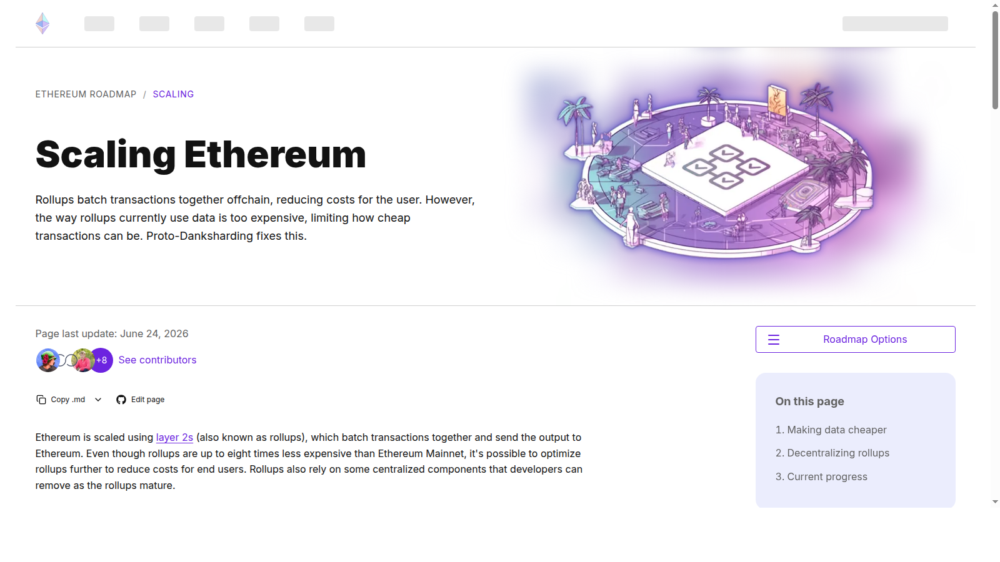
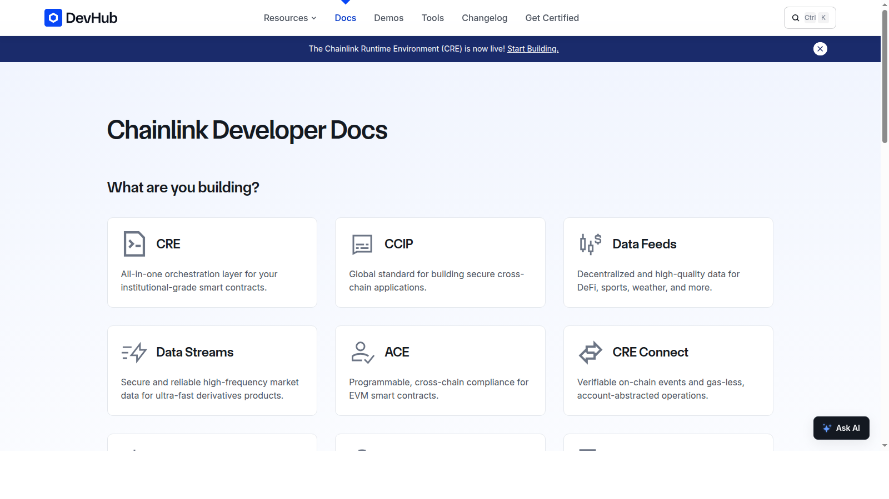
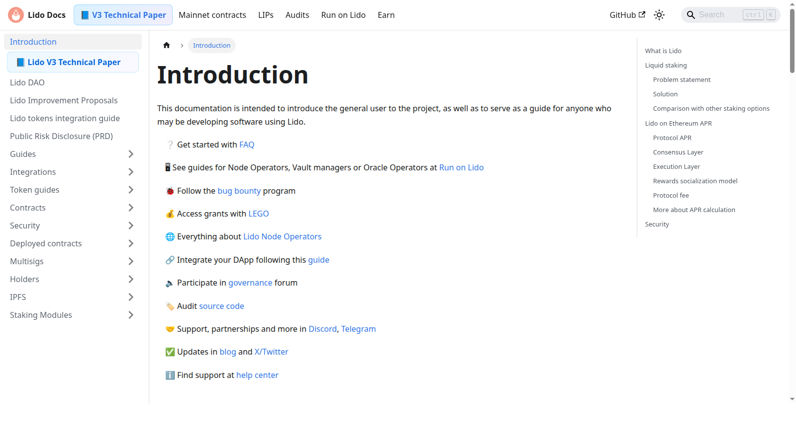

# Top Ethereum Ecosystem Coins 2026: 12 ETH Projects to Watch

Last updated: 2026-07-10

An Ethereum ecosystem list in 2026 cannot just be a pile of familiar tickers. Ethereum matters because it sits at the center of several overlapping systems: settlement, rollups, staking, DeFi, stablecoins, tokenization, and data availability. The best Ethereum watchlist is the one that shows which part of that machine each project actually serves. That broader logic overlaps with [Best DeFi Projects 2026](02-best-defi-projects-2026.md), but it matters more narrowly here because the question is not which DeFi protocol wins in general. The question is which assets still matter specifically to Ethereum's economic core.

If you are building an Ethereum watchlist, the real problem is usually not finding enough recognizable names. The real problem is figuring out which projects still matter once you stop thinking in ticker buckets and start thinking in roles such as settlement, scaling, oracles, staking, and data.

That is why this article does not rank Ethereum ecosystem coins by familiarity alone. We are looking at them through the lens of stack relevance, public product posture, and whether each role still looks important when compared with [Top Crypto Narratives 2026](03-top-crypto-narratives-2026.md), [Top On-Chain Indicators 2026](08-top-on-chain-indicators-2026.md), and [Top Institutional Crypto Trends 2026](09-top-institutional-crypto-trends-2026.md).

> Why you can trust this guide
>
> This article is based on live public product pages and current documentation reviewed in July 2026. We directly reviewed public-facing sources tied to core Ethereum functions, including Ethereum's scaling pages, Chainlink docs, and Lido docs. Where a claim still depends on live network data, deeper protocol usage, or wallet-based testing, we mark it for final verification before publication.

## The top Ethereum ecosystem coins in 2026 are concentrated in DeFi, scaling, data, and infrastructure

The top Ethereum ecosystem coins in 2026 are concentrated in the parts of the stack that still matter when sentiment cools: DeFi leaders, rollup infrastructure, core oracle and data layers, staking systems, and settlement-adjacent services. That is why the list starts with names such as ETH, Chainlink, Lido, Aave, Uniswap, Arbitrum, Optimism, EigenLayer, ENS, Pendle, Maker, and Ether.fi. Together they map the core economic functions surrounding Ethereum rather than just its loudest short-term trades.

## How we ranked Ethereum ecosystem coins for this list

This list uses six filters:

- importance to Ethereum's actual usage
- role inside DeFi, scaling, or data infrastructure
- ecosystem durability
- liquidity and access
- token utility or governance relevance
- downside risk if Ethereum rotation slows

That means a token can rank well without being the fastest mover on the chart. The point is to map the projects that matter to Ethereum's 2026 market structure.

## What we checked ourselves before ranking these projects

To write this page, we reviewed the live public surfaces and docs tied to Ethereum's main economic roles: scaling, oracle infrastructure, and liquid staking. We did that so the article would not rest only on brand familiarity or token rankings.

That direct review does not replace a full network-level test. We did not benchmark every rollup's live costs, run validator operations, or complete every staking workflow ourselves. But from the public sources we reviewed, one thing stood out immediately: the strongest Ethereum-adjacent projects already signal their function very clearly. They feel like parts of a larger machine rather than isolated ticker stories.

For this type of reader, that difference matters more than broad ecosystem branding. A project can be famous in Ethereum and still be less central than its reputation suggests.

## Visual evidence from our July 2026 review

The screenshots below show why a public-surface review still matters. Even before a deeper technical test, the live pages already reveal whether a project is framing itself around scaling, data infrastructure, or staking coordination.

*Ethereum scaling page captured during our July 2026 review of Ethereum ecosystem leaders.*

What stood out immediately on Ethereum's scaling page was that rollups are presented as a core execution path, not as a side experiment. That is a strength for rollup-linked assets because it ties their relevance to the network's public direction rather than to a short-lived market meme.

*Chainlink docs homepage captured during our July 2026 review of Ethereum ecosystem leaders.*

Chainlink feels infrastructure-first in a way that many ecosystem tokens do not. That is powerful because it makes the oracle and data-layer role easy to understand. It is also a weakness for casual readers who may grasp the strategic role faster than they grasp the token economics.

*Lido docs homepage captured during our July 2026 review of Ethereum ecosystem leaders.*

Lido shows something different again. The public docs make the staking thesis feel concrete and well-organized, but they also signal why concentration and governance questions follow the project everywhere. In practice, that is the tradeoff that matters most.

## The full list

### 1. ETH

ETH still belongs at the center because every serious Ethereum ecosystem list needs the base asset that settles the network, anchors staking, and secures the broader application economy. In 2026 the ETH story is no longer just "smart contracts." It is also about being the capital base for rollups, DeFi collateral, and tokenized asset settlement. That is exactly why ETH keeps showing up not only in ecosystem lists but also in [institutional crypto trends](09-top-institutional-crypto-trends-2026.md) and broader market narratives.

Its risk is that Ethereum has to keep proving its economic relevance, not just its cultural status.

### 2. Chainlink

Chainlink remains essential because real-world data, cross-system coordination, and oracle infrastructure still sit underneath many of the market's more ambitious products. From the public docs we reviewed, Chainlink immediately feels like middleware that expects institutional and protocol-level use cases rather than retail storytelling. That is a strength if you want infrastructure seriousness. It is a weaker fit if you want a fast, intuitive thesis for why the token should always trade in line with its strategic role. As tokenization and complex DeFi structures expand, reliable data and messaging layers matter more, not less.

The risk is that middleware tokens can be strategically important while still difficult for the market to price cleanly.

### 3. Lido

Lido stays high on the list because liquid staking remains one of the most durable ETH-native behaviors. From the public docs we reviewed, the clearest signal was not just convenience. It was how directly the product positions itself around ETH capital efficiency. That is a strength if your priority is a core [Ethereum ecosystem](03-top-crypto-narratives-2026.md) function. But it is also exactly why concentration and governance scrutiny keep following the project.

Its risk is concentration and governance scrutiny. Projects that become too central often inherit political risk inside the ecosystem.

### 4. Aave

Aave matters here because Ethereum is still one of the main bases for collateralized lending and onchain credit. Even if the protocol expands cross-chain, its strategic importance remains tightly tied to Ethereum capital.

The risk is that lending platforms become most vulnerable when the market is under stress.

### 5. Uniswap

Uniswap belongs because trading remains one of Ethereum's core economic activities. Even as other chains compete for speed and retail velocity, Ethereum's DEX infrastructure still matters for liquidity depth and composability.

Its challenge is that exchange infrastructure does not always translate into simple token-value capture.

### 6. Arbitrum

Arbitrum remains important because rollups are central to Ethereum's scaling story. If Ethereum wins by becoming the high-value settlement layer beneath cheaper execution environments, Arbitrum remains one of the clearest ways to express that thesis.

The risk is that the rollup field is crowded and fee compression can shift power quickly.

### 7. Optimism

Optimism matters for many of the same reasons as Arbitrum, but with a different ecosystem footprint and governance story. The project stays relevant because Ethereum scaling is no longer optional; it is the path through which much of the network becomes usable for broader audiences.

Its weakness is that the market may reward the rollup story unevenly.

### 8. EigenLayer

EigenLayer earns a slot because restaking changed how the market thinks about shared security, capital efficiency, and the extension of Ethereum's trust surface. Whether readers are bullish or cautious, the idea matters enough to track.

The risk is complexity and systemic coupling. Restaking can look elegant until stress reveals hidden correlations.

### 9. ENS

ENS remains relevant because identity and naming layers are part of turning Ethereum into an actual user environment rather than just a transaction machine. It is one of the clearer infrastructure pieces for user experience and ecosystem permanence.

The challenge is that utility can be real even when the market treats the token as secondary.

### 10. Pendle

Pendle deserves a place because ETH-based yield markets became a major expression of DeFi maturity. It sits at the intersection of staking, fixed-income style thinking, and capital efficiency.

Its risk is that sophistication can narrow the user base even while the product becomes strategically interesting.

### 11. Maker

Maker still matters because decentralized stablecoin infrastructure remains fundamental to Ethereum's economy. Protocols that create base liquidity and collateral pathways deserve a place in any serious ETH ecosystem overview.

The risk is that policy and collateral composition can reshape the story quickly.

### 12. Ether.fi

Ether.fi belongs on the watchlist because liquid staking and restaking-era products remain one of the liveliest parts of the ecosystem. It captures a part of the market that wants ETH exposure plus additional yield logic.

That also makes it sensitive to shifts in restaking sentiment.

## Key evidence and catalysts to track through H2 2026

Track these signals when refreshing this article:

- whether Ethereum rollups keep reducing user costs and increasing throughput
- whether staking and restaking products retain trust
- whether Ethereum remains the main home for tokenized assets and large stablecoin flows
- whether middleware layers such as oracles and identity stay central to product growth
- whether Ethereum loses retail activity but keeps institutional-grade activity

## What this tells us about Ethereum in 2026

Ethereum in 2026 looks less like a single chain thesis and more like a layered economic system. The projects that matter most are not always the flashiest. They are the ones serving settlement, data, liquidity, scaling, and capital efficiency. For an authority-building site, that is useful because it turns an overbroad keyword like "Ethereum ecosystem coins" into a more intelligent page about which roles inside Ethereum still deserve attention. In practice, this page works best when read next to [Best DeFi Projects 2026](02-best-defi-projects-2026.md), [Top Crypto Narratives 2026](03-top-crypto-narratives-2026.md), and [Top On-Chain Indicators 2026](08-top-on-chain-indicators-2026.md).

## FAQ

### Why include ETH itself on an ecosystem list?

Because ETH is still the central asset that secures the network and underpins many of the ecosystem's most important products.

### Are rollup tokens part of the Ethereum ecosystem?

Yes. If Ethereum scales through rollups, those networks are part of the ecosystem's economic reality.

### Why are staking and restaking names so prominent?

Because ETH capital efficiency remains one of the key ways value moves through the ecosystem.

## What would make this page stronger before final publication

We should not pretend we tested more than we actually tested. If the editorial team wants this page to carry stronger first-hand E-E-A-T signals, the right move is to add evidence we actually captured ourselves:

### 1. Exclusive visual evidence

- screenshots of scaling pages, docs hubs, staking flows, or product dashboards reviewed directly
- one real wallet-connected review path for staking or rollup usage
- side-by-side images showing how different Ethereum roles present themselves publicly

### 2. First-person editorial notes

- what our team noticed immediately when comparing scaling, oracle, and staking surfaces
- which products felt clearer or more complex than expected
- what looked strategically central versus merely familiar

### 3. Balanced evaluation

- one practical strength observed from the live public flow
- one structural weakness or friction point
- one note on who should avoid over-reading the token story

### 4. Quantitative checks

- rollup, staking, or stablecoin-flow references captured on the day of review
- one comparative metric for scaling relevance or staking concentration
- one market-structure data point linking Ethereum to institutional or tokenization activity

## How to use this page

This page should be read as an Ethereum stack map, not just as a ranked ticker page. The most useful way to use it is to compare how much of the list is tied to settlement, staking, data, scaling, and liquidity. If Ethereum's role in high-value onchain activity changes materially, the ranking should change with it.

## External links to cite

- [Ethereum Roadmap](https://ethereum.org/roadmap/) for protocol direction
- [Scaling Ethereum](https://ethereum.org/roadmap/scaling) for rollups and user-cost context
- [Chainlink Docs](https://docs.chain.link/) for oracle and data-layer references
- [Lido Docs](https://docs.lido.fi/) for liquid staking mechanics
- [How L1 and L2s can build the strongest possible Ethereum](https://blog.ethereum.org/2026/03/23/l1-l2-ethereum) for current ecosystem framing

## Media plan

- Hero visual: Ethereum stack diagram covering L1, rollups, staking, oracles, and DeFi
- Comparison table near the top: token, role, why it matters to Ethereum, main risk
- One inline chart: rollup cost or scaling snapshot with source note
- One supporting graphic: where each token sits inside the Ethereum economy

## Editor Source Checklist

- verify Ethereum scaling, blob, and rollup progress claims with current Ethereum Foundation or ethereum.org references [needs source]
- verify live ecosystem priority for EigenLayer, Ether.fi, and ENS at publish time [needs source]
- verify whether Maker or another ETH-native protocol deserves the final top-12 slot based on current 2026 relevance [needs source]

## Internal Link Targets

- `/trends/defi/best-defi-projects-2026`
- `/narratives/cross-market/top-crypto-narratives-2026`
- `/insights/on-chain/top-on-chain-indicators-2026`
- `/insights/institutional/top-institutional-crypto-trends-2026`
