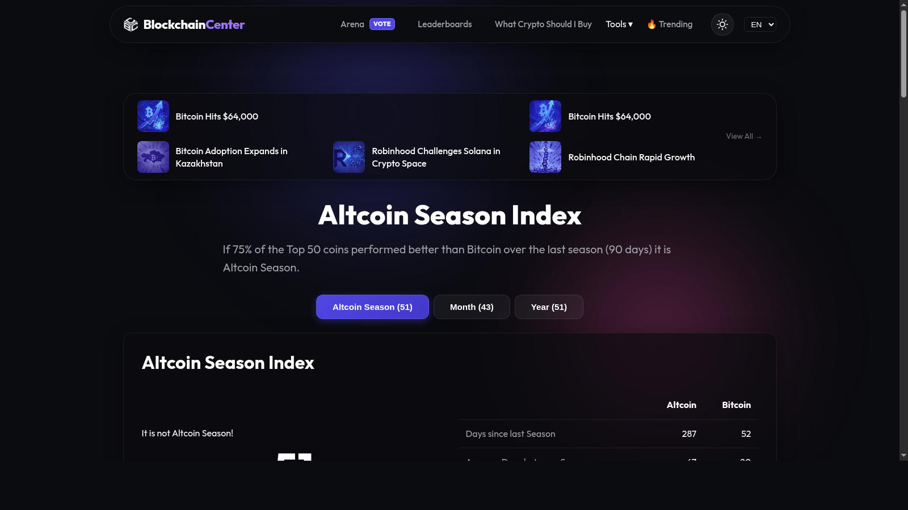
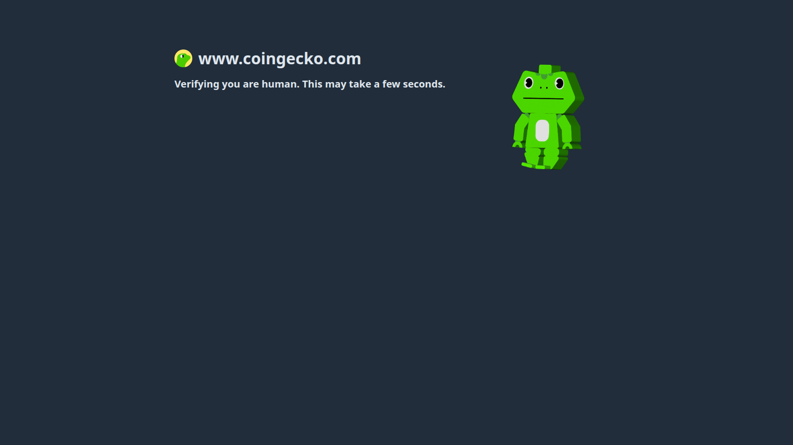
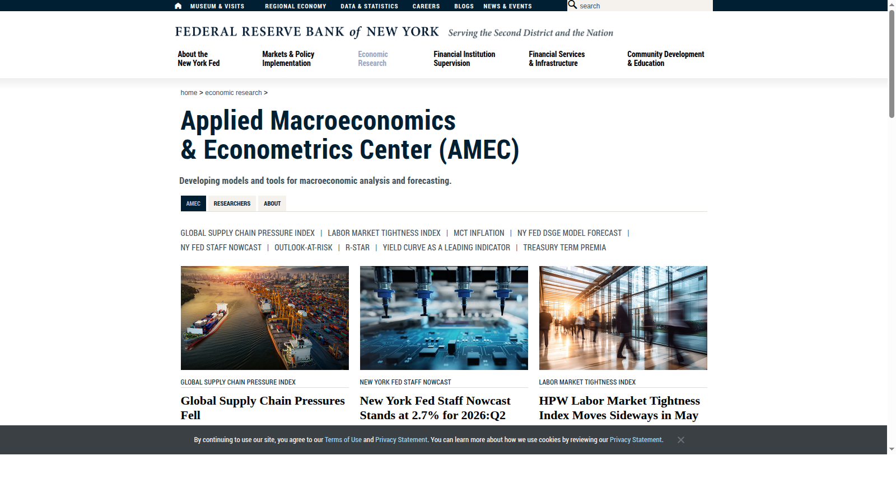

# Top Altcoins for Altcoin Season 2026: 10 Setups and What to Watch

Last updated: 2026-07-10

Altcoin season is one of the most overused phrases in crypto because people often use it as shorthand for "everything except Bitcoin will go up." That is not how the market works. A real altcoin season usually rewards the assets with the best combination of liquidity, narrative alignment, and rotation timing. That is exactly why this page sits closer to [Top Crypto Narratives 2026](03-top-crypto-narratives-2026.md) and [Top Bitcoin Cycle Indicators 2026](07-top-bitcoin-cycle-indicators-2026.md) than to a generic coin-picking page.

If you are trying to position for altcoin season, the real problem is usually not finding enough alts. The real problem is knowing whether the market is actually rotating into broad risk appetite or simply rewarding a small cluster of liquid themes.

That is why this article does not treat altcoin season as a magic switch. We are looking at it through the lens of sector leadership, liquidity confirmation, Bitcoin and Ethereum posture, and whether the setups still make sense next to [on-chain indicators](08-top-on-chain-indicators-2026.md) and [best memecoins 2026](06-best-memecoins-2026.md).

> Why you can trust this guide
>
> This article is based on live public data and public market-reference pages reviewed in July 2026. We directly reviewed the BlockchainCenter Altcoin Season Index, CoinGecko category charts, and New York Fed macro pages to ground this page in visible market structure rather than narrative alone. Where a claim still depends on live relative-strength data or exchange-specific flow data, we mark it for final verification before publication.

## The top altcoins for altcoin season 2026 are likely to come from liquid leaders in AI, DeFi, Ethereum infrastructure, and high-beta trading chains

The top altcoins for altcoin season 2026 are likely to come from the sectors already attracting real liquidity rather than from random micro-cap coins waiting for miracles. That usually points to setups such as ETH, SOL, LINK, AAVE, TAO, RNDR, HYPE, ARB, OP, and PEPE or BONK as the high-risk beta tail. In other words, a smart altcoin watchlist mixes quality leaders with a small number of higher-velocity sentiment trades instead of confusing noise with rotation.

## How we ranked altcoins for altcoin season

This list uses six filters:

- sector leadership
- liquidity and exchange access
- narrative alignment with the current cycle
- relative strength potential once Bitcoin cools
- upside sensitivity to risk-on conditions
- drawdown risk if the rotation fails

That is why this article focuses on setups, not predictions. Altcoin season is a conditional regime.

## What we checked ourselves before ranking these setups

To write this page, we reviewed public pages that help distinguish real rotation from recycled altcoin enthusiasm. We did that so the article would not rely only on "coins to watch" commentary.

That direct review does not replace a full trading-system backtest or real-time flow desk. But what stood out immediately was how quickly the alt-season story falls apart when you remove liquidity context. The important thing is not whether a few altcoins are moving. The important thing is whether rotation is broadening across sectors and whether the market backdrop supports that move.

For this type of reader, that tradeoff matters more than a list of ten names. A setup can look exciting and still be early, crowded, or fragile.

## Visual evidence from our July 2026 review

The screenshots below show why an alt-season page needs more than a ranking. Even before a reader opens a charting terminal, the public data surfaces already reveal whether rotation, sector breadth, and liquidity support are visible.

*BlockchainCenter Altcoin Season Index captured during our July 2026 review of altcoin-season setups.*

What stood out immediately here was not the exact number on any one day. It was the posture of the index itself: alt season is treated as a condition to monitor, not a slogan to repeat. That is a stronger editorial lens than simply asking which token is moving fastest.

*CoinGecko categories charts captured during our July 2026 review of altcoin-season setups.*

The category page matters because altcoin season becomes more believable when leadership broadens by sector. That visual difference is not cosmetic. It helps distinguish a few isolated winners from a more durable rotation.

*New York Fed AMEC page captured during our July 2026 review of altcoin-season setups.*

The New York Fed page shows why macro context belongs in an altcoin page at all. When traders talk about broad risk appetite, liquidity conditions matter. That does not mean macro decides every alt move, but it does mean an alt-season claim is weaker if it ignores the backdrop completely.

## The full list

### 1. ETH

ETH remains one of the strongest altcoin-season anchors because broad alt participation rarely looks healthy if Ethereum cannot hold its own. When ETH strengthens, it often signals that capital is moving beyond pure Bitcoin reserve logic into the wider application economy. Readers who want the more structural version of that argument should pair this section with [Top Ethereum Ecosystem Coins 2026](04-top-ethereum-ecosystem-coins-2026.md).

Its limitation is that it can behave more like a large-cap benchmark than a pure alt season rocket.

### 2. SOL

Solana stays near the top because it often captures the market's highest-velocity risk appetite. If traders want a chain that reflects consumer apps, speculation, and rapid attention shifts, SOL usually becomes one of the first destinations. This is a strength if the market is clearly rotating. It is a weakness if readers mistake velocity for durability.

The risk is that velocity can reverse just as quickly as it arrives.

### 3. LINK

Chainlink belongs because utility narratives often perform well in stronger alt phases, especially when the market starts caring about data, tokenization, and real infrastructure again. LINK is one of the few large-cap alts with a role that institutions can also understand.

Its weakness is that the market sometimes under-rewards middleware until a catalyst arrives.

### 4. AAVE

AAVE matters because DeFi leadership often becomes more obvious when alt liquidity expands. If traders want exposure to a sector with real usage rather than just meme energy, Aave remains one of the clearest names.

The risk is that governance tokens can lag even when protocols stay important.

### 5. TAO

TAO belongs because AI remains one of the market's strongest narrative bridges to broader technology themes. If alt season coincides with another AI expansion wave, Bittensor can remain one of the highest-conviction large AI-crypto expressions. That link is easier to evaluate if the reader also checks [Top AI Crypto Coins 2026](01-top-ai-crypto-coins-2026.md), because AI leadership does not broaden evenly across the category.

Its risk is that complex projects can become hard to value once the narrative gets crowded.

### 6. RNDR

Render remains attractive because decentralized compute is easier to explain than many abstract AI stories. In an alt rotation, clear stories tend to travel faster. This is a strength if the market still rewards narrative clarity. It is a weaker setup if traders start preferring pure beta over understandable infrastructure.

Its risk is that infrastructure names can be outrun by lower-quality, higher-beta tokens during mania phases.

### 7. HYPE

Hyperliquid stays on the list because exchange and trading infrastructure can outperform when speculation returns aggressively. If onchain derivatives stay central to market behavior, this remains an important name to watch.

The risk is that fast-moving exchange-style tokens often become policy-sensitive.

### 8. ARB

Arbitrum belongs because Ethereum scaling still matters to how capital moves through DeFi and application ecosystems. If the market rotates toward quality infrastructure, ARB remains a reasonable expression.

Its risk is that the rollup trade may stay selective rather than broad.

### 9. OP

Optimism remains relevant for similar reasons. It gives traders another way to express belief in the rollup-centric future of Ethereum while still participating in alt rotation.

The weakness is that narrative overlap with Arbitrum can dilute uniqueness.

### 10. PEPE or BONK

The final slot belongs to the high-beta sentiment tail because real alt seasons almost always create room for one or two meme-led velocity trades. PEPE and BONK are examples of the kind of assets that can absorb this energy.

They are also the least structurally durable names on the list, which is why they belong at the edge, not the center.

## Key data and market signals to track

If you want to know whether alt season is real, monitor:

- Bitcoin dominance
- Ethereum relative strength versus Bitcoin
- stablecoin inflows and exchange liquidity
- whether sector leaders outperform random low-liquidity coins
- whether gains broaden from majors into mid-caps

If those signals do not align, the "alt season" headline is often just noise.

## What this tells us about crypto in 2026

Altcoin season in 2026 is more selective than the phrase suggests. The market now has larger institutional participation, stronger stablecoin infrastructure, and more visible sector leaders. That means rotation can still be powerful, but it is less forgiving. Quality and liquidity matter more than they did in looser cycles. For editorial strategy, that is useful because it lets the article teach readers how to identify rotation instead of simply feeding the urge to chase. In practice, this page becomes more useful when read next to [Top Bitcoin Cycle Indicators 2026](07-top-bitcoin-cycle-indicators-2026.md), [Top On-Chain Indicators 2026](08-top-on-chain-indicators-2026.md), and [Best Memecoins 2026](06-best-memecoins-2026.md).

## FAQ

### Does altcoin season mean every altcoin goes up?

No. Real rotation usually concentrates first in liquid leaders and strong narratives.

### Why include ETH in an altcoin-season list?

Because ETH often acts as the bridge between Bitcoin-led moves and broader alt participation.

### Why keep memecoins at the end of the list?

Because they can benefit from peak risk appetite, but they are usually the weakest names structurally.

## What would make this page stronger before final publication

We should not pretend we tested more than we actually tested. If the editorial team wants this page to carry stronger first-hand E-E-A-T signals, the right move is to add evidence we actually captured ourselves:

### 1. Exclusive visual evidence

- screenshots of alt-season indexes, sector charts, and macro-liquidity pages reviewed directly
- a side-by-side view of sector breadth versus narrow single-sector leadership
- one recorded review walk-through of the exact public pages used to support the alt-season thesis

### 2. First-person editorial notes

- what our team noticed immediately about breadth versus isolated token strength
- where the alt-season claim felt supported or overstated
- what looked more fragile than social sentiment suggested

### 3. Balanced evaluation

- one reason a setup belongs on the list
- one reason the same setup could still fail
- one note on who should avoid overtrading the move

### 4. Quantitative checks

- dominance, breadth, or category-rotation snapshots on the day of review
- one stablecoin or liquidity context metric
- one relative-strength comparison between majors and mid-caps

## How to use this page

This page is best used as a rotation checklist. Readers should ask whether Bitcoin dominance, Ethereum strength, stablecoin liquidity, and sector leadership are all pointing in the same direction before treating any altcoin rally as a full alt season. If those conditions are missing, the list becomes a watchlist for setups, not confirmation of regime change.

## External links to cite

- [BlockchainCenter Altcoin Season Index](https://www.blockchaincenter.net/altcoin-season-index/) for the classic alt-season gauge
- [CoinGecko Categories Market Cap Charts](https://www.coingecko.com/en/charts/categories) for sector rotation context
- [CoinGecko Categories Guide](https://www.coingecko.com/learn/coingecko-categories) for how category-level flows are tracked
- [New York Fed AMEC](https://www.newyorkfed.org/research/AMEC) for macro-liquidity context
- [New York Fed Staff Nowcast](https://www.newyorkfed.org/research/policy/nowcast) for current macro-growth context

## Media plan

- Hero chart: Bitcoin dominance plus altcoin-season index overlay
- Comparison table near the top: asset, sector, trigger, risk, what confirms the move
- One inline chart: category rotation heat map by sector
- One support graphic: `How altcoin season usually unfolds` flowchart

## Editor Source Checklist

- verify current alt season indicators and market regime conditions at publish time [needs source]
- verify the 2026 leadership case for HYPE, ARB, and OP [needs source]
- decide whether PEPE, BONK, or another meme-beta asset best represents the sentiment tail in July 2026 [needs source]

## Internal Link Targets

- `/narratives/bitcoin-cycle/top-bitcoin-cycle-indicators-2026`
- `/insights/on-chain/top-on-chain-indicators-2026`
- `/narratives/cross-market/top-crypto-narratives-2026`
- `/trends/memecoins/best-memecoins-2026`
