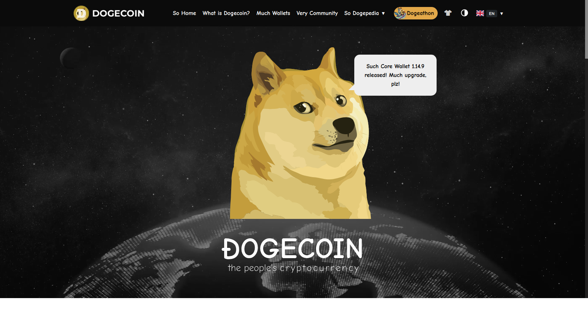
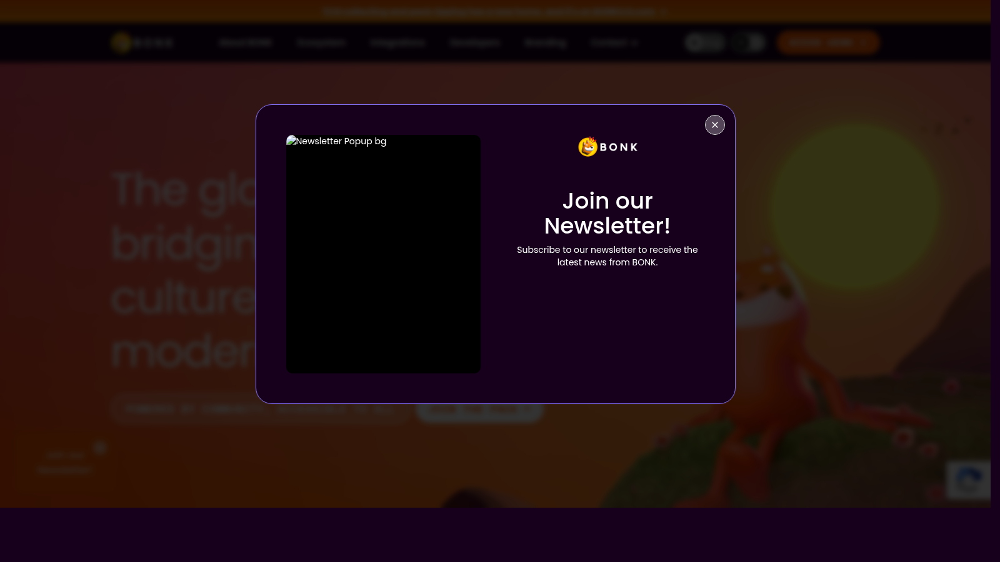

# Best Memecoins 2026? A Risk-First Watchlist of 10 Projects

Last updated: 2026-07-13

If you are looking at memecoins in 2026, the real problem is usually not choosing the funniest brand. The real problem is figuring out which memes still have enough liquidity, recognition, and community persistence to matter after the first attention spike fades.

That is why this article does not rank memecoins by social noise alone. We are looking at them through the lens of exchange access, category survival, cultural recognition, and how the names behave in relation to [Top Altcoins for Altcoin Season 2026](05-top-altcoins-for-altcoin-season-2026.md), [Top On-Chain Indicators 2026](08-top-on-chain-indicators-2026.md), and the wider [Top Crypto Narratives 2026](03-top-crypto-narratives-2026.md).

> Why you can trust this guide
>
> This article is based on live public project pages and category references reviewed in July 2026. We directly reviewed public-facing surfaces for major memecoin names including Dogecoin and BONK, and we cross-checked category framing against public memecoin references. Where a claim still depends on live market depth, exchange-specific liquidity, or fast-moving narrative shifts, we keep the language risk-first.

## The best memecoins in 2026 are still high-risk trades, and the strongest candidates are the ones with durable liquidity and active communities

The best memecoins in 2026 are still high-risk trades, but the stronger candidates usually share the same traits: deep liquidity, sticky community attention, recognizable branding, and a history of surviving more than one market mood. That keeps DOGE, SHIB, PEPE, BONK, WIF, FLOKI, BRETT, POPCAT, MOG, and one rotating newer contender near the top of the watchlist. The key is that memecoin strength usually comes from distribution and social energy, not from an impressive product deck.

## How we ranked memecoins for this list

This list uses six filters:

- liquidity depth
- exchange access
- community persistence
- meme recognizability
- attention response during risk-on phases
- downside risk from concentration, dilution, or hype decay

This is a watchlist, not a promise page. The important thing is not whether a meme is loud. The important thing is whether it can still matter after the joke stops feeling new.

## What we checked ourselves before ranking these memecoins

To write this page, we reviewed live public project surfaces for category-defining meme assets rather than relying only on price tables or social chatter. We did that because memecoin pages become useless very quickly if they only repeat popularity without checking how the projects actually present themselves.

That direct review does not replace a full liquidity audit or exchange-by-exchange depth check. But what stood out immediately was that the stronger memecoins already signal brand persistence differently. Some lean on cultural legacy. Some lean on ecosystem identity. Some still feel more like a temporary attention wave than a durable meme brand.

For this type of reader, that difference matters more than one-week performance. The important thing is not whether a meme is moving. The important thing is whether it still has enough recognition and distribution to matter after the move slows down.

## Visual evidence from our July 2026 review

The screenshots below show why public-surface review still matters even in a memecoin category. The visual differences are not cosmetic. They signal whether a project behaves like a legacy meme, an ecosystem meme, or a more fragile attention play.

*Dogecoin homepage captured during our July 2026 review of memecoin leaders.*

What stood out immediately on Dogecoin was the simplicity and confidence of the presentation. It does not need a complex product story to justify its place in the category. That is a strength because cultural longevity is part of the thesis. It is also a weakness because the brand can feel too familiar to deliver the highest-beta upside.

*BONK homepage captured during our July 2026 review of memecoin leaders.*

BONK signals something very different. The public surface feels more ecosystem-linked and campaign-driven, which makes sense for a meme tied closely to Solana's consumer and trading energy. That is a strength if ecosystem momentum stays hot. It is a weaker fit if the market starts demanding meme brands that can survive outside one chain culture.

## The full watchlist

### 1. DOGE

DOGE remains the benchmark because it still has the strongest cultural recognition of any memecoin. The strength is that it combines liquidity, exchange access, and broad public familiarity in a way few memes can match. The weakness is that being the oldest and most obvious meme trade can limit its upside versus faster, newer names. DOGE stays near the top because category leadership in memes is partly about recognition, not just freshness.

### 2. SHIB

SHIB stays relevant because it evolved from a simple meme into a broader branded ecosystem. The strength is that this gives it more staying power than one-joke tokens usually get. The weakness is that ecosystem expansion can look more impressive in marketing than in user behavior. SHIB remains important because it sits in the category's rare middle ground between meme identity and sustained brand-building.

### 3. PEPE

PEPE belongs high because it became one of the clearest examples of how internet-native meme recognition can turn into a major crypto liquidity event. The strength is speed: when memecoin beta comes back, PEPE is often one of the first names traders reach for. The weakness is that extreme sentiment reversals can hit just as hard. PEPE matters because a real memecoin watchlist should reflect where attention actually concentrates, not where analysts wish it would.

### 4. BONK

BONK matters because it is closely linked to Solana's consumer and trading energy. The strength is that this gives it distribution through a broader ecosystem story, not just through a single meme cycle. The weakness is that chain-specific meme cycles can cool quickly. That is why BONK belongs on this page but should also be read beside [Top Altcoins for Altcoin Season 2026](05-top-altcoins-for-altcoin-season-2026.md), where ecosystem-driven risk appetite matters more than meme identity alone.

### 5. WIF

WIF remains important because it shows how simple branding and strong social spread can build a serious liquidity footprint. The strength is readability. Traders understand the meme immediately, which helps it travel fast in risk-on conditions. The weakness is that there may be little left to defend if attention rotates elsewhere. WIF belongs here because some memecoins win precisely by being easy to transmit, not by being complicated.

### 6. FLOKI

FLOKI keeps a place because it has worked hard to maintain a branded identity across multiple market phases. The strength is persistence itself. In memecoins, surviving more than one sentiment reset is a real signal. The weakness is that aggressive branding can invite skepticism if the surrounding product claims do not matter to holders. FLOKI matters because memecoin endurance is rarer than the category likes to admit.

### 7. BRETT

BRETT remains relevant because Base-linked meme exposure became part of the broader market conversation. The strength is that it represents how memecoin energy can follow a growing chain ecosystem. The weakness is that it still depends heavily on ecosystem sentiment rather than on category independence. BRETT belongs because a serious watchlist should include at least one meme whose relevance depends on the expansion of a newer chain culture.

### 8. POPCAT

POPCAT belongs as a reminder that memes can still build powerful short-term identity around simple internet-native symbolism. The strength is immediate readability. The weakness is obvious: readability is not the same as durability. POPCAT matters less as a long-term conviction asset than as a signal of how far risk appetite is spreading into lighter and faster narratives.

### 9. MOG

MOG deserves a slot because it became one of the stronger examples of meme culture turning into a repeatable trading identity. The strength is that it represents the second-tier cohort that can still become highly liquid. The weakness is thinner conviction once the market becomes selective again. MOG belongs because a real memecoin market is not just DOGE plus one breakout. It usually has a second line of names competing for attention.

### 10. The rotating new contender

Every memecoin cycle produces a newer name that absorbs disproportionate attention for a period. The strength of leaving one slot open is honesty: memecoin leadership changes faster than most other crypto categories. The weakness is that this slot is the easiest place to chase noise instead of substance. The right standard is simple: the breakout deserves the slot only if it can hold liquidity and exchange access long enough to become more than a one-week curiosity.

## Key data and warning signs to track

To update this article intelligently, track:

- whether liquidity survives after the first social spike
- how concentrated supply appears to be
- whether exchange access broadens or narrows
- whether the meme belongs to a wider chain or culture wave
- whether newer contenders are displacing older names too quickly

For memecoins, these warning signs matter more than polished narratives.

## How to use this page

This page is designed as a sentiment and liquidity watchlist, not a conviction portfolio guide. The ranking should move when a memecoin loses exchange access, shows weaker community persistence, or gets displaced by a stronger and more liquid meme in the same attention lane. In practice, it becomes more useful when read next to [Top Altcoins for Altcoin Season 2026](05-top-altcoins-for-altcoin-season-2026.md) and [Top On-Chain Indicators 2026](08-top-on-chain-indicators-2026.md).

## FAQ

### Are memecoins ever investable in a serious sense?

They can be tradeable, and in some cases liquid enough to matter strategically, but they remain structurally high risk.

### Why is DOGE still so important?

Because category leadership in memes is partly about recognition, not just about newness.

### Why leave one slot open for a rotating contender?

Because memecoin leadership changes faster than most other crypto categories, and pretending otherwise leads to stale pages.

## Sources and further reading

- [CoinGecko Memecoins Category](https://www.coingecko.com/en/categories/meme-token)
- [Dogecoin Foundation](https://dogecoin.com/)
- [Shiba Inu Ecosystem Hub](https://www.shib.io/)
- [BONK official site](https://bonkcoin.com/)
- [FLOKI official site](https://floki.com/)

## Publishing media pack

Featured Image
File: `../assets/article-06-memecoins/dogecoin-home.png`
Placement: below the intro or as the article hero image
Alt text: `Dogecoin homepage reviewed in July 2026 for our best memecoins guide`
Caption: `Dogecoin homepage captured during our July 2026 review of memecoin leaders.`

Screenshot 1
File: `../assets/article-06-memecoins/dogecoin-home.png`
Placement: inside `## Visual evidence from our July 2026 review`
Alt text: `Dogecoin homepage reviewed in July 2026 for our memecoin watchlist`
Caption: `Dogecoin homepage captured during our July 2026 review of memecoin leaders.`

Screenshot 2
File: `../assets/article-06-memecoins/bonk-home.png`
Placement: inside `## Visual evidence from our July 2026 review`
Alt text: `BONK homepage reviewed in July 2026 for our memecoin watchlist`
Caption: `BONK homepage captured during our July 2026 review of memecoin leaders.`
