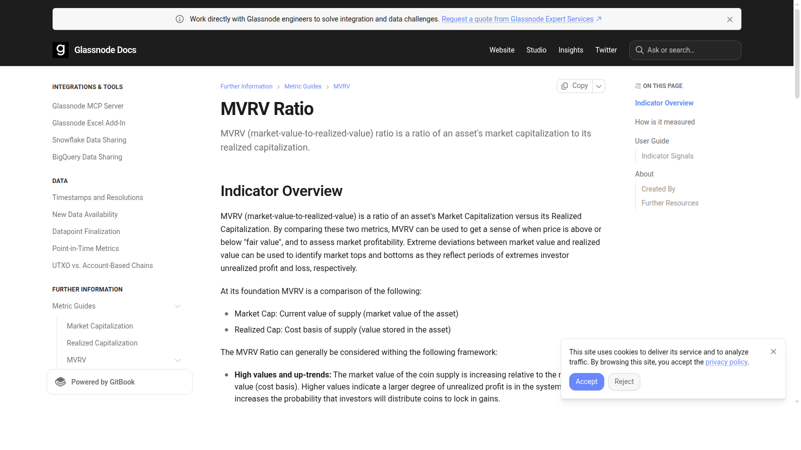
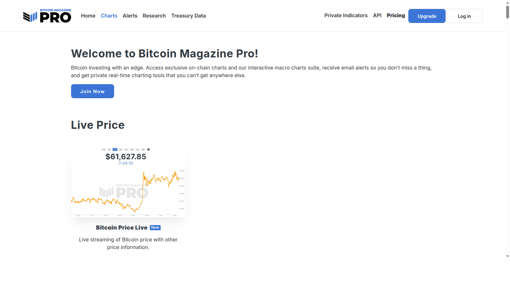

# Top Bitcoin Cycle Indicators 2026: 8 Signals That Matter Most

Last updated: 2026-07-10

Bitcoin cycle analysis becomes less useful the moment readers start looking for a single magic chart. The market has too many moving parts for that. In 2026, the better approach is to combine valuation signals, holder-behavior signals, and macro-liquidity context instead of pretending one indicator can time every top and bottom. That is why this page works best alongside [Top On-Chain Indicators 2026](08-top-on-chain-indicators-2026.md) and [Top Institutional Crypto Trends 2026](09-top-institutional-crypto-trends-2026.md), because Bitcoin no longer trades in an isolated system.

If you are trying to read the Bitcoin cycle, the real problem is usually not finding more charts. The real problem is knowing which charts actually answer different questions instead of repeating the same story with different labels.

That is why this article does not present a single "best" indicator. We are looking at the cycle through the lens of valuation, realized behavior, long-term holder conviction, exchange liquidity, and macro context, then checking how those signals sit inside the broader [crypto narrative map](03-top-crypto-narratives-2026.md).

> Why you can trust this guide
>
> This article is based on live public metric guides and current public chart references reviewed in July 2026. We directly reviewed Glassnode's MVRV guide and the Bitcoin Magazine Pro chart hub to ground the article in visible metric definitions and cycle tools. Where a claim still depends on proprietary datasets, live market feeds, or chart-specific thresholds, we mark it for final verification before publication.

## The top Bitcoin cycle indicators in 2026 are the signals that best combine valuation, holder behavior, profit-taking pressure, and macro context

The top Bitcoin cycle indicators in 2026 are the ones that help answer different questions rather than repeating the same story. A practical set starts with MVRV, realized price, SOPR, Reserve Risk, Puell Multiple, RHODL-style holder age signals, exchange balance trends, and macro liquidity or ETF flow context. Together these indicators tell you whether Bitcoin looks cheap or overheated, whether holders are distributing, and whether the broader market environment is still supportive.

## How we chose these indicators

This list uses five filters:

- historical usefulness across multiple cycles
- clarity of the signal
- ability to pair with other indicators
- relevance to current market structure
- usefulness for avoiding late-cycle mistakes

That matters because a good indicator is not one that always predicts the exact turn. It is one that improves decision quality.

## What we checked ourselves before ranking these indicators

To write this page, we reviewed public metric guides and cycle-chart hubs rather than relying on secondary explainers alone. We did that so the article would stay tied to how these indicators are actually defined and used in the wild.

That direct review does not replace a full chart-pack analysis with live thresholds and historical testing. But what stood out immediately was that the best-known cycle tools are not interchangeable. Some are good at valuation framing. Some are better at realized behavior. Some only become useful when combined with broader liquidity context.

For this type of reader, that distinction matters more than one indicator's popularity. The important thing is not which chart is famous. The important thing is which chart helps answer the decision in front of you.

## Visual evidence from our July 2026 review

The screenshots below show why a public review still matters. Even before a reader opens a trading terminal, the guide and chart surfaces already signal which tools are designed for explanation and which are designed for cycle tracking.

*Glassnode MVRV guide captured during our July 2026 review of Bitcoin cycle indicators.*

What stood out immediately on Glassnode's MVRV guide was that the metric is presented as a valuation framework, not as a magic timing button. That matters because many readers misuse MVRV by treating it like a standalone trigger.

*Bitcoin Magazine Pro charts hub captured during our July 2026 review of Bitcoin cycle indicators.*

The chart hub makes a second point clear: cycle analysis is naturally dashboard-based. That is a strength because readers can compare tools. It is also a weakness because it becomes easy to overfit once too many charts are open at the same time.

## The full list

### 1. MVRV

MVRV remains one of the most widely watched cycle tools because it compares market value with realized value and helps frame whether the market is running too far above the aggregate cost basis. From the guide surface we reviewed, the clearest strength is that it translates a messy market into a cleaner valuation question. The weakness is that readers often ask it to do more than that.

Its weakness is that valuation extremes can persist longer than traders expect.

### 2. Realized Price

Realized price remains important because it gives readers a simple anchor for aggregate holder cost basis. In broad terms, it helps distinguish between healthy pullbacks and deeper structural weakness.

It works best as a context tool, not as a stand-alone timing trigger.

### 3. SOPR

Spent Output Profit Ratio matters because it helps show whether coins moving onchain are being spent at profit or loss. That gives traders a way to think about realized selling pressure rather than just unrealized sentiment.

Its limitation is that the interpretation becomes noisy without broader context.

### 4. Reserve Risk

Reserve Risk remains one of the more useful long-cycle tools because it tries to compare price with the confidence of long-term holders. When conviction and price diverge sharply, the signal becomes more interesting.

The tradeoff is that it is less intuitive for casual readers than simpler metrics.

### 5. Puell Multiple

Puell Multiple still matters because miner behavior remains a part of Bitcoin's economic structure. It can help frame when miner revenue looks stretched relative to historical norms.

Its relevance can vary as Bitcoin's market structure evolves, which is why it should not be overused.

### 6. RHODL and holder-age metrics

Holder-age metrics matter because they help show when older coins begin moving again, which can signal changing conviction or distribution. In cycle analysis, the behavior of long-term holders often matters more than crowd commentary.

The weakness is complexity. These metrics are easy to misuse if readers are chasing certainty.

### 7. Exchange balance and reserve trends

Exchange balances remain useful because they hint at whether coins are moving toward trading venues or away from them. That is not a perfect sell signal, but it can add context around liquidity and market intent.

The danger is assuming every inflow or outflow has the same meaning.

### 8. Macro liquidity and ETF flow context

Macro liquidity and ETF flow data belong on a 2026 cycle list because Bitcoin no longer trades in a world isolated from institutional flows. Liquidity conditions, policy expectations, and large regulated flow channels now shape the cycle more directly than they did in earlier eras. That is exactly why this section overlaps with [Top Institutional Crypto Trends 2026](09-top-institutional-crypto-trends-2026.md) instead of pretending macro is separate from crypto structure.

That makes this less "purely onchain" than other indicators, but more realistic.

## Key evidence and combinations that matter most

The best way to use this set is through combinations:

- `MVRV + SOPR` for valuation plus realized profit-taking
- `realized price + exchange balances` for cost basis plus liquidity behavior
- `Reserve Risk + RHODL` for long-term holder conviction
- `onchain signals + macro liquidity` for avoiding tunnel vision

That combination logic matters more than any single line on a chart.

## What this tells us about Bitcoin in 2026

Bitcoin in 2026 is mature enough that cycle analysis has to respect market structure changes. ETF flows, institutional custody, macro-policy sensitivity, and deeper derivatives markets all mean the old one-metric mentality is less reliable. The strongest content angle is therefore not "here is the top signal." It is "here is the small dashboard that helps you avoid the worst mistakes." In practice, this page becomes stronger when read alongside [Top On-Chain Indicators 2026](08-top-on-chain-indicators-2026.md) and [Top Altcoins for Altcoin Season 2026](05-top-altcoins-for-altcoin-season-2026.md), because both pages help show when Bitcoin-cycle context is broadening into wider market behavior.

## FAQ

### What is the single best Bitcoin cycle indicator?

There is not one. MVRV is widely used, but it becomes more useful when paired with holder-behavior and macro signals.

### Why include macro liquidity on a cycle list?

Because Bitcoin now responds more directly to institutional and policy-sensitive capital than it did in earlier cycles.

### Can these indicators still fail?

Yes. They reduce uncertainty; they do not remove it.

## What would make this page stronger before final publication

We should not pretend we tested more than we actually tested. If the editorial team wants this page to carry stronger first-hand E-E-A-T signals, the right move is to add evidence we actually captured ourselves:

### 1. Exclusive visual evidence

- screenshots of metric guides and chart hubs reviewed directly
- side-by-side captures showing how different cycle tools frame the market
- one short recorded walk-through of the public chart stack used in the article

### 2. First-person editorial notes

- what our team noticed immediately when comparing explanatory guides with chart dashboards
- which indicators felt clearer and which felt easier to misuse
- where the public material was more or less precise than expected

### 3. Balanced evaluation

- one practical reason to use each indicator
- one limit or misuse risk
- one note on which readers should avoid overrelying on it

### 4. Quantitative checks

- live threshold references captured on review day
- one simple comparison between valuation, behavior, and liquidity signals
- one macro or ETF-flow input used alongside the onchain set

## How to use this page

This page should be used as a dashboard guide, not a promise that one indicator will call tops and bottoms precisely. The strongest workflow is to combine one valuation metric, one holder-behavior metric, and one macro-liquidity signal before making a strong cycle claim. If those signals disagree sharply, the responsible interpretation is usually uncertainty, not forced conviction.

## External links to cite

- [Glassnode Guide to MVRV Ratio](https://docs.glassnode.com/guides-and-tutorials/metric-guides/mvrv/mvrv-ratio) for valuation framing
- [Glassnode Guide to SOPR](https://docs.glassnode.com/guides-and-tutorials/metric-guides/sopr/sopr-spent-output-profit-ratio) for realized-profit interpretation
- [LookIntoBitcoin Charts](https://www.lookintobitcoin.com/charts/) for Reserve Risk and other long-cycle tools
- [New York Fed AMEC](https://www.newyorkfed.org/research/AMEC) for macro-liquidity inputs
- [Bitcoin Treasuries](https://bitcointreasuries.net/) for corporate-holding context

## Media plan

- Hero chart: small dashboard panel showing MVRV, SOPR, realized price, and liquidity context
- Comparison table near the top: indicator, what it measures, best use, main limitation
- One inline chart: MVRV or realized price reference chart with source note
- One support graphic: `How to combine on-chain and macro indicators`

## Editor Source Checklist

- verify current definitions and chart interpretations for MVRV, SOPR, Reserve Risk, RHODL, and Puell Multiple [needs source]
- verify whether ETF flow context deserves a stronger explicit role in the 2026 version [needs source]
- add one source-backed chart or data box for each indicator before final publication [needs source]

## Internal Link Targets

- `/insights/on-chain/top-on-chain-indicators-2026`
- `/narratives/altcoin-season/top-altcoins-for-altcoin-season-2026`
- `/narratives/cross-market/top-crypto-narratives-2026`
- `/insights/institutional/top-institutional-crypto-trends-2026`
