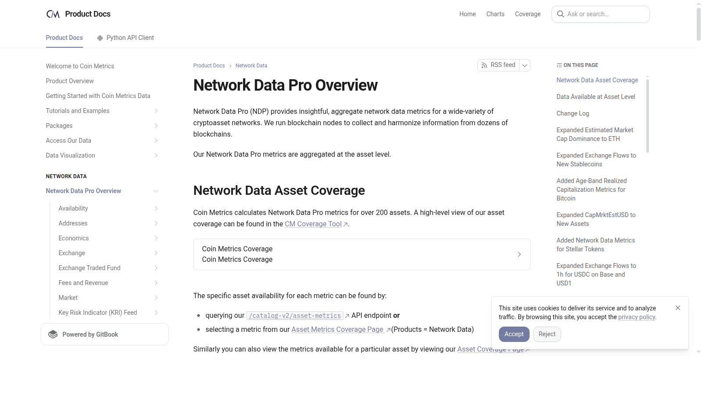
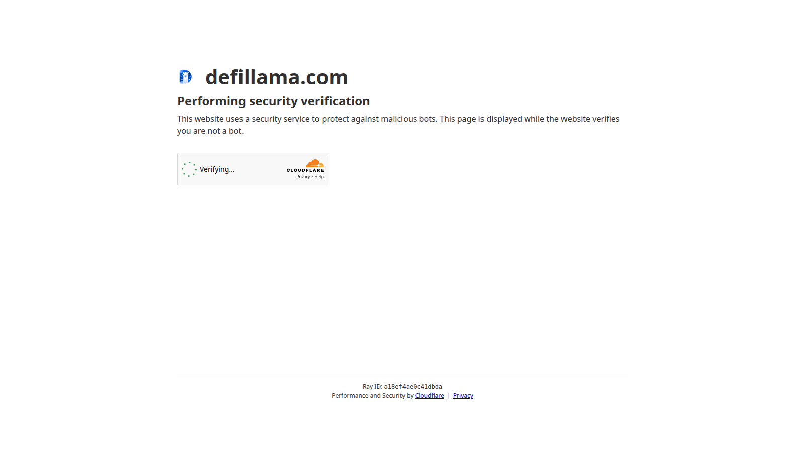

# Top On-Chain Indicators 2026: 10 Metrics for Bitcoin, Ethereum, and Risk

Last updated: 2026-07-10

On-chain analysis is most useful when it tells readers which problem a metric actually solves. Many articles fail here because they throw ten charts into one page without explaining whether those charts help with valuation, liquidity, trend confirmation, or risk management. In 2026, the better approach is to organize the indicators by job. That is why this page works best alongside [Top Bitcoin Cycle Indicators 2026](07-top-bitcoin-cycle-indicators-2026.md) and [Best DeFi Projects 2026](02-best-defi-projects-2026.md), because on-chain metrics become more useful when matched to actual market questions.

If you are trying to use on-chain analysis well, the real problem is usually not access to more dashboards. The real problem is knowing which metric answers which decision before you start reading charts out of context.

That is why this article does not present one giant toolbox without hierarchy. We are organizing the metrics by demand, liquidity, valuation, and risk, then checking how those categories interact with [crypto regulation trends](10-top-crypto-regulation-trends-2026.md) and the wider [crypto narrative map](03-top-crypto-narratives-2026.md).

> Why you can trust this guide
>
> This article is based on live public documentation and public data pages reviewed in July 2026. We directly reviewed Coin Metrics network-data docs, DefiLlama's stablecoin dashboard, and public onchain metric references to keep the article tied to visible data structures instead of generic metric lore. Where a claim still depends on paid datasets, live thresholds, or proprietary charting context, we mark it for final verification before publication.

## The top on-chain indicators in 2026 are the metrics most useful for tracking demand, liquidity, profit-taking, and trend exhaustion

The top on-chain indicators in 2026 are the ones that help readers answer four direct questions: Is demand growing? Is liquidity getting tighter or looser? Are holders taking profits? Is the market overheating? That is why the strongest short list includes active addresses, transaction value, stablecoin supply trends, exchange balances, MVRV, SOPR, NUPL, realized price, coin-age metrics, and fee pressure. Together they form a practical dashboard instead of a pile of disconnected charts.

## How we ranked on-chain indicators for this list

This list uses five filters:

- usefulness across Bitcoin and Ethereum
- clarity of interpretation
- value when paired with other signals
- relevance to real trading or allocation decisions
- ability to reveal hidden risk before price fully reacts

That matters because the best metric is not necessarily the fanciest one. It is the one that changes what you do.

## What we checked ourselves before ranking these indicators

To write this page, we reviewed public metric documentation and public data dashboards rather than relying only on second-hand explanations. We did that so the page would stay tied to how the underlying categories are actually presented and used.

That direct review does not replace a full workflow inside paid charting tools. But what stood out immediately was that the strongest metrics already reveal their job in the way they are documented: some are for activity, some for liquidity, some for valuation, and some for stress or crowd heat.

For this type of reader, that division matters more than having a longer list. A metric only adds value if it changes how you interpret the market.

## Visual evidence from our July 2026 review

The screenshots below show why a public review still adds value. Even before a reader opens a custom chart stack, the public sources already reveal how different data providers frame the market.

*Coin Metrics network data page captured during our July 2026 review of on-chain indicators.*

What stood out immediately on the Coin Metrics page was the taxonomy itself. The data is structured as network data first, which is a strength if your priority is disciplined measurement rather than narrative-driven chart picking.

*DefiLlama stablecoins dashboard captured during our July 2026 review of on-chain indicators.*

The stablecoin page makes another point visible very quickly: some of the most useful onchain signals are not exotic at all. Stablecoin supply and distribution can say more about market fuel than a large set of esoteric metrics if the question is liquidity.

## The full list

### 1. Active addresses

Active addresses remain one of the easiest demand gauges to understand. They help readers see whether a network's user footprint is broadening or narrowing. On their own they are crude, but they are still a strong first-pass signal for whether activity growth looks real.

The weakness is that not all addresses represent unique users, so interpretation needs restraint.

### 2. Transaction value settled

Transaction value helps track whether meaningful economic activity is moving through the chain. This is particularly useful when readers want to distinguish between noise and capital-heavy behavior.

Its limitation is that large transfers can distort the picture if they are not contextualized.

### 3. Stablecoin supply trends

Stablecoin supply trends matter because they often act as a proxy for available onchain buying power. When stablecoin balances and circulation expand, they can support risk appetite across the market. This is one of the clearest places where [crypto regulation trends](10-top-crypto-regulation-trends-2026.md) and onchain data overlap.

This metric becomes more important in 2026 because stablecoins are now core market plumbing.

### 4. Exchange balances

Exchange reserve trends remain useful because they hint at whether assets are moving toward liquid trading venues or away from them. That can provide context around selling pressure, custody shifts, and market readiness.

The danger is reading every transfer as a directional trade.

### 5. MVRV

MVRV belongs on both Bitcoin and broader on-chain lists because it helps with valuation framing. It is one of the best-known ways to ask whether the market is trading too far above aggregate cost basis. Readers who want the more cycle-specific use case should pair it with [Top Bitcoin Cycle Indicators 2026](07-top-bitcoin-cycle-indicators-2026.md).

The weakness is that expensive markets can stay expensive for longer than traders want.

### 6. SOPR

SOPR helps readers evaluate whether coins being spent are moving at profit or loss. That makes it useful for spotting profit-taking regimes and stress periods.

It becomes more valuable when paired with trend and liquidity metrics.

### 7. NUPL

Net Unrealized Profit/Loss remains a useful sentiment-style on-chain metric because it frames how much embedded profit or pain exists across the market. It can help show whether euphoria or despair is building structurally.

Its limitation is that it is a broad emotional map, not a tactical trigger.

### 8. Realized price

Realized price matters because it gives a simple but powerful cost-basis anchor. It is especially useful for readers who want a clean way to think about whether a drawdown still looks structurally healthy.

Like many strong metrics, it works better as context than as a prediction engine.

### 9. Coin-age and dormancy metrics

Coin-age metrics matter because they help show whether long-held coins are beginning to move. That can reveal changing long-term holder behavior before it becomes obvious in headlines.

The weakness is complexity. Readers need editorial help to avoid over-reading one spike.

### 10. Fee pressure and blockspace demand

Fee data matters because it reflects whether users are actually competing for blockspace. In both Bitcoin and Ethereum-related analysis, fee pressure can reveal when demand becomes economically meaningful.

Its limitation is that high fees are not automatically bullish if they reflect temporary congestion rather than durable demand.

## Key combinations that make these indicators more useful

The most useful pairings are:

- `active addresses + transaction value` for demand breadth plus economic scale
- `stablecoin supply + exchange balances` for liquidity context
- `MVRV + realized price + NUPL` for valuation and crowd heat
- `SOPR + coin-age metrics` for realized behavior and holder conviction
- `fee pressure + activity metrics` for judging whether usage is meaningful

That is the real editorial advantage: translating metrics into decision frameworks.

## What this tells us about on-chain analysis in 2026

On-chain analysis in 2026 is less about finding a hidden secret and more about building a disciplined dashboard. The market is larger, more institutional, and more linked to macro liquidity than before. That means on-chain data still matters, but it works best when it is part of a wider decision system. The strongest article on this keyword should therefore help readers know which metric to open first depending on the question they are trying to answer. In practice, this page becomes stronger when read next to [Top Bitcoin Cycle Indicators 2026](07-top-bitcoin-cycle-indicators-2026.md), [Best DeFi Projects 2026](02-best-defi-projects-2026.md), and [Top Altcoins for Altcoin Season 2026](05-top-altcoins-for-altcoin-season-2026.md).

## FAQ

### What is the best on-chain indicator for beginners?

A simple starting set is active addresses, exchange balances, realized price, and stablecoin supply trends.

### Are on-chain indicators enough on their own?

No. They are strongest when paired with market structure, policy, and liquidity context.

### Why do stablecoins belong on an on-chain indicator list?

Because stablecoins increasingly represent onchain settlement power and buying capacity, not just a parking asset.

## What would make this page stronger before final publication

We should not pretend we tested more than we actually tested. If the editorial team wants this page to carry stronger first-hand E-E-A-T signals, the right move is to add evidence we actually captured ourselves:

### 1. Exclusive visual evidence

- screenshots of public metric documentation and dashboard views reviewed directly
- side-by-side captures showing demand, liquidity, and valuation metrics in different interfaces
- one short recorded walkthrough of the public pages used in the article

### 2. First-person editorial notes

- what our team noticed immediately about how different providers frame the same market
- which metrics felt clearer or more practical than expected
- where a dashboard helped and where it risked overwhelming the reader

### 3. Balanced evaluation

- one practical use case for each metric
- one reason it can fail or mislead
- one note on which readers should not over-rely on it

### 4. Quantitative checks

- stablecoin or exchange-reserve snapshot from the review date
- one valuation-versus-liquidity comparison
- one activity metric with a concrete interpretation example

## How to use this page

This page is best used to match metrics with decisions. If the question is demand, start with activity and transaction value. If the question is liquidity, start with stablecoins and exchange balances. If the question is cycle heat, move to valuation and profit-taking metrics. That structure adds more value than reading every chart the same way.

## External links to cite

- [Glassnode Metric Guides](https://docs.glassnode.com/guides-and-tutorials/metric-guides) for MVRV, NUPL, realized price, and related metrics
- [Coin Metrics Network Data Pro Docs](https://gitbook-docs.coinmetrics.io/network-data/network-data-overview) for on-chain metric definitions
- [New York Fed AMEC](https://www.newyorkfed.org/research/AMEC) for macro-liquidity context
- [DefiLlama Stablecoins Dashboard](https://defillama.com/stablecoins) for stablecoin supply tracking
- [CryptoQuant Quicktake](https://cryptoquant.com/) for exchange reserve and flow framing

## Media plan

- Hero visual: dashboard-style metric matrix split into demand, liquidity, valuation, and risk
- Comparison table near the top: metric, what it shows, when to use it, where it fails
- One inline chart: stablecoin supply or exchange-balance trend with source note
- One support graphic: `Which on-chain metric to open first depending on the question`

## Editor Source Checklist

- verify current definitions and preferred chart sources for each metric [needs source]
- verify whether fee pressure and dormancy metrics deserve stronger Bitcoin-specific or Ethereum-specific framing [needs source]
- add one source-backed "best use case" table before publication [needs source]

## Internal Link Targets

- `/narratives/bitcoin-cycle/top-bitcoin-cycle-indicators-2026`
- `/trends/defi/best-defi-projects-2026`
- `/trends/ai-crypto/top-ai-crypto-coins-2026`
- `/narratives/altcoin-season/top-altcoins-for-altcoin-season-2026`
