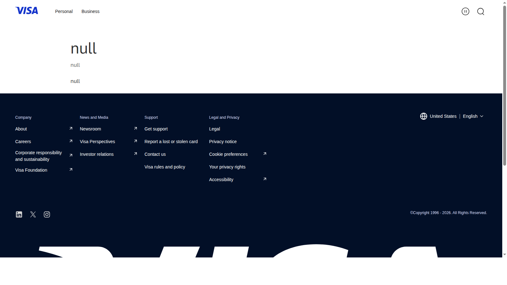

# Top Institutional Crypto Trends 2026: 8 Signals Reshaping Market Structure

Last updated: 2026-07-13

If you are trying to understand institutional crypto in 2026, the real problem is usually not spotting another headline. The real problem is figuring out which developments actually change the market's plumbing instead of just its tone.

That is why this article does not rank institutional trends by prestige alone. We are looking at them through the lens of product structure, distribution access, custody and settlement relevance, and whether they connect to broader themes such as [Top Crypto Regulation Trends 2026](10-top-crypto-regulation-trends-2026.md), [Top Crypto Narratives 2026](03-top-crypto-narratives-2026.md), and the [Ethereum ecosystem](04-top-ethereum-ecosystem-coins-2026.md).

> Why you can trust this guide
>
> This article is based on live public pages and public research reviewed in July 2026. We directly reviewed the BlackRock BUIDL fund page, Visa's stablecoin page, and Robinhood's stock-token launch page to ground the article in real public evidence around tokenization, settlement, and market-access expansion. Where a claim still depends on private flow data, live custody figures, or deeper institutional product usage, we keep the language observed rather than inflated.

## The top institutional crypto trends in 2026 are ETF normalization, tokenized assets, stablecoin infrastructure, treasury adoption, and finance-platform convergence

The top institutional crypto trends in 2026 are the changes that make crypto easier to hold, move, wrap, settle, and supervise inside traditional financial systems. That includes ETF normalization, tokenized treasuries and funds, stablecoin payment infrastructure, corporate treasury experimentation, exchange-to-brokerage convergence, custody stack expansion, regulated tokenized equity rails, and region-specific compliance segmentation. These trends matter because they reshape the market's plumbing rather than just its branding.

## How we ranked institutional trends for this list

This list uses five filters:

- impact on market structure
- durability beyond one quarter
- relevance to regulated capital
- effect on distribution and trust
- spillover into broader crypto adoption

The important thing is not whether a headline sounds prestigious. The important thing is whether it changes how capital can actually move.

## What we checked ourselves before ranking these trends

To write this page, we reviewed live public pages tied to tokenized funds, tokenized securities access, and institutional-facing product packaging. We did that so the article would not depend only on commentary about institutions coming onchain.

That direct review does not replace a full institutional workflow test or access to private distribution metrics. But what stood out immediately was that the strongest trends already show up in the way products are framed publicly. Some pages are clearly built around institutional wrappers and cash-management logic. Others are built around widening access to familiar assets through crypto-native rails.

For this type of reader, that difference matters more than a generic adoption headline. The important thing is not whether the brand is large. The important thing is whether the structure changes how capital can move.

## Visual evidence from our July 2026 review

The screenshots below show why an institutional trend page needs more than broad narrative language. The public surfaces already reveal whether the trend is about product packaging, payment rails, new access layers, or both.

*Visa stablecoin page captured during our July 2026 review of institutional crypto trends.*

What stood out immediately on the Visa page was that stablecoins are being framed as payment infrastructure rather than as niche crypto collateral. That is a strength for the settlement-rail narrative because it shows the theme appearing in the language of mainstream payment systems rather than only inside crypto-native commentary.

*Robinhood stock-token launch page captured during our July 2026 review of institutional crypto trends.*

The Robinhood page signals something different. It makes tokenized market access feel like a distribution story rather than just a backend innovation story. That is a strength if the next phase of institutional crypto is partly about interface and reach, not just custody and settlement.

## The full list

### 1. ETF normalization

ETF normalization remains near the top because the market has already moved past the novelty stage. The strength is that crypto exposure now fits more naturally into a standard portfolio conversation. The weakness is that ETF availability can make readers overestimate how broadly the rest of crypto market structure has matured. This trend matters because it changes allocation behavior and investor expectations around access and liquidity.

### 2. Tokenized treasuries and funds

Tokenized treasury products and fund wrappers matter because they show institutions trying to bring familiar low-risk and yield-bearing products onchain. From the public pages we reviewed, what stood out immediately was the language of cash management and institutional wrapper design rather than speculative storytelling. That is a strength if you care about durable packaging. It is a weakness if you assume packaging automatically means broad end-user scale. This trend stays high because it changes how traditional assets can be distributed and settled.

### 3. Stablecoin infrastructure for payments and settlement

Stablecoins are now institutional infrastructure, not just trading collateral. The strength is that payment firms, exchanges, fintech platforms, and crypto companies increasingly frame them as settlement rails. The weakness is that settlement narratives can still outrun regulatory clarity and actual user penetration. This matters because whoever wins stablecoin distribution can influence day-to-day utility, not just market cap league tables.

### 4. Corporate treasury adoption beyond Bitcoin maximalism

Corporate treasury behavior still matters because it signals which crypto assets can be defended inside boardrooms. The strength is that treasury logic makes crypto legible to conservative capital allocators. The weakness is that some treasury moves are more promotional than strategic. This trend remains important because it tests whether balance-sheet adoption can expand beyond the narrowest version of the Bitcoin-only story.

### 5. Exchange-to-brokerage-to-bank convergence

Large crypto platforms increasingly want more than exchange revenue. The strength is that brokerage rails, custody depth, payment functions, and broader product stacks can make institutions more willing to engage. The weakness is that every added layer increases compliance complexity and operational risk. This trend matters because future winners may look less like single-product exchanges and more like regulated financial platforms.

### 6. Institutional custody stack expansion

Custody remains one of the least glamorous but most important parts of institutional adoption. The strength is that stronger custody makes every other institutional product more credible. The weakness is that custody quality is often invisible to casual readers until something breaks. This trend matters because mainstream capital does not scale into markets where asset control still looks improvised.

### 7. Tokenized equities and securities access

Tokenized stocks, tokenized ETFs, and similar wrappers matter because they extend the crypto interface into traditional securities exposure. From the Robinhood page we reviewed, the clearest signal was that tokenized access is being framed as product expansion, not just backend experimentation. That is a strength if you believe interface and distribution matter as much as settlement. It is a weakness if product rights and jurisdictional limits stay too fragmented. This trend remains important because it widens what crypto platforms can actually offer.

### 8. Jurisdiction-based market segmentation

Institutional adoption in 2026 is increasingly jurisdiction-specific. The strength of this trend is that it explains why products can scale quickly in one region while staying awkward in another. The weakness is that it fragments the global story and makes universal conclusions less reliable. This belongs on the list because institutions do not just ask whether crypto is growing. They ask which version of crypto is legally operable in their market.

## Signals that would move this list

For updates, watch:

- product launches that expand regulated access
- growth in tokenized treasury and fund assets
- stablecoin settlement partnerships
- custody and brokerage license developments
- whether institutional flows broaden beyond Bitcoin-only exposure

Those signals reveal whether adoption is getting deeper or merely louder.

## How to use this page

This page is designed to help readers track infrastructure capture, not to celebrate every institutional headline equally. A trend should move up only if it changes market access, distribution, custody quality, settlement behavior, or product legitimacy in a durable way. In practice, this page becomes stronger when read beside [Top Crypto Regulation Trends 2026](10-top-crypto-regulation-trends-2026.md) and the wider [Top Crypto Narratives 2026](03-top-crypto-narratives-2026.md) hub.

## FAQ

### Is institutional adoption still mostly about Bitcoin?

Bitcoin remains the clearest anchor, but the broader trend is now about infrastructure, tokenized products, custody, and payment rails.

### Why are tokenized treasuries so important?

Because they bring a familiar low-risk product structure onchain and help connect traditional cash management to crypto-native rails.

### What is the biggest institutional risk in 2026?

Fragmentation. Products may grow quickly in one region or wrapper while remaining restricted or awkward elsewhere.

## Sources and further reading

- [BlackRock BUIDL Fund page](https://www.blackrock.com/cash/en-us/products/blackrock-usd-institutional-digital-liquidity-fund)
- [Securitize tokenization platform overview](https://own.securitize.io/)
- [Coinbase 2026 Institutional Investor Survey](https://www.coinbase.com/institutional/research-insights/research/insights-reports/2026-institutional-investor-survey-e-and-y)
- [Visa and Bridge stablecoin announcement](https://usa.visa.com/about-visa/newsroom/press-releases.releaseId.21256.html)
- [Robinhood launches stock tokens and a Layer 2 blockchain](https://robinhood.com/us/en/newsroom/robinhood-launches-stock-tokens-reveals-layer-2-blockchain-and-expands-crypto-suite-in-eu-and-us-with-perpetual-futures-and-staking/)

## Publishing media pack

Featured Image
File: `../assets/article-09-institutional/visa-stablecoin-page.png`
Placement: below the intro or as the article hero image
Alt text: `Visa stablecoin page reviewed in July 2026 for our institutional crypto trends guide`
Caption: `Visa stablecoin page captured during our July 2026 review of institutional crypto trends.`

Screenshot 1
File: `../assets/article-09-institutional/visa-stablecoin-page.png`
Placement: inside `## Visual evidence from our July 2026 review`
Alt text: `Visa stablecoin page reviewed in July 2026 for our institutional crypto guide`
Caption: `Visa stablecoin page captured during our July 2026 review of institutional crypto trends.`

Screenshot 2
File: `../assets/article-09-institutional/robinhood-stock-tokens-page.png`
Placement: inside `## Visual evidence from our July 2026 review`
Alt text: `Robinhood stock tokens launch page reviewed in July 2026 for our institutional crypto guide`
Caption: `Robinhood stock-token launch page captured during our July 2026 review of institutional crypto trends.`
