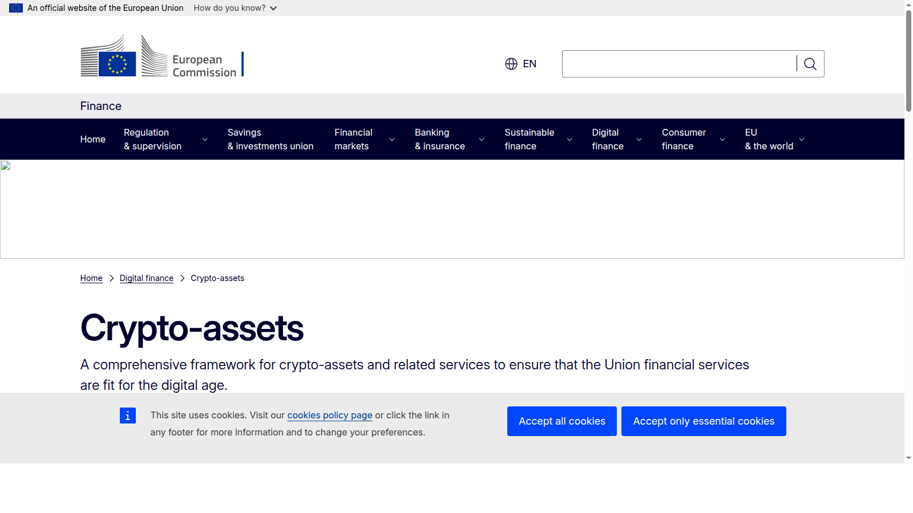
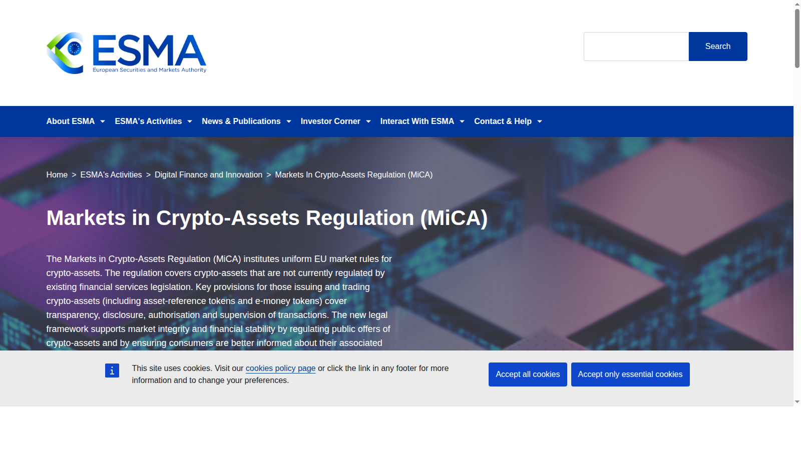
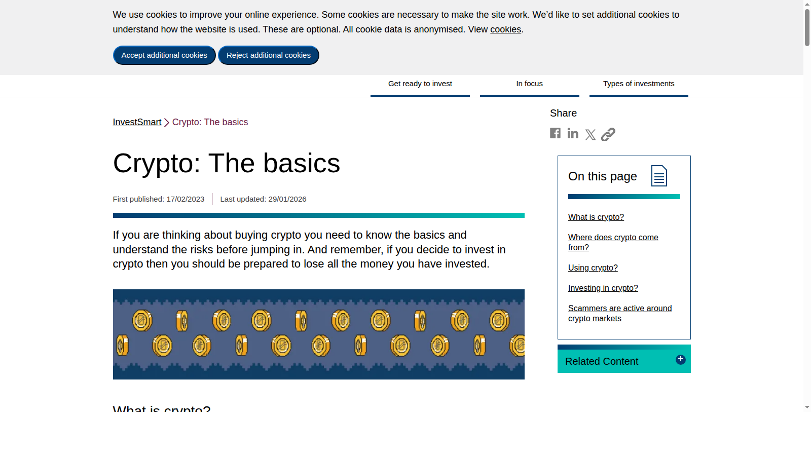

# Top Crypto Regulation Trends 2026: 8 Policy Shifts to Watch

Last updated: 2026-07-10

Crypto regulation pages often fail because they either drown readers in legal jargon or collapse everything into panic language. The more useful approach in 2026 is to ask a simpler question: which policy shifts are most likely to change who can issue, list, distribute, custody, or settle crypto products at scale? That is why this page works best next to [Top Institutional Crypto Trends 2026](09-top-institutional-crypto-trends-2026.md), because regulation matters most when it changes product scope and distribution.

If you are trying to understand crypto policy in 2026, the real problem is usually not finding another legal headline. The real problem is knowing which policy changes actually alter trust, access, or product design in the market.

That is why this article does not rank regulation trends by fear level. We are looking at them through the lens of market impact, product scope, distribution control, and how they connect to [best DeFi projects](02-best-defi-projects-2026.md), the [Ethereum ecosystem](04-top-ethereum-ecosystem-coins-2026.md), and the wider [crypto narrative map](03-top-crypto-narratives-2026.md).

> Why you can trust this guide
>
> This article is based on live public policy pages reviewed in July 2026. We directly reviewed the European Commission crypto-assets page, ESMA's MiCA page, and the FCA's crypto basics page to ground the article in visible regulatory surfaces rather than in second-hand summaries alone. Where a claim still depends on legal interpretation, current enforcement detail, or private market-impact data, we mark it for final verification before publication.

## The top crypto regulation trends in 2026 are the policy shifts around stablecoins, market structure, custody, token classification, and regional segmentation

The top crypto regulation trends in 2026 are the policy shifts that change distribution and trust, not just the ones that generate scary headlines. That includes MiCA implementation and rethink, US interpretive and enforcement direction, stablecoin reserve expectations, tokenized securities frameworks, exchange licensing, custody segregation standards, cross-border compliance fragmentation, and the regulatory treatment of onchain yield and synthetic products. These trends matter because they define which parts of crypto can become mainstream and which parts remain structurally constrained.

## How we ranked regulation trends for this list

This list uses five filters:

- market impact
- direct effect on issuers, exchanges, and users
- durability beyond a single enforcement cycle
- influence on liquidity and distribution
- relevance across multiple jurisdictions

That matters because not every legal headline changes market structure.

## What we checked ourselves before ranking these policy shifts

To write this page, we reviewed live public regulatory and policy pages rather than relying only on legal commentary or crypto-news paraphrases. We did that so the article would stay tied to what institutions, exchanges, and users can actually see in public framework pages.

That direct review does not replace legal advice or a jurisdiction-by-jurisdiction compliance memo. But what stood out immediately was that the strongest policy trends already have a very visible public posture. Some are framed as formal market infrastructure. Others are framed as consumer protection, supervisory clarity, or operational boundaries.

For this type of reader, that difference matters more than the number of headlines in a news cycle. The important thing is not whether regulation is loud. The important thing is whether it changes behavior.

## Visual evidence from our July 2026 review

The screenshots below show why a regulation page is stronger when it is tied to public primary sources. Even before legal analysis begins, the public pages already reveal where policy is becoming operational rather than rhetorical.

*European Commission crypto-assets page captured during our July 2026 review of crypto regulation trends.*

What stood out immediately on the Commission page was that crypto policy is already organized as a formal digital-finance track rather than as a side issue. That is a strength for the MiCA narrative because it makes the framework feel operational and durable.

*ESMA MiCA page captured during our July 2026 review of crypto regulation trends.*

The ESMA page signals the supervisory layer behind MiCA. That matters because the story is not only that Europe has rules. The story is that the framework now has an implementation and oversight surface.

*FCA crypto basics page captured during our July 2026 review of crypto regulation trends.*

The FCA page shows a different posture: consumer-facing framing and risk communication. That visual difference matters because regulation does not only operate at the issuer and exchange layer. It also shapes how users encounter the category.

## The full list

### 1. MiCA implementation and early rethink

MiCA stays near the top because Europe now has a formal crypto framework that affects issuers, exchanges, wallets, and stablecoin distribution. What makes 2026 especially important is that the conversation has already moved from "MiCA is here" to "how well does it work in practice?" [needs source]

That shift matters because implementation details often decide which firms actually benefit.

### 2. Stablecoin reserve and issuer standards

Stablecoin policy remains central because stablecoins now act like infrastructure. Reserve composition, redemption expectations, reporting, and issuer licensing all affect who can distribute trusted dollar products across regions [needs source]. This is one of the clearest places where policy and [best DeFi projects](02-best-defi-projects-2026.md) intersect.

This is one of the few policy areas that touches almost every other part of the market.

### 3. US interpretive direction on crypto assets

US regulatory posture still matters because it influences listing risk, issuer behavior, token classification debates, and investor confidence. In 2026 the key issue is not just enforcement. It is whether guidance becomes clearer enough for firms to build with less ambiguity [needs source].

That matters because US uncertainty still shapes global strategy.

### 4. Exchange licensing and product scope

The market increasingly cares not only whether an exchange is licensed, but what that license allows it to do. Brokerage features, derivatives access, custody, payments, and tokenized securities all depend on product scope.

This trend matters because exchanges are becoming regulated financial platforms, not just token venues.

### 5. Custody segregation and client-asset protection

Custody rules matter because institutional adoption and mainstream trust depend on how clearly firms must separate client assets, manage risk, and disclose controls. This sounds technical, but it changes where serious money is willing to sit.

It also becomes a differentiator in competitive markets.

### 6. Tokenized securities and onchain market-access rules

Tokenized stocks, funds, and related products remain policy-sensitive because they sit at the border between crypto distribution and traditional securities regulation. The main 2026 question is not whether tokenization is possible. It is which jurisdictions and structures allow it to scale [needs source]. This section also overlaps directly with the settlement and tokenization logic in [Top Institutional Crypto Trends 2026](09-top-institutional-crypto-trends-2026.md).

This trend matters because it opens a bridge between crypto-native interfaces and familiar financial assets.

### 7. Regulation of onchain yield, staking, and synthetic products

Yield-bearing tokens, liquid staking, synthetic dollars, and structured onchain products remain in a sensitive policy zone. Regulators care because these products can look like banking, investment, or derivatives activity depending on the structure.

That means product design is increasingly a regulatory strategy as much as a technical strategy.

### 8. Cross-border compliance fragmentation

Crypto still operates globally, but regulation does not. In 2026, one of the biggest structural trends is that firms must increasingly build region-by-region compliance stacks instead of assuming one global product model will work everywhere.

This matters because fragmentation creates winners with strong legal and operational discipline.

## Key evidence and milestones to track through H2 2026

For updates, watch:

- how MiCA changes real exchange and stablecoin distribution
- whether US guidance becomes clearer or merely shifts tone
- which jurisdictions lead on tokenized securities
- how custody standards evolve for institutional providers
- whether staking and synthetic-yield products face tighter perimeter rules

These milestones matter more than headline-counting.

## What this tells us about crypto in 2026

Regulation in 2026 is less about asking whether crypto survives and more about asking which version of crypto gets permission to scale. That makes policy analysis more commercially relevant than it used to be. The best regulation page is therefore not a legal glossary. It is a map of how policy changes who gets trust, access, distribution, and durable market share. In practice, this page becomes stronger when read beside [Top Institutional Crypto Trends 2026](09-top-institutional-crypto-trends-2026.md) and the broader [Top Crypto Narratives 2026](03-top-crypto-narratives-2026.md) hub.

## FAQ

### Is regulation mainly a risk for crypto in 2026?

It is both a risk and a sorting mechanism. Good policy can strengthen trust and distribution while weak positioning can exclude firms from growth.

### Why does MiCA matter so much?

Because it provides one of the clearest formal regional frameworks and therefore influences product design, listing decisions, and stablecoin access.

### Which category is most exposed to regulatory change?

Stablecoins, exchanges, custody, tokenized securities, and yield products all remain highly exposed.

## What would make this page stronger before final publication

We should not pretend we tested more than we actually tested. If the editorial team wants this page to carry stronger first-hand E-E-A-T signals, the right move is to add evidence we actually captured ourselves:

### 1. Exclusive visual evidence

- screenshots of primary-source policy and supervisory pages reviewed directly
- side-by-side captures showing issuer-facing versus consumer-facing regulatory posture
- one recorded walkthrough of the public pages behind the article's top-ranked trends

### 2. First-person editorial notes

- what our team noticed immediately about how different regulators frame crypto
- which pages felt operational, supervisory, or consumer-protective in emphasis
- where the public signals were clearer or thinner than expected

### 3. Balanced evaluation

- one real reason the policy shift matters
- one limit or uncertainty
- one note on who should avoid over-reading the trend

### 4. Quantitative checks

- one timeline of policy milestones
- one market-impact example tied to listings, stablecoins, or custody
- one comparative note across Europe, the UK, and the US where possible

## How to use this page

This page works best as a market-impact map rather than a legal memo. Readers should use it to identify which policy areas most directly change distribution, trust, and product scope. The ranking should shift only when a rule meaningfully changes what exchanges, issuers, custodians, or users can do in practice.

## External links to cite

- [European Commission Crypto-Assets / MiCA page](https://finance.ec.europa.eu/digital-finance/crypto-assets_en) for policy framework and review context
- [ESMA MiCA page](https://www.esma.europa.eu/esmas-activities/digital-finance-and-innovation/markets-crypto-assets-regulation-mica) for supervisory and implementation references
- [SEC statement on certain protocol staking activities](https://www.sec.gov/newsroom/speeches-statements/peirce-statement-protocol-staking-052925) for current US policy tone
- [SEC interpretive release on crypto asset activities](https://www.sec.gov/rules-regulations/2026/03/s7-2026-09) for US interpretive direction
- [FCA cryptoassets information page](https://www.fca.org.uk/consumers/cryptoassets) for UK-facing user and regulatory context

## Media plan

- Hero visual: regulation map split into stablecoins, exchanges, custody, tokenized securities, and yield products
- Comparison table near the top: trend, affected entities, likely market effect, region
- One inline timeline: policy milestones for Europe, US, and UK in 2026
- One support graphic: `How regulation changes who gets distribution and trust`

## Editor Source Checklist

- verify live MiCA implementation and review developments using European Commission or ESMA material [needs source]
- verify current US interpretive and policy developments using SEC or other primary-source guidance [needs source]
- verify the latest live examples of tokenized securities launches and exchange-license expansion before publication [needs source]

## Internal Link Targets

- `/insights/institutional/top-institutional-crypto-trends-2026`
- `/trends/defi/best-defi-projects-2026`
- `/trends/ai-crypto/top-ai-crypto-coins-2026`
- `/narratives/cross-market/top-crypto-narratives-2026`
